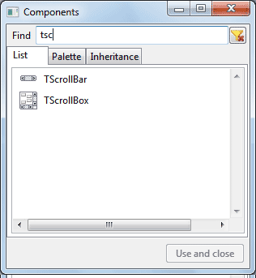
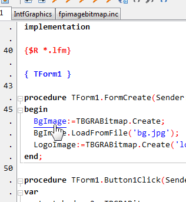
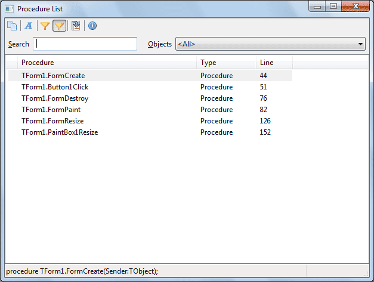
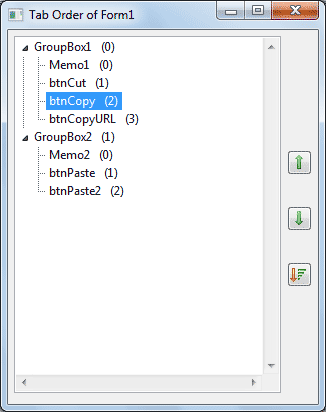
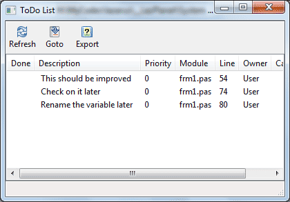
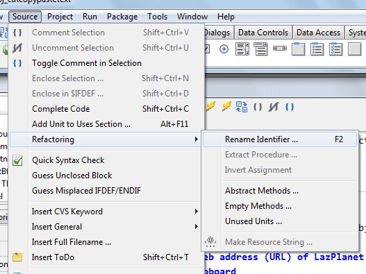
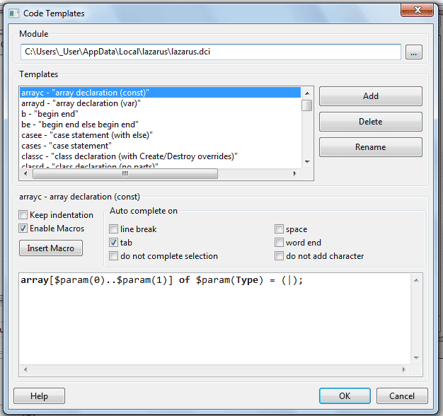

In this useful article we see some of the less known but handy tools or features that Lazarus has
<!-- more -->
  
Lazarus is a cross platform RAD IDE tool to develop applications for your need. Lazarus is a great IDE but its marketing efforts are poor, but if you are used to the Lazarus wiki then you will find out the true treasures in this IDE. It is packed with hundreds of features, yet the users know a little about them. Those features can cut some minutes of work from your daily life for your ease. Here are some interesting features that you might not know about:  
  

### 1\. Component List (with Search and categorization)

Press Ctrl+Alt+P. This will bring out the components list and you can search the component you want or simply just click it. It can't get any easier than this!  
  

Component List. It can't get any easier than this!

  

### 2\. Jump to definition hotlink By control+clicking

Click a variable name or procedure/function by pressing Ctrl.  
This is particularly useful if you are unsure of any procedure definition or the source declaration of any variable.  
  

  

### 3\. $IFDEF compiler directives (OS+CPU architecture)

This is not actually a feature of Lazarus but more of FPC. But many don't know it can be done in Lazarus. I am listing it for those people who might underestimate Lazarus just of not knowing this feature exists. A simple code would be:  

{$IFDEF WINDOWS}  
 showmessage('Windows!');  
 {$IFDEF WIN32}  
 showmessage('32 Bit Windows!');  
 {$ENDIF}  
 {$IFDEF WIN64}  
 showmessage('64 Bit Windows!');  
 {$ENDIF}  
{$ENDIF}  
{$ifdef LINUX}  
 showmessage('Linux!');  
{$endif}  
{$ifdef Darwin}  
 showmessage('Mac OS!');  
{$endif}  

  
  
EDIT: It seems Lazarus has a feature about compiler directives after all which you may not know was in Lazarus! As leledumbo mentions about this feature in his comment, Lazarus has a ["low-lighting inactive" code feature since version 1.2](http://wiki.lazarus.freepascal.org/New_IDE_features_since#Low-lighting_inactive_.24IFDEF_code). This feature lightly dims the compiler directives that currently does not apply to your OS/architecture/compiler. Although it is just a cosmetic feature, this might help someone understand the directives better and identify correct block of code quickly.  
  
There are tonnes of more ways you can use compiler directives. You can look in the following links:  
[Lazarus Forum: Is there a list of $IFDEF XXXXX Declarations?](http://forum.lazarus.freepascal.org/index.php?topic=15869.0)  
[FPC Manual: Compiler defines during compilation](http://www.freepascal.org/docs-html/prog/progap7.html)  
[Lazarus: Detect Operating System (Compiler Switch)](http://www.askingbox.com/tip/lazarus-detect-operating-system-compiler-switch)  
[Lazarus wiki: Conditional compilation](http://wiki.freepascal.org/Conditional_compilation)  
[Lazarus wiki: Multiplatform Programming Guide](http://wiki.lazarus.freepascal.org/Multiplatform_Programming_Guide)  
  

### 4\. Procedure List

Press Alt+G.  
This will show you a list of procedures/functions in the current unit. This is extremely helpful when you have hundreds of procedures that cannot be found with just scrolling the code. You can double click any procedure/function from the list to jump to it.  
  

  
For this purpose you can also use Code Explorer (available from View menu) shows uses, types, variables, procedures of the project. But this will take time to expand some plus signs. ... whichever suits you.  
  

### 5\. Tab Order manager

Available from View->Tab Order.  
This dialog enables you to review your tab order arrangements in the form components. Tab order is basically a way to control which component gets focus after which component. You can order/re-order the tab order from this dialog box by clicking the arrow buttons.  
  

Tab order editor dialog:  
defines how user will navigate  
through components by pressing tab

  
Another feature is that you can automatically order the components by using how you positioned the components in the form (using their Left and Top property). This is a handy feature when you are fighting a deadline or just this is a meh affair to you.  
  

### 6\. ToDo List

Available from View->ToDo List menu.  
This is a very useful feature when you don't remember where you put your todo comments. If you don't know what a todo comment is, it is basically a note to yourself that you need to do something in the code later. Test it by putting something like this in your code:  
  

// TODO: I will update it later

  
Now if you summon the ToDo List, it will show that comment. You can jump to your ToDo by clicking on it.  
  

ToDo List dialog

  

### 7\. Code Refactoring

Actions available from Source->Refactoring menu.  
I know less about code Refactoring. I have used this feature to rename variables throughout my code of a project which it did quite splendidly. It has other tools which I believe is worth its place.  
  

  

### 8\. Clean Directory

Available from File->Clean Directory menu.  
This is especially useful when you want to distribute your project code without the temporary files created during compile. You can also specify any custom file format that you want to be removed.  
  

### 9\. Export Code as HTML

Available from File->Export as HTML menu.  
Lazarus has its way of showing code. I mean its colors, font spacing etc. When you copy and paste it, it no longer has the beauty of those syntax highlighted colors that we love. If you want to retain those colors  & share it with a friend then why not try this feature?  
  

### 10.Code Templates 

(Tools-> Code Templates..., triggered  by Ctrl+J)  
This is a power feature for every programmer. Just check out the shortcuts in Tools->Code Templates... menu. You can type in these shortcuts and press Ctrl+J to have some code created for you. Cool!  
  

  
You can also add a code if you want. Just add a pipe character where you want your cursor to be when the code is inserted. I have used such features with Notepad++ (with Fingertext plugin) and with Sublime Text and it feels awesome to type code, believe me!  
  
You can get more help on how to create your own code templates here: [Lazarus Wiki: IDE Window: Code Templates](http://wiki.lazarus.freepascal.org/IDE_Window:_Code_Templates).  
  
  
Lazarus has some amazing features that can make creating programs a breeze! Try them, I'm sure you'll love them!