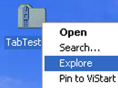
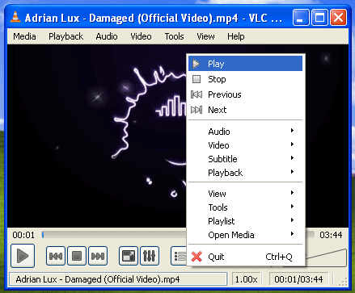
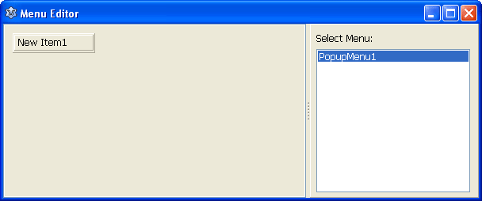
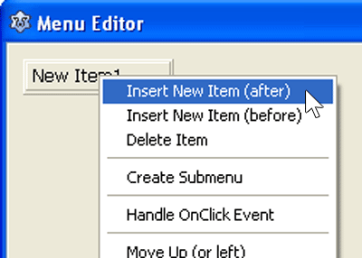
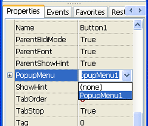
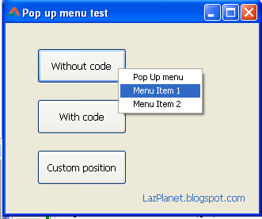

Pop Up menus pop when you right click on the application somewhere to make available the quick jobs in a menu. We explore 3 ways of using popup menus in Lazarus.
<!-- more -->
  
Popup menus are common in many popular applications. For example, in VLC Media Player (or any other typical media player) if you right click on the video area then a popup menu appears. It lets you open media files, play or pause, skip to the next song and many more.  

  
Lazarus has a very easy implementation of this popup-style menu. Lazarus has a component named TPopupMenu for this purpose. Once we create menus we can show it in 3 different ways, which I will demonstrate.  
  
  

### Creating the popup menu

Creating the popup menu is easy. Just drop a TPopupMenu component in the form, then right click it and choose "Menu Editor...". Then select the item you want to modify then modify it with the help of the Object Inspector -> Properties. You can then change the menu item caption, name, checked etc. You can also add items by right clicking any of the existing menu items in the menu editor window. You will have to create as many TPopupMenu components as many popup menus you want.  
  
Let's just see it practically...  
  
Create a new project (Project-> New Project-> Application-> OK).  
  

#### Creating a new popup menu and editing its items' properties

  
Now drop a TPopupMenu component in the form. Now right click it and select "Menu Editor...".  
  

  
  
You will see 1 menu item already created for you. You can change its property, for example, Caption property to something like "My popup menu item 1". For this you can click on the item to select it, then change the property from the Object Inspector.  
  

#### Adding new item to the menu

  
If you want more item(s) to be added then the default single item, then obviously you need to add more menu items. You can add new menu items by right clicking and selecting "Insert New Item (after)" or "Insert New Item (before)".  
  

  
  
After inserting menu items, close the Menu Editor window to get back to your form.  
  

### Using Popup Menu in 3 ways

  

#### Way 1: Using the PopupMenu property (without code)

You can skip all the mumbo jumbo and show the popup menu without writing any code! If you set the PopupMenu property of a component to the TPopupMenu you just prepared, then the menu will appear when you right click on that component.  
  
Drop a TButton on the form. Set its PopupMenu property to the TPopupMenu from the dropdown menu.  
  

  
Now run the project (F9 or Run-> Run) and right click on the button to see the popup menu.  
  

#### Way 2: Using code to show the popup menu

Using the PopupMenu property to show the popup menu is just simple and proper for almost all uses. Sometimes you may want to do some custom coding before showing the popup menu. Then using this method is a good idea.  
  
Drop another TButton component in the form (suppose it is named Button2). On its OnMouseDown event (Object inspector-> Events-> OnMouseDown) enter the following code:  

procedure TForm1.Button2MouseDown(Sender: TObject; Button: TMouseButton;  
  Shift: TShiftState; X, Y: Integer);  
begin  
  if Button = mbRight then  
  PopupMenu1.PopUp;  
end;

  
Now run the project (F9 or Run-> Run) and right click the button and you will see the popup menu.  
  
The TPopupMenu.PopUp shows the menu. It automatically shows the menu at the position of the mouse pointer.

#### Way 3: Showing menu on Left Click (fixed position)

This is also another use. It is seen in many UI designs. For example, there are many antivirus programs which have an "Options" button. If you click it, you can see many customizing menu options.  
  
We can create such a menu with the code below:  
  
First, drop a TButton (suppose it is named Button3) and then double click it and enter:  
  

procedure TForm1.Button3Click(Sender: TObject);  
var  
  pt, pt2: TPoint;  
  
begin  
  pt.x:=Button3.Left;  
  pt.y:=Button3.Top+Button3.Height;  
  
  pt2:=ClientToScreen(pt);  
  
  PopupMenu1.PopUp(pt2.x, pt2.y);  
end;

  
Now run the project and click on the button. You will see the menu to appear at the bottom of the button. The PopUp procedure should've shown the menu at the mouse pointer, not the bottom of the button. How did we do it? With the PopUp(x, y) syntax. You can show the menu at any place on the screen you wish at any time with this syntax.  
  
There you have it. 3 ways to use popup menus in Lazarus form designer.  
  

  

### Download Sample Code ZIP

You can download the above example tutorial project source code from here: [http://db.tt/NP2l6YEK](http://db.tt/NP2l6YEK)  
Size: 635 KB  
The package contains compiled executable EXE.