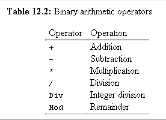
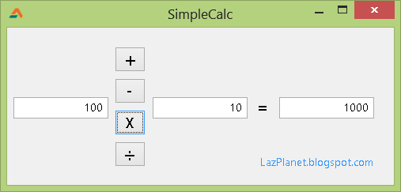

There are many calculator programs out there... with hundreds of buttons to click and thousands of lines of codes to implement those functions. But in this little project we discover a simple calculator...by hand...
<!-- more -->
  
  
We have 4 Buttons for calculation and 2 Editboxes for entering numbers. That's it. We just implement the addition, subtraction, multiplication, devision with two numbers. Should be easy.  
  

### Concept

Simply if we have two variables like these having numbers:  
  
  
  num1: single = 20;  
  num2: single = 10;  
  
and a variable for holding the result:  
  
  MyResult: single = 0;  
  
then we can do the calculations very easy:  
  
// addition  
MyResult := num1 + num2;  // returns: 30  
  
// subtraction  
MyResult := num1 - num2;  // returns: 10  
  
// multiplication  
MyResult := num1 \* num2;  // returns: 200  
  
// division  
MyResult := num1 / num2;  // returns: 2  
  
It is simple!  
Just look at the arithmetic operators in the [free pascal manual](http://www.freepascal.org/docs-html/ref/refsu39.html):  
  

  
We know + and - for addition and subtraction. But in computers \* is used for multiplication and / for division for easier access from keyboard.  
  
We have a layout in the project like this:  
  

  
The user inputs two numbers in the first two Editboxes, then presses a button for the result to be shown. The project code contains error handling code and thus may look complicated at first. But let's break down the code in simple parts and look at a simplified version.  
  

### Simple Example

It is better if you create a new Project (Project->New Project->Application->OK) and go with this explanation to try out the examples to learn practically. This will improve your learning. Add 3 TEditboxes and make their text to zero (by selecting the Editboxes and click on Text property and replacing the default value, e.g. Edit1, Edit2, with 0). Name the editboxes edtNum1, edtNum2 and edtResult. edtNum1 and edtNum2 will contain our two numbers. We can also add 4 TButtons in the form and naming them accordingly (e.g. btnAdd, btnSubtract, btnMultiply, btnDivision).  
  
Then double click btnAdd and enter:  
var  
  res: single = 0;  
begin  
  res := StrToFloat(edtNum1.Text) + StrToFloat(edtNum2.Text);  
  edtResult.Text := FloatToStr( res );  
end;  
  

### Explanation

Now the explanation:  
res: single = 0;  
We could have used integer types. But we use single type because we want to have decimal places.  
  
StrToFloat(edtNum1.Text)  
Editbox.Text property returns a string. We cannot calculate with string value, because strings are character types. They contain characters. Even if they have numbers in it, they are in the character form. So we would have to convert the strings to numeric type (so that we can do our calculations). So we used StrToFloat (which means "Convert String type To Float Type") to convert the edtNum1.Text to a numeric type. Same goes for edtNum2:  
  
StrToFloat(edtNum2.Text)  
  
After we have converted String to Float (StrToFloat) we can do our calculation:  
  
StrToFloat(edtNum1.Text) + StrToFloat(edtNum2.Text)  
  
...and we store our result in a "Single" variable named res:  
  
  res := StrToFloat(edtNum1.Text) + StrToFloat(edtNum2.Text);  
  
Now we have to show the result in edtResult. edtResult.Text is a string type property, so it will only accept string as a value. So we write:  
  
  edtResult.Text := FloatToStr( res );  
  
FloatToStr converts our Float (Single) value to a string. So we can set the float as the Text property of edtResult.  
  
We can do the same with the rest of the buttons:  
  
For subtraction:  
  
  
var  
  res: single = 0;  
begin  
  res := StrToFloat(edtNum1.Text) - StrToFloat(edtNum2.Text);  
  edtResult.Text := FloatToStr( res );  
end;  
  
  
For Multiplication:  
  
  
var  
  res: single = 0;  
begin  
  res := StrToFloat(edtNum1.Text) \* StrToFloat(edtNum2.Text);  
  edtResult.Text := FloatToStr( res );  
end;  
  
For Division:  
  
  
var  
  res: single = 0;  
begin  
  res := StrToFloat(edtNum1.Text) / StrToFloat(edtNum2.Text);  
  edtResult.Text := FloatToStr( res );  
end;  
  
The only thing that differs between the button commands is that the operator has been changed. So, it is simple! Haven't I told you already?  
  

### Caution

In case of division we have to make sure that no 0 (zero) gets as the second value for the calculation. If it does, the application will face a crash! An error message will shut the application down. We know that we cannot use zero as the second value but the users don't know that. They can accidentally or unintentionally enter 0 as value and face an application crash. So we will have to implement an error handling. It can be done like this:  
  
  
var  
  res: single = 0;  
begin  
  
if (StrToFloat(edtNum2.Text) = 0) then begin  
  edtResult.Text := '(ERROR)';  
end else begin  
  res := StrToFloat(edtNum1.Text) / StrToFloat(edtNum2.Text);  
  edtResult.Text := FloatToStr( res );  
end  
  
end;  
  
Also, we can use Val to ensure that no character gets in to our calculation. The Val works like this- Val needs three values. Val tries to convert the first value (a string) to an integer (second value which is a numeric variable). If it fails, (that means if it finds a character which is not a number), it returns the position of that non-numeric character. So if it returns 0 then we have no errors, so it is a number. If it returns non-zero value then we will have to show errors.  
  
If we want to implement this in the above example then it will become too messy and complicated. So we will have to redesign the way we coded this application. That's why you need to see the code sample zip given below.  
  
We implemented a ValidateInput() function to return false if inputs have invalid characters. And if the inputs are valid, the inputs are stored in Num1 and Num2 variables of Single type. This validation check is done before every calculation. And we have the same On Click event procedure for all the four buttons, but the buttons have their separate Tag property to identify which button is clicked.  
  
For example the Tag property of the Add button is 1. So in the CalculateMe function we have something like:  
  
  
      if Index = 1 then  
        MyResult := num1 + num2  
  
  
Here, the Index variable contains the Tag value.  
  
Good luck on your journey! Have your own calculators made!  
  

### Source Zip Download

You can download the sample source code zip file from here: [http://db.tt/2mZrTg7n](http://db.tt/2mZrTg7n)  
Size: 519 KB  
_Image: rfclipart.com_