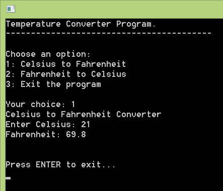

Another good way to practice your programing skills- Celsius to Fahrenheit converter. There is a good formula for the conversion which makes it easy to create converter programs. We have a basic console program...  
  
  
The cyclone named "Mohasen" (or Mahasen) is crossing Bangladesh. Unfortunately 4 people were dead because of this. Where I live it is a rainy weather here, but no sign of Mohasen here. But the weather is a excuse for today's post. I have a Thermometer in my room. Due to the rainy nature of weather it is 21 degree Celsius and 65 degree Fahrenheit here.  
  
I have a thermometer, that's why I got both Celsius and Fahrenheit temperature. But what happens when you got one of them? ...and you need the other? That's why the converters. [Celsius](http://en.wikipedia.org/wiki/Celsius) (or Centigrade) to [Fahrenheit](http://en.wikipedia.org/wiki/Fahrenheit) to Celsius converters are interesting programs. They use this simple formula and manage to convert temperature. It is pretty amazing!  
  
  

### Celsius and Fahrenheit

Celsius is usually used to measure the temperature of the climate/weather, and Fahrenheit is used to measure the temperature of the body. They have their different scales, so one temperature cannot be the same in both Celsius and Fahrenheit. So we have to convert between them to get the appropriate amount.  
  

### The Conversion

The converter formula is as follows:  
  
  
In the above formula  C refers to the Celsius and F refers to Fahrenheit. We can convert Celsius to Fahrenheit and back with the above function/formula.  
  
ReadLn(Cel);  
WriteLn('The converted Fahrenheit is: ' + FloatToStr((Cel \* 1.8) + 32));  
  
1.8 is replaced by 9/5. It is the same thing, because 9/5=1.8.  
  
Similarly, Fahrenheit to Celsius conversion:  
  
ReadLn(Fah);  
WriteLn('The converted Celsius is: ' + FloatToStr((Fah - 32) / 1.8));  
  
This is also a modification of the formula. Notice that the use of 1.8 is here as well. The 1.8 is divided instead of multiplying as the formula says. The division has reversed the 5/9 to 9/5. (Fah - 32) \* 5/9 is the same as (Fah - 32) / 9/5. So we use the same 1.8 because 9/5=1.8.  
  

### Example Program Code 

The program below is a simple code example of how to implement the formula. Create a new Program Project (Project-> New Project-> Program-> OK). Then copy-paste the code below then Run the Project (F9 or Run->Run).  
  

program proj\_cel\_fah\_converter;  
  
{$mode objfpc}{$H+}  
  
uses  
  {$IFDEF UNIX}{$IFDEF UseCThreads}  
  cthreads,  
  {$ENDIF}{$ENDIF}  
  Classes,  
  sysutils;  
  
var  
  userinput: string;  
  inputint: Integer;  
  Code: Integer;  
  
label  
  intro;  
  
begin  
  WriteLn('Temperature Converter Program.');  
  WriteLn('-----------------------------------------');  
  
intro:  
  WriteLn();  
  WriteLn('Choose an option:');  
  WriteLn('1: Celsius to Fahrenheit');  
  WriteLn('2: Fahrenheit to Celsius');  
  WriteLn('3: Exit the program');  
  WriteLn();  
  Write('Your choice: ');  
  ReadLn(userinput);  
  
  if userinput = '1' then begin  
    WriteLn('Celsius to Fahrenheit Converter');  
    Write('Enter Celsius: ');  
    ReadLn(userinput);  
  
    Val(userinput, inputint, Code);  
    if Code <> 0 then  
      goto intro  
    else  
      WriteLn('Fahrenheit: '+FloatToStr((inputint\*1.8)+32));  
  
    ReadLn;  
  
  end else if userinput = '2' then begin  
    WriteLn('Fahrenheit to Celsius Converter');  
    Write('Enter Fahrenheit: ');  
    ReadLn(userinput);  
  
    Val(userinput, inputint, Code);  
    if Code <> 0 then  
      goto intro  
    else  
      WriteLn('Celsius: '+FloatToStr((inputint-32)/1.8));  
  
    ReadLn;  
  
  end else if userinput = '3' then begin  
    WriteLn('Exiting...');  
    Exit;  
  
  end else begin  
    WriteLn('Wrong input!');  
    goto intro;  
  
  end;  
  
  WriteLn();  
  WriteLn('Press ENTER to exit...');  
  ReadLn;  
end.

  
**Explanation**  
label  
  intro;  
...  
intro:  
...  
  
We use a label so that we can get back to this point when we need to start over again. According to the code if the user enters an invalid input, the program starts from the beginning.  
  
  WriteLn('Choose an option:');  
  WriteLn('1: Celsius to Fahrenheit');  
  WriteLn('2: Fahrenheit to Celsius');  
  WriteLn('3: Exit the program');  
  WriteLn();  
  Write('Your choice: ');  
  ReadLn(userinput);  
  
The user is given 3 options. The first 2 would let the user select either Celsius to Fahrenheit converter or Fahrenheit to Celsius converter. The third option is to quit the program.  
  
    Val(userinput, inputint, Code);  
    if Code <> 0 then  
      goto intro  
    else  
      WriteLn('Celsius: '+FloatToStr((inputint-32)/1.8));  
  
The Val procedure tries to convert the input string to inputint (integer). If it cannot convert the string to Integer then it returns non-zero number in the Code variable. If an error occurs, we return to choices menu. That's why we have used a "intro" Label. If there is no error in the input then the conversion will take place.  
  
  

### Download Sample Code ZIP

You can download an example source code zip file from here: [http://db.tt/ZO5eXPFG](http://db.tt/ZO5eXPFG)  
Or here: [http://bit.ly/17yfRLm](http://bit.ly/17yfRLm)  
Size: 65 KB  
  
**Ref:**  
[http://www.freepascal.org/docs-html/ref/refsu48.html](http://www.freepascal.org/docs-html/ref/refsu48.html)  
[http://www.freepascal.org/docs-html/ref/refse7.html](http://www.freepascal.org/docs-html/ref/refse7.html)  
[http://www.planet-source-code.com/vb/scripts/ShowCode.asp?txtCodeId=259&lngWId=3](http://www.planet-source-code.com/vb/scripts/ShowCode.asp?txtCodeId=259&lngWId=3)