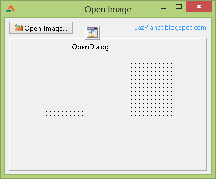
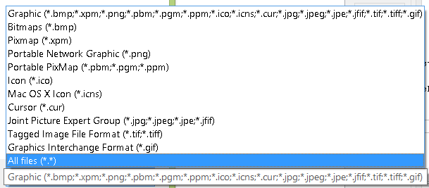
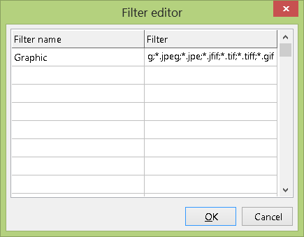
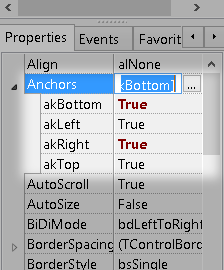
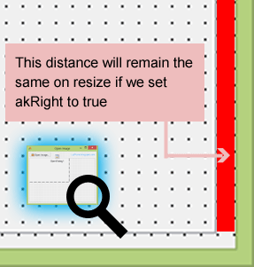

  
Today we are going to make a simple image viewer. It will have a lot of functionality but with only 5 lines of code!
<!-- more -->
  
  
Yes you heard it right! You can create a simple image viewer with only 5 lines of code (and that's by counting begin end lines). That's the beauty of Lazarus. The maximum customization is done through clicks, without coding. No wonder it is called a modern IDE.  
  
So lets go with the program.  
  
  

### Basic Structure

Create a new project (Project->New Project->Application->OK).  
  
The Form Layout will have a TBitBtn (from Additional tab), TImage (from Additional tab) and TOpenDialog (from Dialogs tab).  
  
Name the TBitBtn as btnOpen, TImage as Image1 and TOpenDialog as OpenDialog1.  
The layout would be something like this:  
  

  
Set the Image1's AutoSize property to true. That will resize the Image1 according to the image size.  
Now double click the tButton and enter:  
  

  OpenDialog1.Execute;  
  
  if (OpenDialog1.Files.Count = 1) and (FileExistsUTF8(OpenDialog1.FileName)) then  
  begin  
    Image1.Picture.LoadFromFile(OpenDialog1.FileName);  
  end;

  
First we make the open dialog to appear through the Opendialog1.Execute command. If the user selects 1 file and the file exists (user has not entered a filename by just guessing) then we load/open the image file to image1.picture. So simple!  
  

### First run

Run it now (F9 or Run->Run). Open images of various sizes or formats, play with it. May be you will notice that:  
1\. Large images go out of the form, so it needs scrollbars.  
2\. Some image formats are not supported and opening them gives an error and application faces a crash.  
  
**Issue 1:**  
We can add auto scrollbars with a magic component called TScrollBox. It is under the Additional tab. Drop it into the form. Now right click the Image1 and Cut. Then right click the ScrollBox1 and click Paste. ScrollBox works like a container. You can create and keep components inside it. And the best part is if some controls get bigger and out of the area of ScrollBox, then it shows scrollbars automatically to show all of the components.  
  
Move the Image1 at the top-left position. Now select ScrollBox and go to Properties. Change the HorzScrollBar->Tracking to true. Do the same to VertScrollBar->Tracking. Now the scroll will be live. By default it only scrolls when mouse click is up. Now the actual scrolling will occur when you drag the scrollbars.  
  
**Issue 2:**  
We can set the filter for the formats that TImage (a.k.a. Image1) supports. Select Image1. Try to change the picture (Select Picture->\[...\]->Load). You will see a bunch of formats to be opened (xpm, bmp, png, ico, cur, jpg, gif, tiff etc.)  
  

  
  
Select the OpenDialog1. Then Select Filter property and click on \[...\] button. You will see a lot of columns in a Filter Editor window. They are the combo menu items you are seeing in the above image. The first one will be selected by default. Click the first column and type Graphic, then click the other column and type all the formats:  
\*.bmp;\*.xpm;\*.png;\*.pbm;\*.ppm;\*.ico;\*.icns;\*.cur;\*.jpg;\*.jpeg;\*.jpe;\*.jfif;\*.tif;\*.tiff;\*.gif  
  

  
  
Add the other formats if you want. If you want to keep an option to open all files then add a filter with \*.\*. Then click OK.  
  

### Second Run

Run it (F9).  
  
Load images and test it.  
  
Now, if you load a large image you can scroll to every corner of the image. But it would be better if you could resize the form and make some space. You could maximize the form but the scrollbox is not resized with the form. We can easily make the scrollbox resize with the form resize and as I promised, no more codes except for the 5 lines.  
  
Select the ScrollBox. Select the Anchor property and set the four properties (akBottom, akLeft, akRight, akTop) as follows:  
  

  
Anchors work as a place where a specific corner of the component will stay during the resize. Usally the akTop and akBottom anchor is set to true. If we enable the akBottom anchor then the distance between the forms bottom edge and the component's bottom edge will remain same when the form is resized. If we enable akRight anchor then the distance between right edge of the component and the right edge of the form will be the same on form resize.  
  

  
The icon that I have used for the open button comes from the [Silk Companion Icon pack available here](http://damieng.com/creative/icons/silk-companion-1-icons). You can set the Glyph property of the btnOpen object to show an icon of your choice.  
  

### Third and Final run

  
Now we can have a final run. I hope you will be happy with the results. You have got an image viewer having: scrollbars for large images,  
resize window resizes the image viewer area,  
open button having a nice icon which opens a dialog with appropriate filters etc.  
  

### Download Sample Code zip

Download the example source code zip file from here: [http://db.tt/nivChy58](http://db.tt/nivChy58)  
Or here: [http://bit.ly/ZxpHFz](http://bit.ly/ZxpHFz)  
Size: 527 KB  
  
The zip file contains compiled executable EXE file.