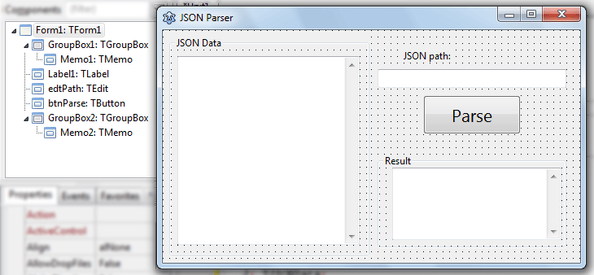
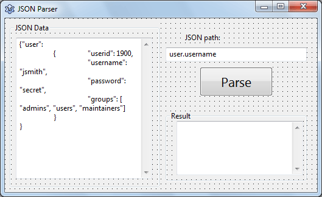
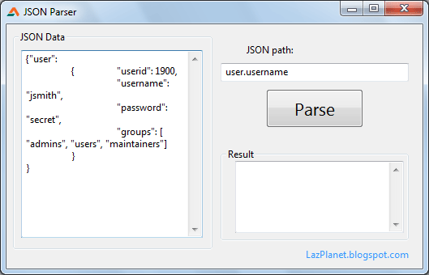

Can't get enough of JSONs? Crunch some JSON data with this simple code!
<!-- more -->
  
  
[JSON](http://wiki.freepascal.org/JSON) is a very common data format now a days, especially in various APIs. [JSON](http://en.wikipedia.org/wiki/JSON) or [JavaScript Object Notation](http://www.json.org/) is a comma seperated data writing format. It is easy for the humans to read & write. It is easy for the machines to read & write. So it is a d@mn good format to put data in. See this example and you'll get the idea:  
  

{  
    "name1": value1,  
    "name2": value2  
}

  
As you can see, the value is written in quotes followed by a colon (:) sign, followed by a value is the basic structure. It is an example straight from the [wiki](http://wiki.freepascal.org/JSON). Here's another one from the wiki:  
  

{"user":  
    {    "userid": 1900,  
        "username": "jsmith",  
        "password": "secret",  
        "groups": \[ "admins", "users", "maintainers"\]  
    }  
}

  
Seems complex at first. But as you can see, it is very straight forward. It is fairly simple, especially when compared to other text based data structures such as [XML](http://wiki.freepascal.org/XML_Tutorial). Oh boy! Newbies have a nightmare writing XML codes. Those sharp-edged, pointy angle brackets are not something which is easy to their eyes!  
  
But JSON is very simple. It can be broke down into several points:  
  
\- When you want to write a group of data you use a curly brackets ( { } ).  
\- The whole data is considered as a group and so it is **enclosed in 2 curly brackets**, always. (Even when there is only one name/value pair.)  
\- Then you write **names** of values and then **values**. You separate them with a colon (:)  
\- If you write a string anywhere, use double quotes ( " " ). And if you write numeric data, don't use it.  
  
  
That's it! So simple.  
  
How about a simple pascal example to go with it? Okey, let's get to it!  
  

### 2 Lines Code Example

Start [Lazarus](http://lazarus.freepascal.org/). Create a new Application Project (Project -> New Project -> Application -> OK).  
  
Switch to Code View (F12). Add fpjson and jsonparser to the uses. These are units which has functions to work with JSON.  
  

uses  
  ..., fpjson, jsonparser;

  
Now switch to Form View (F12). Now double click the form and enter the following code:  
  

procedure TForm1.FormCreate(Sender: TObject);  
var  
  json: String;  
  J: TJSONData;  
begin  
  // We hold our json data in a string.  
  // The variable "json" is a string type.  
  // We can also use TJSONStringType instead of string.  
  json:='{"user":'+  
    '{    "userid": 1900,'+  
        '"username": "jsmith",'+  
        '"password": "secret",'+  
        '"groups": \[ "admins", "users", "maintainers"\]'+  
    '}'+  
  '}';  
  
  // We send our JSON data to TJSONData. This is line 1 of our code.  
  J:=GetJSON(json);  
  
  // We show the username from the data  
  // FindPath returns TJSONData  
  // So we use .AsString to convert it to string. This is line 2.  
  Caption :=  J.FindPath('user.username').AsString;  
end;

  
So you see it! We have a perfectly working example of JSON parsing with barely 2 lines of code. Lazarus is that good!  
  
Now go ahead and Run the project (F9 or Run-> Run). You will see jsmith in the titlebar of your form. Neat!  
  

### Extending the example

We have seen a basic example. Now its time to extend it. We will build a program to let us paste json data in it and query different paths. This will help us test various API responses and get a good idea which path will work best for us.  
  
So, go ahead and create a new Application Project (Project -> New Project -> Application -> OK). That's easy!  
  
Now, as before, add fpjson and jsonparser to the uses:  
  

uses  
  ..., fpjson, jsonparser;

  
Switch to Form view and draw 2 TMemo. Memo1 should be on the left and Memo2 should be on the right. Set their ScrollBars to ssAutoVertical in order for them to be scrollable. You can use TGroupBox to decorate any way you like.  
  
Now draw a TEdit and a TButton on the form. They should appear as Edit1 and Button1. Change their name as edtPath and btnParse to have a identifiable layout. Use any TLabels if you think they are appropriate, even a TGroupBox is good. My form looks like this:  
  

  
You can set some default values. For that change the Memo1's Lines as the code below:  
  

{"user":  
    {    "userid": 1900,  
        "username": "jsmith",  
        "password": "secret",  
        "groups": \[ "admins", "users", "maintainers"\]  
    }  
}

  
Set edtPath's Text property as: `user.username`  
And blank out the Memo2's Text property.  
  
And you may want to change the Form's Caption as well, that's no surprise!  
  
Now your form may look like this:  
  

  
Now double click the button and enter:  
  

procedure TForm1.btnParseClick(Sender: TObject);  
var  
  J: TJSONData;  
begin  
  // Parse JSON Data to TJSONData  
  J:=GetJSON(Memo1.Text);  
  // Get the value for the path in edtPath  
  Memo2.Text:=J.FindPath(edtPath.Text).AsString;  
end;

  
Again, only 2 lines of code does the trick!  
  
Now Run it (F9 or Run-> Run).  
  

  
  
  
Noe click the Parse button. You should see jsmith in the Result. It works graciously. But what if the path does not exist? Try out with some random path and you will see an SIGSEGV error.  
  
To fix it, add a [simple try ... except block](http://wiki.freepascal.org/Logging_exceptions#Manual_exception_handling) in your code, like this:  
  

procedure TForm1.btnParseClick(Sender: TObject);  
var  
  J: TJSONData;  
begin  
  
  try  
    // Parse JSON Data to TJSONData  
    J:=GetJSON(Memo1.Text);  
    // Get the value for the path in edtPath  
    Memo2.Text:=J.FindPath(edtPath.Text).AsString;  
  
  except  
    on E: Exception do ShowMessage('Error finding path!');  
  
  end;  
  
end;

  
You will not see the message when running from inside Lazarus. To test it, save the project somewhere and run it from Lazarus, then double click the .exe from the explorer. Then enter a random string to test if the message box appears.  
  
Now you are ready parse some serious JSON goods!  
  
If you want to learn more advanced ways to parse you will find some other examples here: [http://svn.freepascal.org/cgi-bin/viewvc.cgi/trunk/packages/fcl-json/examples/](http://svn.freepascal.org/cgi-bin/viewvc.cgi/trunk/packages/fcl-json/examples/)  
  
  

### Download Sample Code ZIP

You can download the above tutorial project's example source code from [here](https://www.dropbox.com/s/88zq6rl5xmvhh0b/JSONParser.zip?dl=1)  
Or here: [http://bit.ly/json-parser](http://bit.ly/json-parser)  
Size: 720 KB  
The package contains compiled executable EXE file.  
  
**Ref:**  
[http://wiki.freepascal.org/JSON](http://wiki.freepascal.org/JSON)  
[http://www.freepascal.org/docs-html/fcl/fpjson/index.html](http://www.freepascal.org/docs-html/fcl/fpjson/index.html)  
[http://svn.freepascal.org/cgi-bin/viewvc.cgi/trunk/packages/fcl-json/examples/](http://svn.freepascal.org/cgi-bin/viewvc.cgi/trunk/packages/fcl-json/examples/)