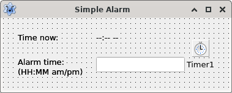
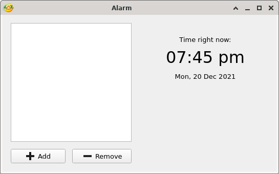

Alarm clocks are simple but very useful in our daily lives, right? How about if we make our own?
<!-- more -->

I work on my computer very often. So it gets easy for me to forget things. I need alarm clocks to remind me of time sensitive things. It might be simple as reminding me to turn of the stove after the water gets boiled, to feed the pet, water plants etc. Alarm clocks are handy for me.

Like me, I think you have many uses for one too. So today let's see how we can create an alarm clock in Lazarus.

The concept is simple. If we break it down a little bit an alarm app does these 2 basic things:
- Keep a list of alarm times
- Check if it is time to ring any of the listed alarms

Really easy, right?

So let's get our hands dirty with a simple version of the alarm...


### Basic Tutorial

Start [Lazarus](https://lazarus-ide.org/).

Create a new Program project (**Project - New Project - Application - OK**).

Create this simple layout:



Just draw a **TLabel**, a **TEdit** and a **TTimer** (from System tab). They'll probably be named Label1, Edit1 and Timer1 consecutively. Empty **Text** property of **Edit1** and set `--:-- --` as **Caption** of **Label1**. Optionally, set **Caption** property of **Form1** to something like "**Simple Alarm**". You can also set **Project - Project Options - Project Options - Application Settings - Title** to **Simple Alarm**.

Then draw as many TLabels as you want to indicate what element does which. Let them take any name that comes in automatically. In this case two TLabels for "Time now:" and "Alarm time:" are what you'd want to create.

Now double click **Timer1** and enter:

```pascal
procedure TForm1.Timer1Timer(Sender: TObject);
begin
  Label1.Caption := FormatDateTime('hh:nn am/pm', Time);

  if Edit1.Text = Label1.Caption then begin
    ShowMessage('Alarm rings!!');
    Close;
  end;
end;
```

Now press F9 (or Run - Run) and input a time for your alarm. Be cautious to follow the exact format (HH-MM am/pm). e.g. "08:45 pm". Then wait.


It should show a message when it hits the time you entered. After you click OK the program will close itself.


It is as simple as that.

But it would be nice if we could have multiple alarms and inputs could be little easier. That's why we'll be making an advanced version of an alarm clock next...


### Tutorial

Start [Lazarus](https://lazarus-ide.org/).

Create a new Application project (**Project - New Project - Application - OK**).

Draw TLabel, TListBox, TBitBtn (from Additional tab), TTrayIcon (from Additional tab), TTimer (from System tab) components like the screenshot below:


Set the `Name` property of the TListBox to `lstAlarms`, one TBitButton to `btnAdd` and another to `btnRemove`. Set `Name` of the second TLabel to `lblTime` and the third one to `lblDate`.

Set `Caption` property of TLabels and TBitBtns according to screenshot. Set `AutoSize` property to `False` and `Alignment` to `taCenter` for TLabels, then resize them to same size. This is so that the TLabels stay center.

Set `MultiSelect` property of **lstAlarms** to `True` to allow selecting multiple items and remove them at once. Set `Font -> Size` property of **lblTime** to `24`. Set `Interval` property of `Timer1` to `5000`. Set `BalloonHint` to `Alarm` and `Visible` to `True` for `TrayIcon1`.

Optionally, you can set the `Glyph` property of TBitBtns and `Icon` property of TTrayIcon. I found CC0 licensed icons from [Aiconica](https://aiconica.net/) and resized to 16px x 16px size (`convert input.png -background transparent -resize 16x16 output.png` or `ffmpeg -i input.png -pix_fmt rgba -s 16x16 output.png`) and used them. The files are included in the `images` directory in the project source code. But you can use other ones as you wish.

Double click `Timer1` and enter:

```pascal
procedure TForm1.Timer1Timer(Sender: TObject);
var
  i: Integer;
  TimeStamp: string;
  AlarmData: TStringArray;
begin
  // Show current time
  lblTime.Caption:=FormatDateTime('hh:nn am/pm', Time);
  // Show current date
  lblDate.Caption:=FormatDateTime('ddd, d mmm yyyy', Date);

  // Get the current timestamp to compare with each alarm time
  TimeStamp := FormatDateTime('hh:nn am/pm', Time);
  // Loop through the alarm list to see if it's time to ring the alarm!
  for i := 0 to lstAlarms.Items.Count - 1 do begin
    // Check if the list item exists. We have to check this in case any previous
    // alarm triggered and some list item removed.
    if i < lstAlarms.Items.Count then begin
      AlarmData := lstAlarms.Items[i].Split('-');
      //ShowMessage(Trim(AlarmData[0]) + ' - ' + TimeStamp);
      if Trim(AlarmData[0]) = TimeStamp then begin
        // We remove the alarm, so that it doesn't ring again
        lstAlarms.Items.Delete(i);
        // We show the alarm message
        ShowMessage('Alarm rings!'#13#10#13#10
                    + 'Alarm time: ' + AlarmData[0] + #13#10
                    + 'Alarm hint: ' + AlarmData[1]);
      end;
    end;
  end;
end;
```

The above is the lifeblood of this project. It shows the time, date and most importantly rings the alarm when the time is detected to be alarm trigger time.

Switch to Form View (F12) and double click the form and enter:

```pascal
procedure TForm1.FormCreate(Sender: TObject);
begin
  // Load alarm list from alarmlist.dat file
  lstAlarms.Items.LoadFromFile(Application.Location + DirectorySeparator + 'alarmlist.dat');

  Timer1Timer(Sender);
end;
```

The `LoadFromFile` command will load the file `alarmlist.dat` into `lstAlarms`. You can use `'/'` instead of `DirectorySeparator`. But this is the proper solution because it changes according to platform (e.g. becomes `\` on Windows and `/` on Linux distros or Unix).

`Timer1Timer(Sender);` just calls the Timer1's OnTimer procedure. This is so that the time display gets updated on launch of our app.

Now on Object Inspector, go to Events and click on **[...]** button beside **OnClose** and enter:

```pascal
procedure TForm1.FormClose(Sender: TObject; var CloseAction: TCloseAction);
begin
  // Save alarm list to file alarmlist.dat on the same directory as the executable/exe
  lstAlarms.Items.SaveToFile(Application.Location + DirectorySeparator + 'alarmlist.dat');
end;
```

This is to save the alarms users created to `alarmlist.dat` file so that the app can load it when it launches next time.

Click **[...]** button next to **OnWindowStateChange** and enter:

```pascal
procedure TForm1.FormWindowStateChange(Sender: TObject);
begin
  // If minimized, make form invisible
  Visible := not (WindowState = wsMinimized);
end;
```

This gives you a nice feature that when you minimize the form it hides itself and gets out of your workflow. We have a TTrayIcon to show a little tray icon while it is minimized. Now we want to make the form visible again when the form is unminimized. So, switch to Form view (F12), double click **TrayIcon1** and enter:

```pascal
procedure TForm1.TrayIcon1Click(Sender: TObject);
begin
  // Restore from minimized state when tray icon is clicked
  WindowState := wsNormal;
  // Above command doesn't make the form visible, so we need to make it visible
  Visible := True;
end;
```

Now we'll create our  for setting alarms. Go to **File - New Form**. We had Unit1 for Form1 before. After this, a new form will be created named Form2 and with it a new unit file called Unit2. A little tip. You can click **Project - Forms** (Shift+F12) to switch between forms if other ways of navigating between forms is not working for you. You can then use F12 to switch to code view for that form.

Now find the `implementation` clause on Unit1 (you should find a tab on source editor, or if not, Ctrl+F12, double click Form1, F12) and make it look something like this:

```pascal
implementation

uses
  Unit2;
```

Now we will be able to use Form2's components in our code in Form1. With that out of the way let's create components on Form2. Here is a screenshot of the components for Form2:


Create 1 TEdit, 3 TListBoxes, 1 TLabel and 2 TBitBtns. Set `Name` property of the TEdit to `edtHint`; TListBoxes to `lstHour`, `lstMinute` and `lstampm`; TLabel to `lblTimeHint`, 2 TBitBtns to `btnOK` and `btnCancel`. Add other TLabels as needed and change `Caption` properties to make your form look similar to the above screenshot.

Select **lstHour** and set it's **Items** property to:

```
01
02
03
04
05
06
07
08
09
10
11
12
```

Select **lstMinute** and set it's **Items** property to:

```
01
02
03
04
05
06
07
08
09
10
11
12
13
14
15
16
17
18
19
20
21
22
23
24
25
26
27
28
29
30
31
32
33
34
35
36
37
38
39
40
41
42
43
44
45
46
47
48
49
50
51
52
53
54
55
56
57
58
59
60
```

Select **lstampm** and set it's **Items** property to:

```
am
pm
```

Select the form (Form2), go to **Object Inspector - Events** and click **[...]** beside **OnShow** and enter:

```pascal
procedure TForm2.FormShow(Sender: TObject);
var
  parts: TStringArray;
begin
  // Empty the last inputted hint
  edtHint.Text := '';

  // Get time elements
  parts := FormatDateTime('h|m|am/pm', Time).Split('|');

  // Select current hour
  lstHour.Selected[ StrToInt( parts[0] ) - 1 ] := True;

  // Select current minute
  lstMinute.Selected[ StrToInt( parts[1] ) - 1 ] := True;

  // Select current am/pm
  if parts[2] = 'am' then
    lstampm.Selected[ 0 ] := True // select am
  else
    lstampm.Selected[ 1 ] := True; // select pm
end;
```

This basically prepares the form for the user. Don't you hate it when alarm apps just choose the first hour, minute etc. in the input? So we select the current hour, minute etc. so that user can easily adjust from there. We also empty the hint input.

We're using [`FormatDateTime()`](https://www.freepascal.org/docs-html/rtl/sysutils/formatdatetime.html) to create a timestamp string of current time with `|` in middle of different parts. That's on purpose. We use that `|` (pipe character) to split the string into different elements. We then use these elements for setting selection of each element to appropriate input. `StrToInt( parts[0] ) - 1` is just a clever way to convert the current hour value to list index number. Index numbers are zero based, so we subtract 1 from hour value. `StrToInt( parts[1] ) - 1` is similar but just for the minute.

Pay attention that we're using the `OnShow` event instead of `OnCreate` (which is created by double clicking the form), because `OnCreate` event runs on project startup. But `OnShow` runs everytime we show the form, meaning everytime the user will click the Add button. If we ran the above commands on `OnCreate` the hint would just empty on project startup and everytime user clicks add it would show the last input. By using `OnShow` we're emptying that every time the `Form2.Show` is run. Same with time inputs. We update the time selection every time the form is shown.

Now we look to update the time hint label when the user selects a time.

Switch to form view (F12) and select **lstHour**, go to **Object Inspector - Events** and click **[...]** beside **OnSelectionChange** and enter:

```pascal
procedure TForm2.lstHourSelectionChange(Sender: TObject; User: boolean);
begin
  lblTimeHint.Caption := lstHour.GetSelectedText + ':'
                         + lstMinute.GetSelectedText + ' '
                         + lstampm.GetSelectedText;
end;
```

Now select **lstMinute** and **lstampm** and enter `lstHourSelectionChange` in the input beside **OnSelectionChange**.

We got most of the functionality done for Form2. We just have the OK and Cancel buttons to cover. That's easy. Just double click **btnOK** and enter:

```pascal
procedure TForm2.btnOKClick(Sender: TObject);
begin
  ModalResult:=mrOK;
end;
```

Then double click **btnCancel** and enter:

```pascal
procedure TForm2.btnCancelClick(Sender: TObject);
begin
  ModalResult:=mrCancel;
end;
```

When we show Form2 from Form1 and when user clicks either OK or Cancel, we need a way to know from Form1 which button the user clicked. These are just a way of sending that information to Form1. Which will be clear in a minute...

Switch to **Form1**'s form view (Shift+F12), double click **btnAdd** and enter:

```pascal
procedure TForm1.btnAddClick(Sender: TObject);
var
  AlarmText: string;
begin
  if Form2.ShowModal = mrOK then begin
    AlarmText := Form2.lstHour.GetSelectedText + ':'
        + Form2.lstMinute.GetSelectedText + ' ' + Form2.lstampm.GetSelectedText
        + ' - ' + Form2.edtHint.Text;
    lstAlarms.Items.Add(AlarmText);
  end;
end;
```

So basically this is checking if the user clicked the OK button and adding the alarm if so.

Now run the project (Run - Run or F9).



Click Add to create alarms.


Play around to your heart's content!

If you want to play a sound when your alarms ring, you can try [this](https://wiki.lazarus.freepascal.org/Play_Sound_Multiplatform) or [any of the solutions that work for you](https://wiki.lazarus.freepascal.org/Multimedia_Programming#Playing_Sound).


**Ref:**
\- Date and time formatting reference: <https://www.freepascal.org/docs-html/rtl/sysutils/formatchars.html>
