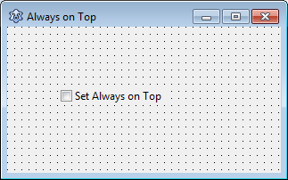
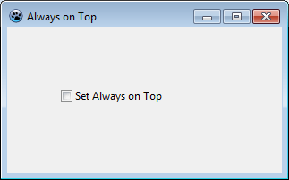
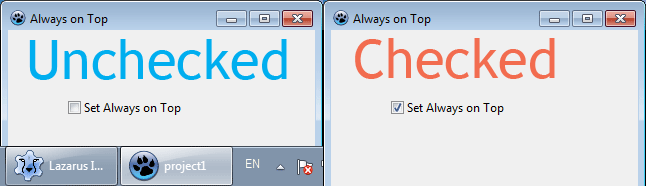

We learn how to make our forms stay Always on Top so that it always stays shown on screen. It is good for projects where live information is shown or sometimes just for fun!
<!-- more -->


Sometimes we need to set the form to Always on Top, so that the form doesn't get behind other windows and stays on top all the time. We want it when the form is important and we want to keep an eye on it all the time.

It is very easy. We have a Form property just to make it stay Always on Top. The property is **FormStyle**. We can set it to **fsSystemStayOnTop** to make it stay on top. And then set it to **fsNormal** to cancel the Always on Top behaviour.

We also have a fsStayOnTop in FormStyle property. But it has a limitation. It is clearly stated [in the wiki](http://wiki.freepascal.org/Lazarus_0.9.30_release_notes#LCL_Changes):

> **fsSystemStayOnTop \[...\] is same as with fsStayOnTop except that fsStayOnTop is form on app top, so when application deactivates fsStayOnTop is not on top of other application(s), fsSystemStayOnTop is always on top.


So, now that we learned that we can put together a nice simple project for it to be tested...


### Tutorial

Create a new Application Project (**Project -> New Project -> Application -> OK**).

Draw a **TCheckBox** on the form. Set its **Caption** to something like: "**Set Always on Top**". Since there are less components on the form, you can resize it to a smaller size.





Now, what we want to do is, when the user checks the Checkbox, we want to set the form to Always on Top. We will cancel the Always on Top after the user unchecks the Checkbox. This would allow the user (or us!) to test the Always on Top feature.

So, double click the CheckBox and enter:

```pascal
  if CheckBox1.Checked then
    FormStyle:=fsSystemStayOnTop
  else
    FormStyle:=fsNormal;
```

First, we check if the Checkbox is checked. If it is checked, we set the `Form1.FormStyle` to `fsSystemStayOnTop`. (We can ommit `Form1` and only write `FormStyle :=...` because we are writing inside a TForm1's own procedure.) On the other hand, if the Checkbox is unchecked, we would make the form normal again by setting `FormStyle` to `fsNormal`.

Well, we are done. It was a very beginner tutorial but a lot of the Lazarus programers don't know it.


### Test it

Now press F9 (or **Run->Run**) to run the project.





Check it and uncheck it. Click to focus on other windows and check if it works. One way to test Always on Top is to move your form over the Taskbar and check and uncheck it.





Have fun!
