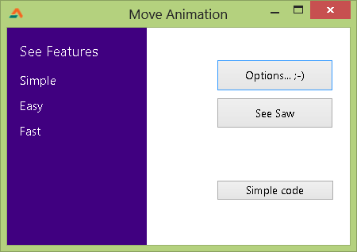

You have seen Windows 8 panels sliding and disappearing in and out of the screen. Now create such effects for your program! Here's a handy little procedure...
<!-- more -->
  
  
  
Animation amazes us, entertains us, and it takes our breath away sometimes. It is a glamor in your app and an eye catcher as well.  
  
You can move components with a for...do loop with using sleep. I agree, creating animation procedures are a bit hard. But you can always start small, create a working demo, then extend with implementing many conditions and tweaks.  
  

### Quick Tutorial

We will first try an example without a procedure. If you understand this one, you will probably understand the sample code with the procedure. (This will be my excuse to not explain the actual procedure! ;-) )  
  
Create a new application project (Project->New Project->Application->OK).  
  
Create a TButton. Double click it and enter:  
  

var  
  i: Integer=1;  
  step: Integer=5;  
  
begin  
  
  while i <= 250 do begin  
  
    Button3.Left := i;  
    Repaint;  
  
    // We spare some time...  
    Sleep(1);  
  
    Inc(i, step);  
  
  end;  
  
end;

  
Now some explanation...  
  
**Explanation:**  
  
  i: Integer=1;  
  
We start our animation from Left:=1;  
  
  step: Integer=5;  
  
step is the increment for every loop. You can increase it to increase speed.  
  
  while i <= 250 do begin  
  
We will stop our animation when the Button's Left = 250.  
  
    Button3.Left := i;  
  
We will change the button's left value (we move the button according to the value of i).  
  
    Repaint;  
  
We can also use Form1.Repaint. This will not leave any marks of the previous position. To see what it does, comment this line and Run the Project.  
  
    // We spare some time...  
    Sleep(1);  
  
We use sleep so that the animation does not end in milliseconds! We take some time so that every step gets some time to show. That's the motto of animation, right? If you can't see it, it is not animation.  
  
    Inc(i, step);  
  
And then we increase the value of i by step. If you use greater values for step, the Left value will advance with a greater amount with every loop. If 5 steps takes (100 / 5 =) 20 loops, then 10 will take (100/10=) 10 loops. So animation will be faster when step is 10, because there is less loops needed to finish the animation.  
  

### The Procedure used in Sample Code

We use a procedure in our sample code. It is nothing but an enhancement of the above one. But the basics remain the same. The procedure is as follows:  
  

procedure TForm1.MoveAnimation(moveobj: TComponent;  
  leftfrom: Integer; leftto: Integer;  
  topfrom: Integer; topto: Integer);  
  
var  
  i: Integer;  
  step: Integer=5;  
  moveareax, moveareay: integer;  
  
begin  
  i := 1;  
  moveareax := leftto - leftfrom;  
  moveareay := topto - topfrom;  
  
  while i <= 100 do begin  
  
    tbutton(moveobj).Left := round(leftfrom + (moveareax \* i / 100));  
    tbutton(moveobj).Top := round(topfrom + (moveareay \* i / 100));  
    Repaint;  
  
    Sleep(1);  
  
    // we exit the while...do loop when our work is done  
    if i >= 100 then  
      Exit;  
  
    Inc(i, step);  
    if (100 - i) < step then  
      i := 100;  
  
  end;  
  
end;

  
And we use it by:  
  

  MoveAnimation(Panel1, -Panel1.Width, 0, 0, 0);

  
Here, the parameters are:  
1\. Component to be animated/moved  
2\. The left position to start the animation  
3\. The left position to end the animation  
4\. The top position to start the animation  
5\. The top position to end the animation  
  
Download, Extract and Run the sample code (F9 or Run-> Run).  
  

  
  
You can click the Options button to see the animation of our procedure. We also have a seesaw animation effect, where the Panel in our example moves from one side to another repeatedly.  
  
The procedure described in the Quick Tutorial above is in action in the Sample Code button.  

Image: [iconshock.com](http://www.iconshock.com/img_jpg/STROKE/graphics/jpg/128/animation_icon.jpg)
