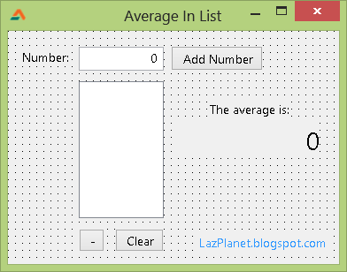
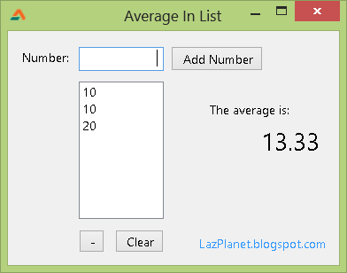

Average calculation is an easy formula to practice your programing skills. We have seen a  of unlimited numbers, now its time for a GUI project.
<!-- more -->


Yesterday you have seen a [Free Pascal](http://www.freepascal.org/)  using Lazarus. We have used a `while` do loop to calculate the final result. It is much more easier to create such a program in GUI ([Graphical User Interface](http://en.wikipedia.org/wiki/Graphical_user_interface)).


### What we will do

In our little program we will have a `TEditBox`. The user will type in the numbers and press enter. After pressing enter, the number will be automatically added to the list and the average will be calculated automatically.





We will need the basics of list management-  (because we will add the input numbers to a ListBox) and . And for enhancing the program we also add a Remove from list button **[ - ]** and a **Clear** button for clearing the list and starting new calculation.


### Tutorial

Add a `TEditBox`, `TListBox`, 3 `TButton`s, 3 `TLabel`s. Set their properties like the following:

**TEditBox:**
Alignment : taRightJustify
Name : edtNumber
TabOrder : 0  (Because we want the focus to be in this component when run.)

**TListBox:**
Items : (Click the \[...\] button and clear all the lines)
MultiSelect : True
Name : ListBox1

**TButton (1):**
Caption: Add Number
Name: btnAdd

**TButton (2):**
Caption: -
Name: btnRemove

**TButton (3):**
Caption: Clear
Name: btnClear

**TLabel (1):**
Caption: Number:

**TLabel (2):**
Caption: The average is:

**TLabel (3):**
Alignment: taRightJustify
Autosize: False
Caption: 0
Font.Size: 18
Name: lblAverage

Position the components according to the screenshot.

Double click the `btnAdd` and enter the commands:

```pascal
var
  Number, Code : Integer;
begin
  Val(edtNumber.Text, Number, Code);

  if Code <> 0 then begin
    ShowMessage('Enter only integers.');
  end else begin
    ListBox1.Items.Add(edtNumber.Text);
    // Scroll to the last item of the listbox
    ListBox1.TopIndex := -1 + ListBox1.Items.Count;
  end;

  edtNumber.Text:='';
  edtNumber.SetFocus;

  CalcAverage;
end;
```

Add the following procedure under `{$R *.lfm}` line:

```pascal
// This procedure calculates the average of the
// numbers that are in Listbox1
procedure TForm1.CalcAverage();
var
  sum: Integer = 0;
  i: Integer;
  count: integer; // how many numbers to average?
  average: single; // we use single because average may have decimal places
begin

  count := ListBox1.Items.Count;

  if count <> 0 then begin

    for i := 0 to count - 1 do begin
      sum := sum + StrToInt(ListBox1.Items[i]);
    end;

    average := sum / count;
    lblAverage.Caption := FormatFloat('0.00', average);

  end else begin
    // if there is no number in the list
    lblAverage.Caption := '0';

  end;

end;
```

Then keep your cursor on `CalcAverage()` and press **Ctrl+Shift+C**. A declaration for the procedure will be created at the top of the code / unit. We can now use the procedure in our code.

Select `edtNumber` and go to **Object Inspector** then click the **Events** tab. Click the `[...]` in front of `OnKeyPress` and enter the following command:

```pascal
begin
   // if the user presses enter...
   if (Key = chr(10)) or (Key = chr(13)) then begin
     btnAddClick(edtNumber);
   end;
end;
```

It will add the number input to the list when user presses Enter key from keyboard. With the `btnAddClick(edtNumber);` the command in `btnAdd`'s click event is run.

Double click the `btnRemove` and enter:

```pascal
var
  i: integer;
begin
  if ListBox1.SelCount > 0 then begin

    // we go through all the list items
    For i := ListBox1.Items.Count - 1 downto 0 do
      // if we found a selected item...
      if ListBox1.Selected [i] then
        // ...delete it
        ListBox1.Items.Delete (i);

    // Re-calculate the average after removal
    CalcAverage;

  end else begin
      ShowMessage('Please select an item first!');

  end;
end;
```

Double click `btnClear` and enter:

```pascal
begin
  ListBox1.Clear;
  CalcAverage;
end;
```

Now Run the program (**F9** or **Run -> Run**).





Now input numbers and press enter. You will see the average of the numbers in the `lblAverage`.

The code is pretty much self explanatory. For further explanations of the code you can look at the  and  example. You can also extend the capacity of the program by by declaring sum, count, and average variable in the `CalcAverage` procedure, with a variable type of greater capacity.
