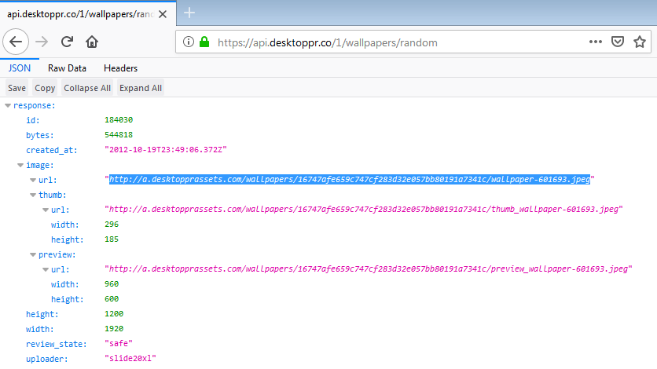
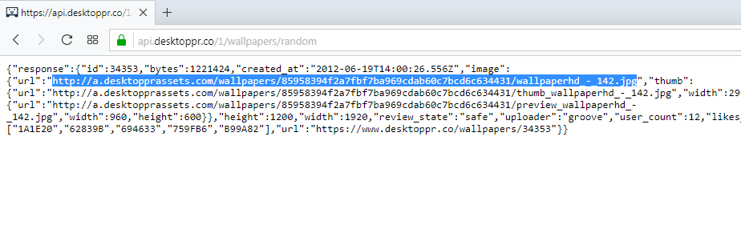
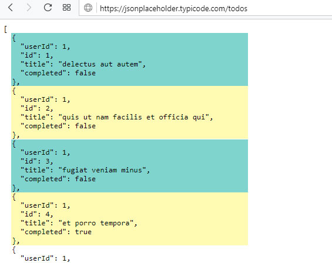
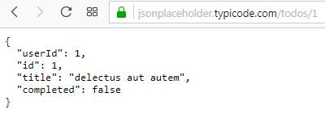
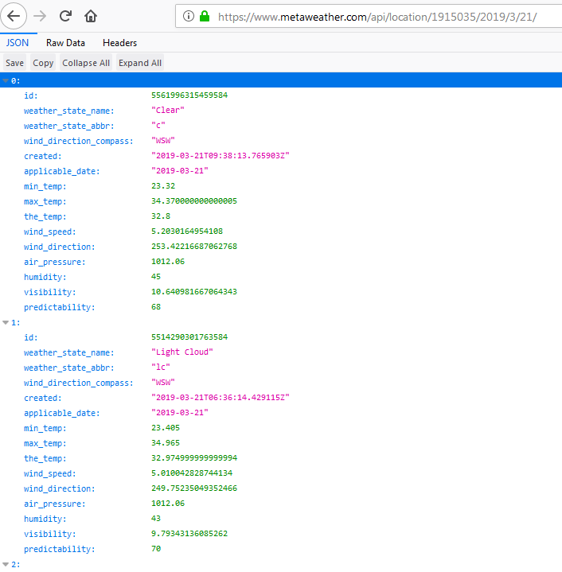
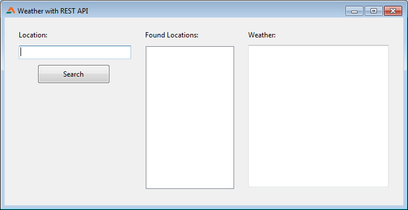
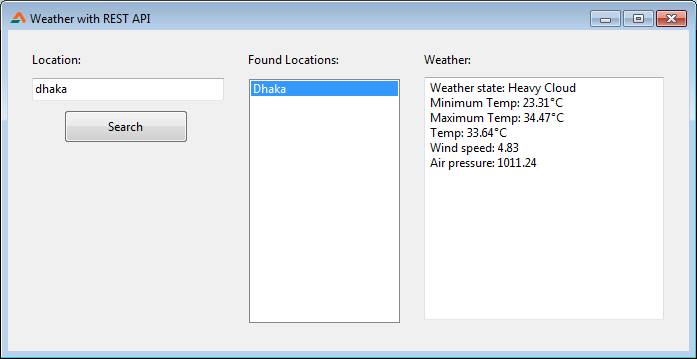

REST APIs are "the thing" to learn these days. But how should we get it to work on Lazarus? Let's see...
<!-- more -->
  
Does the word API ring any bell? If it doesn't, it means Application Programming Interface. If you have a service that you want to allow people to get access to, then you need a "standard" way to send or get the data. We need a standard so that everyone follows the standard and requests the data same way and gets the same result. This "standard" is called API. Think of it as a bridge between you and the service.  
  
As you may know, Windows has an API. Windows API is very common. You can control many aspects of Windows with the API (for example, [hiding the taskbar](http://localhost/wp-lazplanet/2014/02/20/how-to-show-hide-the-windows-taskbar-with-lazarus/), [make some window transparent](http://localhost/wp-lazplanet/2013/05/11/create-a-form-fade-in-effect/) etc.) Similarly there are APIs for Facebook, Twitter, Instagram and many other popular services. These APIs allow people like us to communicate with the services and send various commands. For example, we can send a command from our app to post a photo to Facebook. This way we can automate things and customize how we want the service to work.  
  
REST API is just a fancy name for a URL based API service. With REST API we send commands to a service through URLs. When we access these URLs, the software on the server will then process the URL and the information within the URL then give you some results.  
  
Simple, right?  
  
It is extremely easy and a great option for a simple API implementation to allow access to data. Any basic language, even [Javascript](https://en.wikipedia.org/wiki/JavaScript) (popular script language used in websites) is [able to request for data and process the results](https://marmelab.com/blog/2015/03/10/deal-easily-with-your-rest-api-using-restful-js.html) just fine. So everyone loves it these days.  
  
You can test a REST API interface right now. Go to this URL: [https://api.desktoppr.co/1/wallpapers/random](https://api.desktoppr.co/1/wallpapers/random)  
  
The URL is basically asking for 1 wallpaper that is random. So after you access URL, the desktoppr.co server goes through its database and finds 1 random wallpaper from the collection of wallpapers they have and then returns a JSON response with information of the wallpaper.  
  
You will see many data in the output. If you are on Chrome or Chrome based browser, you will see a plain text output. If you are on Firefox you will see a organized output with JSON variable names and values beside them, something like this:  
  

  
On the above screenshot you will see some "url" values. The first "url" value is the wallpaper URL.  
  
On the output for Chrome or browsers other than Firefox, press Ctrl+F and search for the word "url" and find its value, something like this:  
  

  
You will find a link to image file. Copy the link and open it. You will find a random wallpaper. So, the system is working. desktoppr.co has a REST API setup for us and it is giving us data when we access special URLs.  
  
There are many other APIs similar to this. This API is public, but there are other REST APIs which require sign ups and API Keys to pass with the URL so that the server can detect any misuse of the service. But basics are the same.  
  
But how did I find this special URL? - You might ask. I found it here: [https://www.desktoppr.co/api](https://www.desktoppr.co/api)  
Every REST API has a documentation saying which URL structure you need to use with the service. Everytime you need to implement a REST API you can search on the internet for this reference for the API you want to implement.  
  
Also, we have covered some of the [basic things needed for REST API](http://localhost/wp-lazplanet/2019/03/15/how-to-get-contents-of-a-url-in-2-ways/). So don't worry, we've got you covered for almost everything for REST API.  
  
Now that we got the hang of the basics, let's dive into a semi-tutorial now...  

### Semi-tutorial

Start [Lazarus](https://www.lazarus-ide.org/).  
Create a new Application project (**Project - New Project - Application - OK**).  
Now save the project with **File - Save All**, in a folder for the project.  
  
Download and extract the **libeay32.dll** and **ssleay32.dll** files from [https://indy.fulgan.com/SSL/](https://indy.fulgan.com/SSL/) into project folder, based on the FPC for the architecture you have installed (consult **Help - About Lazarus** to check). [Details here](http://localhost/wp-lazplanet/2019/03/15/how-to-get-contents-of-a-url-in-2-ways/).  
  
Now draw a **Tbutton**, **TListBox** and a **TMemo** on the form.  
  
Double click on the button and enter:  
  

procedure TForm1.Button1Click(Sender: TObject);  
var  
  listitemsjson:string;  
  J: TJSONData;  
  c: integer;  
begin  
  listitemsjson := FPHTTPClientDownload('https://jsonplaceholder.typicode.com/todos');  
  J := GetJSON(listitemsjson);  
  
  for c := 0 to J.Count - 1 do  
  begin  
    try  
      ListBox1.Items.Add( J.Items\[c\].FindPath('title').AsString );  
    finally  
    end;  
  end;  
  
end;  

  
**Explanation:** We are just using [an test REST API website](https://jsonplaceholder.typicode.com/). We seldom need REST API implementation to run some tests. Some good person has setup a dummy REST API website so that we can test our REST API implementation. We'll use that for this test project. Go ahead and open the link [https://jsonplaceholder.typicode.com/todos](https://jsonplaceholder.typicode.com/todos) in browser.  
  

  
You will see it has returned some test dummy json code so that we can work with it. It returned some dummy todo entries. I have highlighted the individual records with Cyan and Yellow color above so that you can guess where the individual records are.  
  
In our above code, we are getting output from the above URL and and keeping it inside **listitemsjson** variable. Then we are sending the code to GetJSON() function to get the JSON data to be extracted from the return we got.  
  
Then we loop through the JSON data and list the "title" value for each entry on our ListBox.  
  
Now that you are in Code view, add this function before the "**end.**" line (usually the last line in the unit):  
  

function TForm1.FPHTTPClientDownload(URL: string; SaveToFile: boolean = false; Filename: string = ''): string;  
begin  
  // Result will be:  
  // - empty ('') when it has failed  
  // - filename when the file has been downloaded successfully  
  // - content when the content SaveToFile is set to False  
  Result := '';  
  
  With TFPHttpClient.Create(Nil) do  
  try  
    try  
      if SaveToFile then begin  
        Get(URL, Filename);  
        Result := Filename;  
  
      end else begin  
        Result := Get(URL);  
  
      end;  
  
    except  
      on E: Exception do  
        ShowMessage('Error: ' + E.Message);  
  
    end;  
  
  finally  
    Free;  
  end;  
  
end;  

  
Now keep your cursor on the function line and press Ctrl+Shift+C to make a reference to the function on the class declaration.  
  
Also, add **fphttpclient, fpjson** and **jsonparser** under the uses clause:  
  

uses  
  ..., ..., fphttpclient, fpjson, jsonparser;  

  
Add this under the first var clause of the unit:  
  

var  
  woeids: TStringList;  

  
Now switch to **Form View (F12)**. Double click the **ListBox** and enter:  
  

procedure TForm1.ListBox1Click(Sender: TObject);  
var  
  listitemsjson:string;  
  J: TJSONData;  
begin  
  listitemsjson := FPHTTPClientDownload('https://jsonplaceholder.typicode.com/todos/'+IntToStr(ListBox1.ItemIndex+1));  
  J := GetJSON(listitemsjson);  
  Memo1.Clear;  
  
  Memo1.Lines.Add( 'Title: ' + J.FindPath('title').AsString );  
  Memo1.Lines.Add( 'Completed: ' + J.FindPath('completed').AsString );  
end;  

  
**Explanation:** This procedure is for handling the click event on the **ListBox1**. **ListBox1** will have the todo entries listed. When the list items are clicked it will get the selected list item's index with **ListBox1.ItemIndex**. It is zero-based so we'll add 1 to it and pass it with the url.  
  
The URL is something like this:  
[https://jsonplaceholder.typicode.com/todos/1](https://jsonplaceholder.typicode.com/todos/1)  
  
Here, 1 is the index we are querying for. What it does is it returns the details of todo entry with id 1.  
  

  
We are just getting the details for the todo entries and showing it on the **TMemo** we created.  
  
Now **Run** the project (**Run - Run or F9**).  
  
Click the button. It will load the todo entries on the list box. It may take some time to load. Then click the list items to see more details about the todo entry.  
  
Now let's get into a real tutorial...  

### Tutorial

This tutorial is similar to the above one. At least basics are same. We'll just use it for a different purpose. We'll look into a weather REST API program.  
  
Start [Lazarus](https://lazarus-ide.org/).  
Create a new Application Project (**Project - New Project - Application - OK**).  
  
We'll create the components on the form. Draw a **TEdit**, **TButton** and a **TMemo**. Also create labels as necessary, it is upto you. Empty the **Lines** and **Text** property of the **TMemo** and **TEdit** respectively.  
  
Double click on the **form** and enter:  
  

procedure TForm1.FormCreate(Sender: TObject);  
begin  
  woeids := TStringList.Create;  
end;  

  
Go to **Object Inspector** - select the Form - go to **Events** tab - click **OnDestroy** - click the **\[...\]** button beside it and enter:  
  

procedure TForm1.FormDestroy(Sender: TObject);  
begin  
  woeids.Free;  
end;  

  
Switch to **Form view (F12)**  
Double click on the **button** and enter:  
  

procedure TForm1.Button1Click(Sender: TObject);  
var  
  listitemsjson:string;  
  J: TJSONData;  
  c: integer;  
  
begin  
  listitemsjson := FPHTTPClientDownload('https://www.metaweather.com/api/location/search/?query='+Edit1.Text);  
  J := GetJSON(listitemsjson);  
  
  ListBox1.Clear;  
  woeids.Clear;  
  
  for c := 0 to J.Count - 1 do  
  begin  
    try  
      ListBox1.Items.Add( J.Items\[c\].FindPath('title').AsString );  
      // we keep the woeid in a "virtual list" so that we can use it later  
      woeids.Add( J.Items\[c\].FindPath('woeid').AsString );  
  
    finally  
    end;  
  
  end;  
end;  

  
The above code passes the input on the TEdit and passes it to metaweather.com to get the locations. The API takes a id named "WOEID", in order to see the weather for a location. The search function is great because we don't need to remember or keep all the woeids in our program. we can let the user search for it and it will give us the woeid to show the weather.  
  
Woeids are not friendly for the user. It is just a number. So we show the actual location names in the ListBox1. We keep the woeids of the found locations in a TStringList with matching order with the ListBox so that we can later use the same index number to find the woeid when a list item is clicked.  
  
Now switch to **Form view (F12)**. Now double click the **ListBox1** and enter:  
  

procedure TForm1.ListBox1Click(Sender: TObject);  
var  
  listitemsjson:string;  
  J: TJSONData;  
  YY,MM,DD : Word;  
  datestring: string;  
  
begin  
  // prepare the date string for use on the URL  
  DeCodeDate (Date,YY,MM,DD);  
  datestring:=format ('%d/%d/%d',\[yy,mm,dd\]);  
  
  // get JSON response  
  listitemsjson := FPHTTPClientDownload(  
                       'https://www.metaweather.com/api/location/'  
                       +woeids.Strings\[ListBox1.ItemIndex\]  
                       +'/'+datestring+'/');  
  J := GetJSON(listitemsjson);  
  
  // show the data  
  Memo1.Clear;  
  with J.Items\[0\] do begin  
    Memo1.Lines.Add( 'Weather state: ' + FindPath('weather\_state\_name').AsString );  
    Memo1.Lines.Add( 'Minimum Temp: ' + FloatToStrF( FindPath('min\_temp').AsFloat, ffFixed, 8, 2 ) );  
    Memo1.Lines.Add( 'Maximum Temp: ' + FloatToStrF( FindPath('max\_temp').AsFloat, ffFixed, 8, 2 ) );  
    Memo1.Lines.Add( 'Temp: ' + FloatToStrF( FindPath('the\_temp').AsFloat, ffFixed, 8, 2 ) );  
    Memo1.Lines.Add( 'Wind speed: ' + FloatToStrF( FindPath('wind\_speed').AsFloat, ffFixed, 8, 2 ) );  
    Memo1.Lines.Add( 'Air pressure: ' + FloatToStrF( FindPath('air\_pressure').AsFloat, ffFixed, 8, 2 ) );  
  end;  
end;  

  
We are getting the actual weather results this time. When the user clicks the location from the ListBox, the woeid for the location is sent to metaweather API to fetch the weather details for the location. The response looks something like [this](https://www.metaweather.com/api/location/1915035/2019/3/21/) on Firefox:  
  

  
The response has many data, so opening it on Firefox helps us understand the data better. We just need the data below the "0" (zero) element. Others are most probably data of the previous hours.  
  
We then present the data on our TMemo. We use FloatToStrF() function to format the data to double decimal places. You can also use round() - it is up to you.  
  
Now **Run** the project (**F9 or Run - Run**).  
  

  
Now search for a location. Choose an item from the list on the right. It will magically show you the weather.  
  

  
This is a basic weather API implementation. There are many other out there. Feel free to try them out!  
