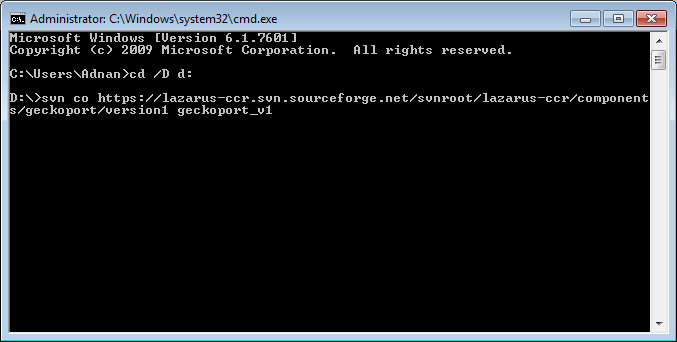
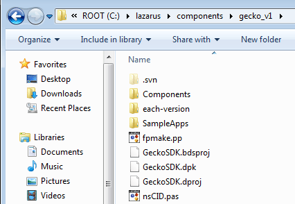
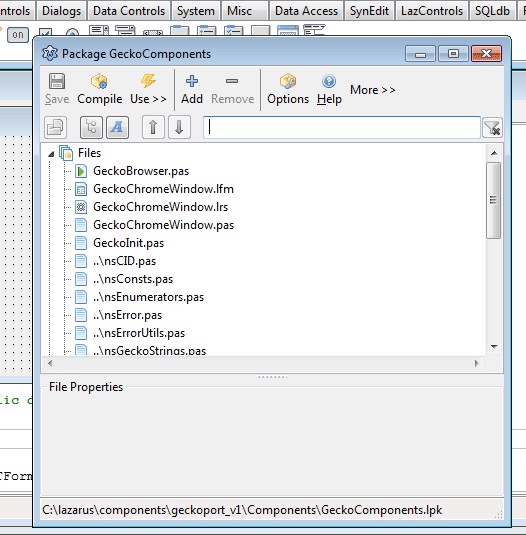
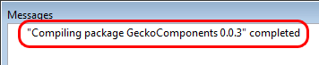
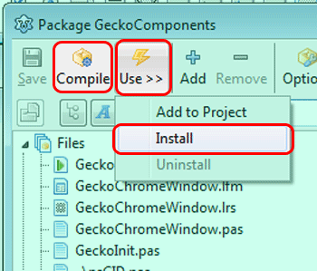
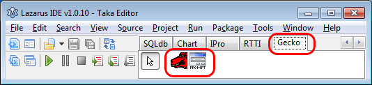
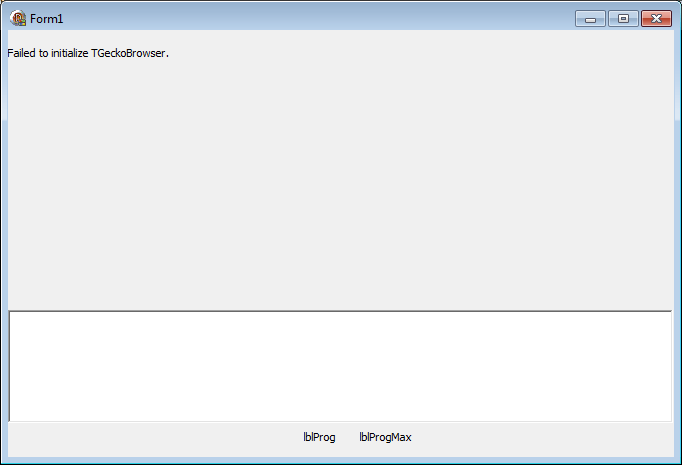
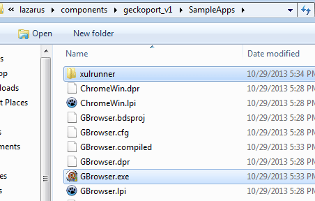
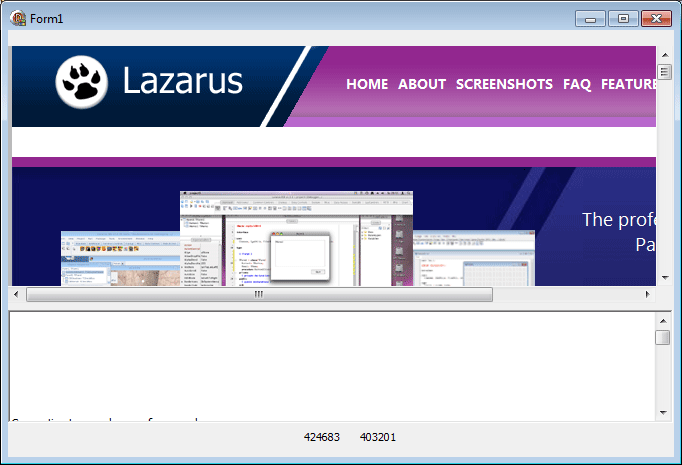

What web browsers do for us? They let us browse the internet, serve some wicked features that we love and let us customize them as we wish. Well, now it's time to make your own and customize it even further!
<!-- more -->


So, are you ready?


### Introduction


[Web browsers](http://en.wikipedia.org/wiki/Web_browser) are software for browsing Internet Websites. And websites of today contain complex HTML codes, elaborate styling and very comprehensive javascripts. If we are to build a web browser ourselves then it would take forever! Even the web browsers we use, such as Firefox, Chrome, Internet Explorer, Safari are fruit of millions of lines of codes and thousands of hours of labor. So building a web browser from scratch is not an option. The second option is to build our browser based on other browser engines. Lazarus can use the [following engines](http://wiki.freepascal.org/Webbrowser):

1. Turbopower internet pro control
2. QT Webkit
3. [THtmlPort](http://wiki.freepascal.org/THtmlPort)
4. [GeckoPort](http://wiki.freepascal.org/GeckoPort)
5. [LazActiveX](http://wiki.freepascal.org/LazActiveX)
6. [LazWebKit](http://sourceforge.net/p/lazwebkit/wiki/Home/)

Turbopower ipro is installed in Lazarus by default. But it has limited functionality. No javascript, no flash etc. Not a real browser in today's web 2.0 era.

If you want to embed an IE frame in your software then LazActiveX is a good option. But I have never used it, so I know almost nothing about it. Also, it is not cross platform, as it depends on Internet Explorer to render pages.

I really like Firefox because of its addons and native looking interface. Firefox uses the Gecko engine which it uses to render the pages. Render means displaying the webpage. Gecko engine reads the website codes (HTML, CSS, Javascript etc.) and displays the webpage on screen and lets the user interact with it, e.g. scroll it, click on links, select things.

If we use Gecko engine for our browser then we can use the "featury" goodness of Firefox in our software. We can have javascript, CSS and Flash in our project! Gecko is indeed a good engine for standard browsing.

And don't get intimidated. It's very easy. You can get your browser working without writing a single command in the command prompt.

So, let's continue our browser project with Gecko.


### Tutorial


Well, the question is how to use Gecko in Lazarus? Let's see... Gecko is not installed by default in Lazarus. So we need to install it. And also, Gecko should appear as a component in the toolbar. For that we will need to compile Lazarus with it installed (but it's not that hard because we can do it from inside Lazarus, with a few clicks.)


### Step 1: Get GeckoPort for Lazarus and Install


Well, there is a [GeckoPort version 2](https://wiki.freepascal.org/GeckoPort_version2). But [nobody could ever use it](http://forum.lazarus.freepascal.org/index.php/topic,19437.msg110804.html#msg110804)! It has errors in it or it is broken. So we will go after version 1. There is not that much of a difference as far as I know.

If you visit the [GeckoPort1 wiki page](https://wiki.lazarus.freepascal.org/GeckoPort), you will find no direct download link. There is an SVN link. But don't worry. I got it for you.


#### A. Getting GeckoPort source code:


If SVN is so complicated for you then download the source code from the link below:

[https://www.dropbox.com/s/f2ydmyr3qaqnxvc/geckoport_v1.zip?dl=1](https://www.dropbox.com/s/f2ydmyr3qaqnxvc/geckoport_v1.zip?dl=1)

Unzip it and you will get a `geckoport_v1` folder. Now skip to step B.

**The SVN way**...
If you like to use SVN to get the source code yourself then you'll have to download it using an SVN client. You can use any client you want. But my personal favorite is the simplest: [Subversion for Windows](http://sourceforge.net/projects/win32svn/) (a.k.a. win32svn). Install it, then you can use svn as you use in linux machines.

First, run the command prompt and cd to a directory, for example:

```
cd /D d:
```

Then run the command below:

```bash
svn co https://lazarus-ccr.svn.sourceforge.net/svnroot/lazarus-ccr/components/geckoport/version1 geckoport_v1
```





Now the Source Code for GeckoPort1 will be downloaded in the "`geckoport_v1`" directory. Again, you can avoid these commands by downloading the source code from the link mentioned above.


#### B. Installing GeckoPort components to Lazarus


No matter which way you chose, you should have a `geckoport_v1` directory.

Now copy that `geckoport_v1` directory to `c:\lazarus\components` directory. You can keep it in any directory, but I like the Lazarus installation to be contained within itself.





Now if you go to `C:\lazarus\components\geckoport_v1\Components` you will see `GeckoComponents.lpk`. Double click it. Lazarus will open up automatically and with a package window titled **Package GeckoComponents**.





Click the **Compile** button on that window. See the **Messages** window. It will eventually finish compiling and will show a message.





Now get back to the package window. Click **More -> Install**. You will get a message that if you want to rebuild Lazarus. Click **Yes**.





Now Lazarus will be automatically rebuilt with the Gecko components and restart itself. (As I said before, its only a matter of some clicks. No command line stuff.)


#### C. Checking installation


In Lazarus, check out the toolbar. If Gecko components have been installed correctly then a new tab named "**Gecko**" should appear with 2 components inside it.





If they are visible to you then you have successfully installed Gecko Components. Congrats!!


### Step 2: Get XULRunner


In order for GeckoPort project to work, you will have to give it some files which are used by Gecko to render the pages correctly. When you make an executable that uses Gecko components, there should be a XULRunner installation that it could find itself. The easier way to let it find XULRunner is to extract the XULRunner to the same directory of the executable. Let's see it more in details...

Visit the website below and download XULRunner 1.9.2.x (not any later versions, it won't work):

[https://developer.mozilla.org/en-US/docs/XULRunner/Old\_Releases](https://developer.mozilla.org/en-US/docs/XULRunner/Old_Releases)
Or, FTP archive for all previous versions: [http://ftp.mozilla.org/pub/mozilla.org/xulrunner/releases/](http://ftp.mozilla.org/pub/mozilla.org/xulrunner/releases/) 
Or, homepage here: [https://developer.mozilla.org/en/XULRunner](https://developer.mozilla.org/en/XULRunner)

I am using [XULRunner version 1.9.2.19](http://ftp.mozilla.org/pub/mozilla.org/xulrunner/releases/1.9.2.19/runtimes/xulrunner-1.9.2.19.en-US.win32.zip).

If you extract XULRunner then you will get a directory named "`xulrunner`". You will have to keep it in the directory that has the executable of your little browser. Please do keep in mind that the XULRunner archive has everything on a `xulrunner` folder. Don't extract it to another "xulrunner" folder. Make sure that the files are under one single xulrunner directory. To ensure this, if you use any decompression utility (such as 7-zip, WinZip, WinRAR etc.) choose "Extract Here" option. Then cut and paste to appropriate directory.

The wiki says:

> Currently the code looks for a xulrunner in the following order:
>
> \-    The ParamStr(1). This means the first parameter in command line. This is temporary for testing purposes only and it will be removed soon.
> \-    The application is located in the same folder as the xulrunner.
> \-    The xulrunner is located in a folder under application executable. Folder must be named "xulrunner".
> \-    Scan registry looking for a GRE "Gecko Runtime Environment".
> \-    Scan registry looking for a Firefox installation.


You could try the above options as well. But I like copying XULRunner to the same directory as the executable. It seems like rather a portable solution compared to other options.

If you are trying from any platform other than Windows to install XULRunner, then consult the [GeckoPort wiki page](http://wiki.freepascal.org/GeckoPort). It has very useful information at the bottom regarding installing in Linux or MacOS.


### Step 3: Testing the sample project


Go to `C:\lazarus\components\geckoport_v1\SampleApps\`. Now you will see 2 projects. Try opening the `GBrowser.lpi` example and hitting **Shift+F9** to build (not F9 or Run->Run). The executable should be generated. Now if you double click the executable on file explorer then you will see an error message in the place of the Gecko Frame "`Failed to initialize TGeckoBrowser`".





This is because we haven't given it XULRunner. So extract and copy "`xulrunner`" directory in the `C:\lazarus\components\geckoport_v1\SampleApps` directory. Now run the executable again. And if everything is okey, you should see the webpage of Lazarus!!







### Step 4: Making your own browser


See the .
