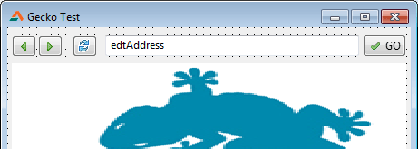
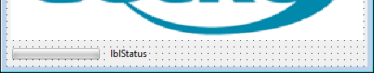
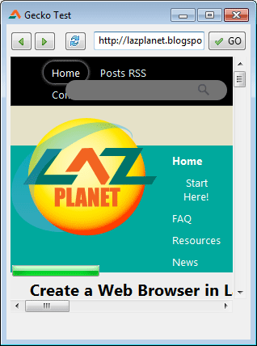

Web browsers are our daily thing. We browse the internet through them. But what about making our own browser? That we are going to do.
<!-- more -->

_Before you continue please read [part 1 of this tutorial](http://lazplanet.blogspot.com/2013/10/browser-in-lazarus-with-gecko-pt1.html) to setup your [Lazarus](http://www.lazarus.freepascal.org/) to add support for GeckoPort components in your Toolbar._

Ever thought of having a browser of your own that you wanted to add a stopwatch to? A stopwatch that measures how much time each website takes to load? Or may be counts how much time you surf in a day, month or year? That's just a weird idea. But the head of programers are filled with such ideas. Let's not forget, some of the best creative ideas can come from these weird ideas.

Anyway, I think more or less 1 in 10 developers among us would think making a browser would be cool, considering customizability. Making a browser and completely controling its behavior yourself, is very cool.

So today we are creating a simple web browser in Lazarus IDE. So let's start...


### Before we begin...


I am quite sure that you know there are many browsers. For example, Mozilla Firefox, Microsoft Internet Explorer, Google Chrome (Chromium in Linux), Opera etc. Lazarus also has many libraries for creating a web browser. Such as LazActiveX, LazWebkit, Gecko. Check out [this wiki page](https://wiki.lazarus.freepascal.org/Webbrowser) for details on the options you have. But I have chosen [GeckoPort](https://wiki.lazarus.freepascal.org/GeckoPort) for our tutorial. GeckoPort is a port of [Mozilla's Gecko engine](https://developer.mozilla.org/en-US/docs/Mozilla/Gecko). Gecko is the library which Firefox uses to render web pages. So if we use GeckoPort then we should be able to show pages like Firefox.

Although there is a "but". The Lazarus Wiki has two versions of GeckoPort. [Version 1](https://wiki.lazarus.freepascal.org/GeckoPort) and [version 2](https://wiki.lazarus.freepascal.org/GeckoPort_version2). Version 2, according to the wiki, has better support for later versions of XULRunner:

> Version 2 is based on automatically generated include-files from the idl files from the Gecko SDK. For this purpose the idltopas utility is used. This way it's earier to follow the fast Gecko-release cycle now gecko-developers do not maintain backwards compatibility any more.

Now the big BUT is that nobody ever (I think) could make it to work. It has problems that interrupts the compiling. So we would have to use version 1 instead.


### Tutorial


In the part 1 of the tutorial we have successfully setup Gecko in Lazarus and built & ran one of the sample projects. We have extracted XULRunner 1.9.2.x on the exe path and everything ran okey.

In this instalment, we will see how to create a browser project ourselves and create a basic browser to browse with.


#### Project Preparation


Start [Lazarus](http://www.lazarus.freepascal.org/).

Create a new Application Project (**Project -> New Project -> Application -> OK**).

Now save the project through Save All (**File -> Save All**). Name the project something like `proj_gecko_test.lpi` and the unit to something like `frm1.pas`.

Now click Open from the toolbar (or **File -> Open**). Now open the `proj_gecko_test.lpr` file (not the .lpi file). Now we have to add `Math` unit to the `uses` section. I had some compiler directives before so I kept them. I have brought the Interfaces unit down in a compiler directive with `Math` unit. But I think you are safe without it, just by adding `Math` unit without the compiler directives. Here is the `uses` part of my project:

```pascal
uses
  {$IFDEF UNIX}{$IFDEF UseCThreads}
  cthreads,
  {$ENDIF}{$ENDIF}
  Forms, frm1
  { you can add units after this }
  {$IFDEF LCL}
    ,Interfaces
    {$IFDEF MSWINDOWS}
      ,Math
    {$ENDIF}
  {$ENDIF}
  ;
```

Now, after the following code between the `begin` and `end`:

```pascal
  {$IFDEF FPC}
   {$IFDEF MSWINDOWS}
    //For now - disable all floating point exceptions or XULRUNNER will crash.
    SetExceptionMask([exInvalidOp,exDenormalized,exZeroDivide,exOverflow,exUnderflow,exPrecision]);
   {$ENDIF}
  {$ENDIF}
```

Click **File -> Save All** to save all your project files (including the .lpr file). Now close the `.lpr` file (you can simply middle click on the tab that has the file name). Now you should only have the **frm1** code tab.

And also, extract the XULRunner 1.9.x to your project directory.

Okey, now we are ready for some serious action!


#### Components on Form

Go to form view (**F12**). Now go to **Gecko** tab from the toolbar and drop a **TGeckoBrowser** component on your form. You should see a component with a Lizard in it. That's Gecko! Our trusty browser component! Name your trusty component as "`Browser`".


 


Now Drop a `TEdit` (from **Standard** tab) and a `TBitBtn` (from **Additional** Tab). Set the caption of `TBitButton` as `GO`. Set it's name to `btnGo`. Name the `TEdit` to `edtAddress`.

Drop 3 `TSpeedButton`s (from **Additional** tab). They will be our Back, Forward and Refresh/Reload button. Name them btnBack, btnForward and btnReload. Set their `Glyph` properties to appropriate icons. I have used [FamFamFam](http://www.famfamfam.com/lab/icons/mini/) and [Silk Companion](http://damieng.com/creative/icons/silk-companion-1-icons) icon packs.





Now drop a `TProgressBar` (from **Common Controls** tab). That will be our loading progress bar. Drop a `TLabel` as well and name that `lblStatus`.





#### Now to coding...

Double click `btnGo` and enter:

```pascal
procedure TForm1.btnGoClick(Sender: TObject);
begin
  Browser.LoadURI(edtAddress.Text);
end;
```

Now that you are in code view, go to the first `var` clause of the unit and add the `homepage` string, like this:

```pascal
var
  Form1: TForm1;
 
  // Contains the homepage URL. Change it as you wish!
  HomePage: string = 'http://lazplanet.blogspot.com';
```

( The `Form1: TForm1;` line will vary if you have named the form to something else other than Form1. )

Now switch to form view (**F12**) and double click the form. And enter:

```pascal
procedure TForm1.FormCreate(Sender: TObject);
begin
  edtAddress.Text := HomePage;
  btnGoClick(Sender);
end;
```

Basically, we are setting the address bar text to our `HomePage` url, then virtually clicking our go button. That should open the homepage for us when we run the program.

Now some other buttons. Double click `btnBack` and enter:

```pascal
procedure TForm1.btnBackClick(Sender: TObject);
begin
  Browser.GoBack;
end;
```

Double click `btnForward` and enter:

```pascal
procedure TForm1.btnForwardClick(Sender: TObject);
begin
  Browser.GoForward;
end;
```

Only `Browser.GoBack` and `Browser.GoForward` is enough for managing our browsing history. In the background, Gecko will manage everything. Like our trusty sidekick, right?! :-)

Reload is also easy. `Browser.Reload` is the code. Double click `btnReload` and enter:

```pascal
procedure TForm1.btnReloadClick(Sender: TObject);
begin
  Browser.Reload;
end;
```

Now, let's see how our browser looks and works. Press **F9** to compile and run the project exe.

Okey, now that you have the project exe running, you should see the LazPlanet website (or the URL that you have set in the HomePage string variable). Now if you click any link it loads the page, but the URL of the new page does not show in the Address bar. Also, we want the progress bar to be working and the status too. So, we would now consult the Events of Gecko component.

Now switch to Form view if you are not already (**F12**). Now select the `Browser` component. Now go to **Object Inspector -> Events**. Now click the `OnLocationChange` event and then click the **[...]** button. Now enter:

```pascal
procedure TForm1.BrowserLocationChange(Sender: TObject; const uri: AnsiString);
begin
  edtAddress.Text:=uri;
end;
```

Now Run (**F9** or **Run -> Run**). Click any URL and the address bar will be updated.

Now we head off to the progress bar and status bar text.
Add the following code to Browser's `OnProgressChange` event procedure:

```pascal
procedure TForm1.BrowserProgressChange(Sender: TObject; Progress: Integer;
  ProgressMax: Integer);
begin
  ProgressBar1.Max:=ProgressMax;
  ProgressBar1.Position:=Progress;
end;
```

Add the following code to `Browser`'s `OnStatusChange` event procedure:

```pascal
procedure TForm1.BrowserStatusChange(Sender: TObject; aMessage: WideString);
begin
  lblStatus.Caption:=aMessage;
end;
```

Also, we love to type address and then press enter to access the website. So select `edtAddress` and add the following code on `OnKeyPress` event procedure:

```pascal
procedure TForm1.edtAddressKeyPress(Sender: TObject; var Key: char);
begin
  // if the user presses enter...
  if (Key = chr(10)) or (Key = chr(13)) then begin
    btnGoClick(Sender);
  end;
end;
```

Now Run (**F9** or **Run -> Run**). When you browse, it would feel more responsive because you will know what the browser is doing with status message and the progress bar. Also you can type an address and press enter to visit it. But what about the resize scenario?


#### Resize Scenario

We can use `Anchors` property to update the components' size on form resize, without writing a single line of code. Every Anchor property (`akBottom`, `akLeft` etc.) is available under `Anchors` property.


Click on the plus sign or the arrow beside the `Anchors` title to expand and see all the items.

Select `edtAddress` and set `akRight` to `True`. Select `btnGo` and set `akLeft` to `False`, `akRight` to `True`. Now select `Browser` component and set `akRight` and `akBottom` to `True`.

Press F9 and see the results. Resize the form and the components will be resized automatically. But the progressbar and status bar does not stay in the right position.





Select `ProgressBar1` and set `akTop` to `False`, `akBottom` to `True`. Select `lblStatus` and set `akTop` to `False`, `akBottom` to `True`.

Now press **F9**. It should now work nicely.


When downloading from below don't forget to extract [xulrunner](http://ftp.mozilla.org/pub/mozilla.org/xulrunner/releases/1.9.2.19/runtimes/xulrunner-1.9.2.19.en-US.win32.zip) in the same directory as the exe to make it work.
