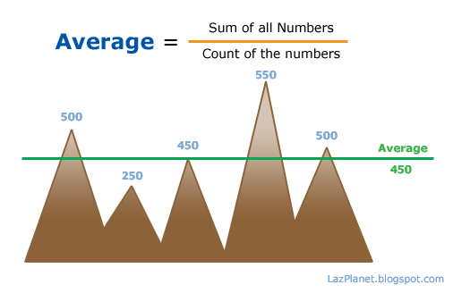
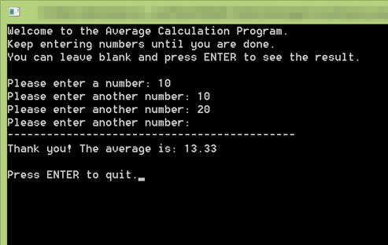

We have seen a lot of average calculation programs. They have limit to their numbers of input. So we have a code that will let you enter number to your heart's content.
<!-- more -->
  
  
Do you know how to calculate average? How do we do it in Lazarus / Free pascal?  
  
Average is the number which we get by dividing the sum of numbers by the count of the numbers. The average number helps us to get an overall look at a whole bunch of numbers. If we get that the average height of the students of a class is 5.5' (5 feet 5 inches) then we can understand that all the students have a height more or less than 5.5'.  
  

  
  
The average calculation is a very easy one. We only need to add the numbers and store it in a variable. At the same time we need to keep the count of the numbers that have been entered. After the numbers are finished entering we need to just Divide the sum with the count of numbers. That's it!  
  
You can find many algorithms, functions, program codes that calculate the average, such as [this one](http://wiki.freepascal.org/Programming_Assignment_2) written by Tao Yue. It calculates the average for 5 numbers. It is a good program example for starters/beginners. But we go a step further. We use a loop to get a number from the user. When the user enters a blank input, the program automatically calculates the average.  
  
See the code below:  
  

### Quick Tutorial

Create a new Program Project (Project->New Project->Program->OK).  
  
Use the following free pascal code:  
  

program proj\_avg\_console;  
  
{$mode objfpc}{$H+}  
  
uses  
  {$IFDEF UNIX}{$IFDEF UseCThreads}  
  cthreads,  
  {$ENDIF}{$ENDIF}  
  Classes, sysutils  
  { you can add units after this };  
  
var  
  // for calculating average  
  sum: single;  
  count: Integer=0;  
  average: single;  
  
  // read the line  
  line: string;  
  
  // for Val (input validation)  
  num: single;  
  code: Integer;  
  
begin  
  writeln('Welcome to the Average Calculation Program.');  
  WriteLn('Keep entering numbers until you are done.');  
  writeln('You can leave blank and press ENTER to see the result.');  
  WriteLn();  
  
  write('Please enter a number: ');  
  ReadLn(line);  
  
  while (line <> '') do begin  
    inc(count);  
  
    val(line, num, code);  
    if code <> 0 then  
      WriteLn('Invalid number.')  
    else  
      sum:=sum+num;  
  
    write('Please enter another number: ');  
    ReadLn(line);  
  
  end;  
  
  // we avoid an error of division by zero  
  if count <> 0 then  
    average := sum / count; // calculate the average  
  WriteLn('--------------------------------------------');  
  WriteLn('Thank you! The average is: ' + FormatFloat('0.00', average));  
  WriteLn();Write('Press ENTER to quit.');  
  
  ReadLn; // we keep the window open  
end.

  
Run the program (F9 or Run->Run).  
  

  
You could enter many numbers you desire. Just leave the input blank and press enter to calculate the average.  

### Explanation

while (line <> '') do begin  
  
We use a while loop, because we want inputs until the user enters blank line. When the user enters a blank line, the while...do loop breaks and it continues the commands after the while block.  
  
    val(line, num, code);  
    if code <> 0 then  
      WriteLn('Invalid number.')  
    else  
      sum:=sum+num;  
  
[Val](http://www.freepascal.org/docs-html/rtl/system/val.html) returns non-zero integer if a non-number character is found. If the number inputted is a number and does not contain letters or invalid characters, it will return 0 (zero). We use Val function as a input validation/error handling procedure. If the user enter anything that is not number, the program will output 'Invalid Number.'  
  
  sum: single;  
  count: Integer=0;  
  
The count integer holds the count of numbers and sum holds the sum total of all the numbers entered. When I told you that it can take input of unlimited numbers, I was lying. It is impossible to hold unlimited numbers. Because, computer memory is limited to some numbers. But modern day RAMs are more than enough for gigantic calculations. In the above code you can declare sum as double, extended or even Comp.  
  
With the count being an integer it can hold number upto -32768 to 32767. That means the program can average up to 32767 numbers. Which should be more than enough. But you can declare count as single or double to extend its capability. [See details about types here](http://wiki.freepascal.org/Variables_and_Data_Types).  
  
  
  
  if count <> 0 then  
    average := sum / count; // calculate the average  
  
If the count is zero then we cannot do division for calculating. If we divide any number with zero then it will raise an error. So we skip the division if count is zero (that means when no number is entered). Then average returns zero.  
  
  WriteLn('Thank you! The average is: ' + FormatFloat('0.00', average));  
  
The average variable is a single type variable. We need a string to use in the WriteLn. The FormatFloat function does 2 things: 1, it converts the number into float format given and it turns it into a string. You can change the format to '0.0000' to show four decimal points of the average.  
  
You can also make an average calculation function based on these codes.  
