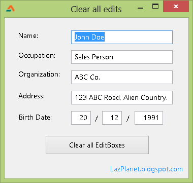

It is a tedious job to create a "Reset Form" button and recall all the names of the Editboxes in the form. So we let Lazarus do that for us! ... with only 3 lines of code!
<!-- more -->


There are sometimes tens and even thousands (if you know what I mean) Text edit fields in a form. If you are a lazy programer, you would be hesitant to add a "Reset Form" button to make their Text Property blank. And unfortunately, programers are lazy, because they have computers to do most of their jobs!

If you are in that team you might be interested in this little code snippet. We learn how to iterate (or go through) all the components of the form and if we find a TEdit, then we make blank by setting the Text property to '' (empty string).


### Quick Tutorial

Create a new Application Project (**Project -> New Project -> Application -> OK**).

Create a couple of **TEdit**s in the form to test our "Reset Form" code. Set **Text** as desired, content doesn't matter. You can also add some **TLabel**s to decorate.

Create a **TButton**. This will be our Reset button. Double click it and enter:

```pascal
var
  i : Integer;
begin
  for i := 0 to ComponentCount-1 do
    if (Components[i] is TEdit) then
      TEdit(Components[i]).Text := '';
end;
```

**Explanation:**

```pascal
  for i := 0 to ComponentCount-1 do
```

We go through all the components/controls in our form. `ComponentCount` actually means `Form1.ComponentCount`. We can use any other container components such as `TPanel`, `TScrollbox` etc. like `Panel1.ComponentCount` or `TScrollbox.ComponentCount`.

```pascal
    if (Components[i] is TEdit) then
      TEdit(Components[i]).Text := '';
```

If we find out that it is a `TEdit`, then we make its `Text` property to blank. Easy! Only three lines of code!

We can also create another button to show the names of all components, without typing in the names...

Create a **TButton**. Double click it and enter:

```pascal
var
  i: Integer;
  list: string;
begin
  for i := 0 to ComponentCount-1 do
    list:=list+#10#13+Components[i].Name;

  ShowMessage('We can also list all the components in the form without knowing their names:'+list);
end;
```

**Explanation:**

```pascal
  for i := 0 to ComponentCount-1 do
    list:=list+#10#13+Components[i].Name;
```

We iterate (go through) all the components of the form. We add the name of each component with a new line (with `#10#13`) in a variable called `list`.

```pascal
  ShowMessage('We can also list all the components in the form without knowing their names:'+list);
```

We show the list with a message box.





Run the program (**F9** or **Run -> Run**). Click the button to see the magic!

_Image: http://docs.oracle.com_

Ref: [http://delphi.about.com/od/objectpascalide/a/owner\_parent.htm](http://delphi.about.com/od/objectpascalide/a/owner_parent.htm)
