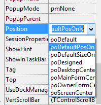
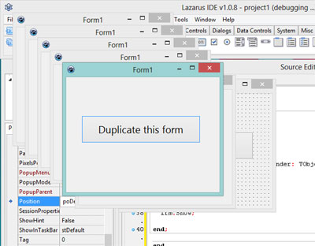

This is a fun code example to try. When you open up a new Application project, you get a form. To have fun, we can create hundreds of "copies" of this form! On runtime. Here's how...
<!-- more -->


### Concept

Do you know what a "Class" is? A Class is a collection of students, right? No, not in the programing world! If you know what class is, then understanding this example will be easier for you. If you don't, then I can simply say that **a class is a variable which has its own variables and functions**. You can ask a class to do something and it will do it. You can say that a class has its own life - like a person! It can answer to your calls and remember things.

For example, when you create a new Application/GUI project, you see a TForm1 class declaration at the top. And a variable declaration of `Form1: TForm1`. Here, `Form1` is a variable which holds the `TForm1` class. It means that we have made a copy of the `TForm1` class as `Form1`. If you say to the `Form1` variable that hey buddy, please close yourself (`Form1.close`) then it closes itself. This way you can command a variable! So this is basically a class.

The beauty of class is that you can make as many "copies" of them you like. For example, you can create a class named `human` and you have two variables like `Name` and `Age`. So you can create new `human`s and name it! ...and set age to it! ...virtually!

```pascal
Human1.Name := 'John';

Human1.Age := 25;


Human2.Name := 'Kate';

Human2.Age := 21;
```

And you can create as many `human`s like this as you want!

_(I found a good introduction of classes in the php manual, but can't find it now. It had a shopping cart class example which was very easy to understand.)_


### Quick Tutorial

Create an **Application** project. **Project -> New Project -> Application -> OK**.


Click the **TButton** from the toolbar and drag an area in the form to create a button. Double click it. Then write:

```pascal
var
  frm: TForm1;

begin
  frm:=TForm1.Create(Form1);
  frm.Show;

end;
```


### Run it!

Press **F9**. Click the button and a new form will appear on top each time you click the button. The problem is that new forms appear at one position. So it is difficult to understand whether a new form has appeared. Close the forms. Do the following...

With the form selected, go to **Object Inspector** and set **Position** to **poDefaultPosOnly**. This will position every new form  in cascading style (one lower to another).





Now again press **F9**. Now you will see pure fun! Forms and forms everywhere! Keep copying until your heart desires.



