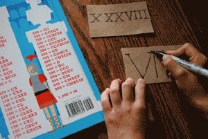
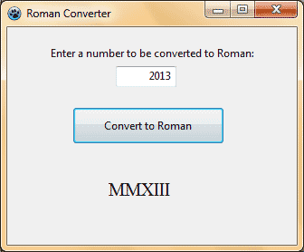
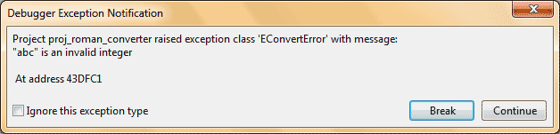

Roman characters look very formal. I, II, III, IV ... BBC uses Roman for their copyright statement (e.g. BBC (c) MMVI). And it looks exceptional. What is your birth year in Roman? Let your program find that for you! Here's how:  
  
  
We can do this through a [strutils](http://www.freepascal.org/docs-html/rtl/strutils/index-5.html) function named: [IntToRoman](http://www.freepascal.org/docs-html/rtl/strutils/inttoroman.html)  
  
The Syntax is as follows:  

function IntToRoman(  
  
  Value: LongInt  
  
):String;

  

### Quick Tutorial

Create a new Application Project. Project->New Project->Application->OK.  
  
Drop a TEdit, TButton and a TLabel. You can name the controls appropriately, but for this tutorial let's assume you named the TLabel as lblRoman. Double click the button and enter:  

lblRoman.Caption := IntToRoman(StrToInt(Edit1.Text));

  
Now Run the Project (Run->Run). Enter a number such as 3, 23, 2013 on the editbox and click the button. You will see that the program works fine and returns the Roman equivalent.  
  
  
  
But if you Enter characters, such as abc, the program will crash with the message below:  
  
  
Click break. Now get back to the code.  
  
The problem with the code is that IntToRoman accepts only Integers as inputs. And we have used StrToInt function to convert user's input into integer. But the function cannot convert strings containing any non-numeric character (character which is not a number). So we will need to detect if the user has entered integer or there is non-numeric character. We can use a function named [Val](http://lazarus-ccr.sourceforge.net/docs/rtl/system/val.html)  for this detection. The function has the following syntax:  

procedure Val(  
  const S: ;  
  var V;  
  var Code: Word  
);

  
In simple words, it takes a string (S) tries to convert it to integer and store it in a variable (V). If failed, it returns the position where the non-numeric character appeared (thus returns a non-zero value in Code).  
  
So we can modify the code as:  

procedure TForm1.Button1Click(Sender: TObject);  
Var  
  Number, Code : Integer;  
begin  
  Val (Edit1.Text, Number, Code);  
  If Code<>0 then  // it has non-numerical input  
    lblRoman.Caption := '(Error)'  
  else  // the input is ok to process  
    lblRoman.Caption := IntToRoman(Number);  
end;

  
Now Run again and try with a non-numeric character and the Label will show "(Error)". Decorate further with adding a label for instruction and may be changing the font size and name. Have fun.  
  

### Download source zip

You can download the source code in a zip file here: [http://db.tt/L6fijSIC](http://db.tt/L6fijSIC)  
Or here: [http://bit.ly/ZBBNfq](http://bit.ly/ZBBNfq)  
Size: 666KB  
  
The zip file contains compiled executable (exe).  
_Photo: mommymaestra.com_