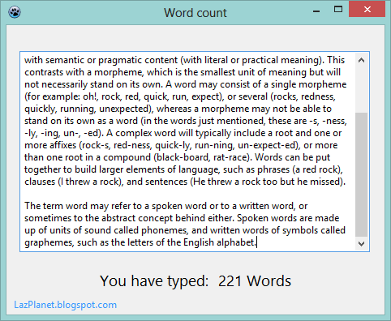

Suppose you have found a huge paragraph. How many words are in that paragraph? Do you want to count yourself? No. We can let our program count the words! Here's how...
<!-- more -->
  
  
The [strutils](http://www.freepascal.org/docs-html/rtl/strutils/index-5.html) unit has an useful function: [wordcount](http://www.freepascal.org/docs-html/rtl/strutils/wordcount.html)  
  
The syntax is:  

function WordCount(  
  const S: ;  
  const WordDelims: TSysCharSet  
):Integer;

  
It counts the words in a given string.  
  
Remember? Some criteria for essay/article writing may require the word count to be something between x and y? It is very common to limit the length of an article, so that teachers or readers are not irritated with huge text.  
  
Now, how can you count words in a sentence, or a paragraph, or even a bunch of paragraphs? Well, we will use the function above. The tricky part is in the WordDelims (or Word Delimiters). Delimiters are the characters which are not part of the words (e.g. space character).  
  

### Quick Tutorial

Create a new Application project. Project->New Project->Application->OK.  
  
Drop a TMemo and a TLabel in the form. Select the Memo and set its ScrollBars to ssVertical. Then double click the memo and write:  

Label1.Caption := IntToStr(WordCount(Memo1.Lines.Text, \[' '\])) + ' Words';

  
WordCount returns the word count as an integer. We use IntToStr for converting the line count to string in order to show it in Label1.Caption. And we add the word " Words" at the end of the count. The \[' '\] part adds a space character as a delimiter. We could add a TSysCharSet variable and then use this in the delimiter part too. (See the final example.)  
  
Don't forget to add strutils in the uses clause:  

uses  
  
..., strutils, ...;

  
Now Run the Project (F9). Write something in the Memo. You will see the count in the Label.  
  

  
  
Now the problem is that when you use a new line, the word count is not right. For example enter:  
I  
am  
  
That should return 2, but it returns 1. This is because there is no space character in between the two words. There are character #13 and #10 in between (for new line). So we have to add it in the delimiter. (Remember, that Unix and Unix based OSs \[e.g.Mac OS X\] do not have #10 for new line.) We can modify the code as below:  
  

var  
  Delimeters:TSysCharSet;  
begin  
  Delimeters := \[' ', '.', ',', (#13)\];  
  Label1.Caption := IntToStr(WordCount(Memo1.Lines.Text, Delimeters)) + ' Words';  
end; 

  
We have added 4 characters as delimiters. You can add more such as, ( ) - @ = : / ; etc.  
  
You can add other components to decorate the form. Such as another TLabel with caption "You have typed: ". May be implement resize anchors to change size of the memo according to the form's size.  

### Sample code download

Download the sample code zip from here: [http://db.tt/hz89LpUW](http://db.tt/hz89LpUW)  
Size: 671 KB  
  
The zip file contains executable (exe) file.  
_Photo: http://thelinecontinuestoblur.blogspot.com_