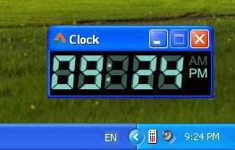

We are going to make a digital clock that has LCD Screen looking digits. Not only that. It can also speak the time!
<!-- more -->


Clock is an essential part of our daily lives. Wherever the new technology taking us, we're rediscovering the clock but can't avoid it. We now have smartwatches that shows time, takes photos, receives messages and more.

Okey, all those new technology apart, today we'll build a small digital clock that sits on your screen and shows time in an LCD Display-like digits. Sounds difficult but it's not.

For the talking part, we will use TTS (Text to Speech), so no tension there either. If you are interested on [how to make the computer speak](http://inkoflife.blogspot.com/2013/03/let-your-software-speak.html), check out [this tutorial](http://inkoflife.blogspot.com/2013/03/let-your-software-speak.html).


So, how can we show LCD looking displays. The answer is there are many digit-looking fonts out there. We can use them. But using those fonts would mean that the font should be installed in the system that will run the program. That seems an extra burden. Especially if you consider cross-platform scenerio.

So I thought of a different approach. I would use an image to store digits. That way it wouldn't need to install the font and it is possible to use hundreds of images of different fonts without installing them in users' computer.


### The Image

I have come up with this image:

[](create-digital-clock-that-talks/digits.bmp)


(You can right click and select "Save Image as..." to download and use the image in your project.)


I have downloaded a font that looks like LCD digits, appropriately named "Let's Go Digital", from [here](https://www.fontsc.com/font/lets-go-digital). Opened photoshop and positioned the digits. Each digit has an imaginery area of 30px x 50px. (Pixels are written as "px" as a short version and generally written as \[width\] x \[height\].)

The image has 15 characters/digits/states of that dimension in the image side by side. So the whole image is 450px x 50px. Depending on the time we'll take certain parts of the image and draw it out in our form. That's our plan. Simple!

You can download thousands of fonts from the internet and place the digits like the above image. So feel free to try any other! Just remember to keep the characters within the dimensions.

I have saved the image as **digits.bmp** in an empty folder that I made. We'll use the folder as the project folder. There is the Photoshop psd file in the project download available with this article, just in case you want to play with it.


### The project

Go ahead and start [Lazarus](http://www.lazarus.freepascal.org/).

Create a new Application Project (**Project -> New Project -> Applicaiton -> OK**).

Now, we would have to save the project. Save the project to the empty directory that you just made. Why are we saving our project that early? Because, we are using the **digits.bmp** from that folder. If we don't save the project it would run from the Temp directory and that image would not be found.


### Coding a bit

First, define the `TBitmap`s that will hold the **digits.bmp** (`digitsBitmap`) and the final clock image (`clockBitmap`).

```pascal
var
  ...
  digitsBitmap: TBitmap;
  clockBitmap: TBitmap;
```

Now, add information about the single digits. Our every digit is 30px x 50px. So we store that value in variables:

```pascal
var
  ...
  digitWidth: Integer = 30;
  digitHeight: Integer = 50;
```

Now, we'll define what's in our **digits.bmp**

```pascal
var
  ...
  digitCount: Integer = 15;
  digitPositions: array[1..15] of String = (
      '0', '1', '2', '3', '4', '5', '6', '7', '8', '9',
      '-', ':', 'A', 'P', ' '
  );
```

`digitCount` contains the total number of digits in the bmp file. `digitPositions` array contains 1 to 15 string items containing each digits' real string. Now, we know all the information of the charaters in the bmp file.

Double click on the form and enter:

```pascal
procedure TForm1.FormCreate(Sender: TObject);
begin
  clockBitmap := TBitmap.Create;
  clockBitmap.SetSize(Width, Height);

  digitsBitmap := TBitmap.Create;
  digitsBitmap.LoadFromFile('digits.bmp');

  drawDigits('--:-- ');
end;
```

We prepare both the `TBitmap`s. We create `clockBitmap` with the dimensions of our form. We will draw this exact `TBitmap` in the form on its `OnPaint` event.

We prepare `digitsBitmap` and load the `digits.bmp` on it.

We also use `drawDigits`, which we didn't declare yet. We use the procedure to draw an initial text `'--:-- '` on the form.

Now select the form and enter the following code in its **OnPaint** event (**Object Inspector -> Events -> OnPaint -> \[...\]**):

```pascal
procedure TForm1.FormPaint(Sender: TObject);
begin
  if Assigned(clockBitmap) then
    Canvas.Draw(0,0,clockBitmap);
end;
```

We draw the `clockBitmap` everytime the form is painted. If you don't know, the form is "painted" everytime the form is resized, gets focus, releaved some part while moving, the form is painted. If we don't draw the bitmap, the revealing part would be blank!

We use `Assigned()` to see if the bitmap is `Create`-d (with `TBitmap.Create`). If the bitmap is not `Create`-d and we try to draw it then it will raise a SIGSEGV exception. So we check it everytime we use it.

Now enter the following code on the form's `OnClose` event:

```pascal
procedure TForm1.FormClose(Sender: TObject; var CloseAction: TCloseAction);
begin
  if Assigned(digitsBitmap) then digitsBitmap.Free;
  if Assigned(clockBitmap) then clockBitmap.Free;
end;
```

Again, we check with `Assigned()` then we use `.Free` to free the `TBitmap`s we created. (It's important that we `.Free` everything that we `.Create`-d. If we fail to do that a memory leak might be created.)

Add the following procedure (before the "`end.`" line, under the `implementation` clause):

```pascal
procedure TForm1.drawDigit(digit:string; X, Y: Integer);
var
  rectDest, rectSrc: TRect;
  digitNumber: Integer;
  i: Integer;
begin
  // if the bitmaps have not been initialized (Create'd)
  // then we can't work with them!!
  if (Assigned(digitsBitmap)=false)
  or (Assigned(clockBitmap)=false) then
       exit;

  digitNumber:=15; // the default digit position
  for i := 1 to digitCount do begin
    if digitPositions[i] = UpperCase(digit) then begin
       digitNumber:=i;
       Break;
    end;
  end;

  with rectDest do begin
    Left:=X;
    Top:=Y;
    Right:=Left+30;
    Bottom:=Top+digitHeight;
  end;

  with rectSrc do begin
    Left:=digitWidth * (digitNumber-1);
    Top:=0;
    Right:=Left+digitWidth;
    Bottom:=Top+digitHeight;
  end;

  clockBitmap.Canvas.CopyRect(rectDest, digitsBitmap.Canvas, rectSrc);
  FormPaint(Form1);
end;
```

Now, place your cursor inside the procedure and press **Ctrl+Shift+C**. That will create a forward declaration under the `TForm1` class.

This procedure draws a single digit, given its position, which can be `1` through `15`, at a given position (with X and Y). This procedure is only half of the drawing we would do. We would use it in our `drawDigits()` procedure which will use this procedure to draw each single digit.

```pascal
  digitNumber:=15; // the default digit position
  for i := 1 to digitCount do begin
    if digitPositions[i] = UpperCase(digit) then begin
       digitNumber:=i;
       Break;
    end;
  end;
```

First we loop through every digit position to find the character in the digits.bmp.

Then we prepare 2 `TRect`s for `CopyRect`. We copy pixels from the appropriate position from the bmp and draw it in our `clockBitmap`, to be eventually drawn on the form.

Now add the following procedure:

```pascal
procedure TForm1.drawDigits(digits:String);
var
  c: Char;
  x: Integer;
begin
  x := 0;
  for c in digits do begin
    drawDigit(c, x, 0);
    Inc(x, digitWidth);
  end;
end;
```

Like the above procedure, take your cursor inside the procedure and press **Ctrl+Shift+C**.

Now draw a `TTimer` (from **System** tab) in the form. The `Interval` property is set to `1000`. 1000 miliseconds = 1 second. Now double click it and enter:

```pascal
procedure TForm1.Timer1Timer(Sender: TObject);
var
  TimeString: String;
begin
  TimeString := FormatDateTime('hh:nna/p', Now);
  drawDigits(TimeString);
end;
```

Now Run the project (**F9** ot **Run -> Run**) to see how it looks.

You will see that the form is bigger than the clock. Also, the form is resizable. Set the properties like the following:

```
Width = 180
Height = 50
BorderIcons -> biMaximize = False : to disable maximize button
BorderStyle = bsSingle : to disable resizing
```

Now Run the project again.

This time it looks more perfect.





### Let it talk!

It would be cool if our little digital clock could talk the time! It is possible, thanks to TTS (Text to Speech). Here is a good wiki about TTS in Lazarus/FPC. We can either use [Microsoft Speech API (SAPI)](http://wiki.freepascal.org/SAPI) or [eSpeak](http://wiki.freepascal.org/espeak). SAPI is Windows-only. We are going to use SAPI here to keep it simple. You can implement eSpeak with the code very easily.

Add `comobj` in your `uses` clause:

```pascal
uses
  ...
  {$IFDEF MSWINDOWS}
      ,comobj
  {$ENDIF};
```

We have used compiler directive `{$IFDEF MSWINDOWS}` because `comobj` is only supported in Windows. So if the program is compiled in a platform other than Windows, it will not be used.

On the Form's `OnClick` event enter:

```pascal
procedure TForm1.FormClick(Sender: TObject);
var
  SavedCW: Word;
  SpVoice: Variant;
  TimeString: String;
  TextToBeSpoken:Variant;
begin
  {$IFDEF MSWINDOWS}
    TimeString := FormatDateTime('h:n am/pm', Now);
    TextToBeSpoken := 'The time is: '+TimeString;

    SpVoice := CreateOleObject('SAPI.SpVoice');
    // Change FPU interrupt mask to avoid SIGFPE exceptions
    SavedCW := Get8087CW;
    try
      Set8087CW(SavedCW or $4);
      SpVoice.Speak(TextToBeSpoken, 0);
    finally
      // Restore FPU mask
      Set8087CW(SavedCW);
      SpVoice:=Unassigned;
    end;
  {$ENDIF}
end;
```

Now Run your project (**F9** or **Run -> Run**).

Click on the form to listen to the time being spoken.

Optionally, add the following 2 lines to make the clock appear at the bottom right part of the screen:

```pascal
procedure TForm1.FormCreate(Sender: TObject);
begin
  // ...
  Left := Screen.Width - Width - 30;
  Top := Screen.Height - Height - 90;
end;
```

You can also set the `FormStyle` of the form to `fsStaysOnTop` to set it as a "Always on Top" mode (it won't disappear even if you focus on other windows).


Now run it and enjoy!


### Further experiments

Enhancing a source code is a great way of learning, the fun way. Try these:
\- Make the clock [borderless and make it movable](http://lazplanet.blogspot.com/2013/06/dragging-form-by-its-body.html). Create a right click menu to minimize, always on top etc.
\- Implement an alarm feature. That'd be cool.
\- Give the user the option to choose "skin" image (a.k.a. digits.bmp). So that they can change the appearance of the clock as they wish. You can also change the values of digitWidth and digitHeight according to the new image, so that users can use skins of different sizes.
\- Implement [eSpeak](http://espeak.sourceforge.net/download.html) for cross-platform compatibility. Hint: you can use something like [`RunCommand()`](https://wiki.freepascal.org/Executing_External_Programs#.28Process..29RunCommand) and [`{$ELSE}`](https://www.freepascal.org/docs-html/prog/progsu12.html#x19-180001.2.12) to implement it.
