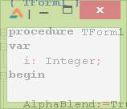
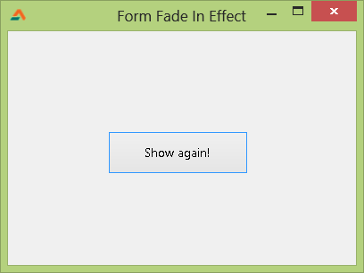

Forms are a bit boring sometimes, right? Spice it a little bit with a Fade In animation effect on startup. That boring square area of form will amuse the users a bit more.
<!-- more -->
  
  
  
Effects always amuse us. Even the slight fade in effect in Windows XP menus used to give us a joyous feeling. Things on the screen appear and disappear all the time. There is no variation. It looks boring. The Web 2.0 is getting a hang of effects. And also there was also Flash used once in the webpages which is becoming extinct due to the popularity of HTML5's browser based technology. Flash brought out many eye catching effects in websites and advertisements. Effects on the screen have also made iPhone and MacOS successful.  
  

### How Form Alpha Blending works in Lazarus

There are [three terms](http://melander.dk/articles/alphasplash/) you should know:  

> [**Transparent**](http://dictionary.reference.com/search?q=transparent)  
>     **trans·par·ent** \[trans-**pair**\-uh nt, -**par**\-\]  
>     Capable of transmitting light so that objects or images can be seen as if there were no intervening material.  
>     In other words; Transparent means invisible.  
> [**Translucent**](http://dictionary.reference.com/browse/translucent)  
>     **trans·lu·cent** \[trans-**loo**\-suh nt, tranz-\]  
>     Permitting light to pass through but diffusing it so that persons, objects, etc., on the opposite side are not clearly visible.  
>     In other words: Translucent means partially transparent. Semi transparent is the same as translucent.  
> [**Opaque**](http://dictionary.reference.com/search?q=opaque)  
>     **o·paque** \[oh-**peyk**\]  
>     Impenetrable by light; neither transparent nor translucent.  
>     In other words; Opaque is the opposite of transparent.

  
Since the version (probably) 0.9.30, an AlphaBlend property is added to TForm's properties. There used to be involved a lot of lines of codes to apply alpha blending to form. This AlphaBlending is the above Translucent term. It means _slightly_ transparent, not totally. For example, Windows 7/8 taskbar is translucent. That means, you can see the wallpaper through the taskbar but in a faded form, as you can see what's behind a fog but partially.  
  

  

_In the above screenshot, you can see the wallpaper only partially through the taskbar. It is "translucency", not transparency as people assume._

  
You can easily set AlphaBlending property to True and then set AlphaBlendValue to anything between 0 to 255 to apply Alpha Blending (or translucency) to the form. Here, 0 means invisible and 255 means visible/opaque. If the AlphaBlend is set to False, then the AlphaBlendValue is not used. But you should keep in mind that this will not work in earlier versions than Windows 2000. Any Windows released after WindowsXP will work fine.  
  

### Quick Tutorial

OK. Enough talk!  
Create a new Application Project (Project->New Project->Application->OK).  
  
With the form remaining selected go to Object Inspector, then Properties tab. Make the AlphaBlend to True. Make the AlphaBlendValue to 200. Then Run (F9 or Run->Run) and see what happens. You will see a translucency effect like the Windows taskbar.  
  
We were only doing the above for a quick test that if the Alpha-blending works. Now make the AlphaBlendValue to 0 (zero). Now add a TButton, double click it and enter the following code:  
  
var  
  i: Integer;  
begin  
  
  AlphaBlend:=True;  
  Show;  
  
  for i := 1 to 51 do begin  
    AlphaBlendValue:=i\*5;  
    Sleep(1);  
  end;  
  
  AlphaBlend:=False;  
  
end;  
  
**Explanation**:  
  
We will run these same commands when the form will be activated. You will see that below...  
  
  AlphaBlend:=True;  
  
  
We set the AlphaBlend to True because we want to use AplhaBlendValue to apply alpha blending to the form.  
  
  for i := 1 to 51 do begin  
    AlphaBlendValue := i \* 5;  
    Sleep(1);  
  end;  
  
We gradually increase the AlphaBlendValue. We use Sleep command for the effect to slow down a little bit. If we don't use Sleep, then the effect will be finished in some milliseconds! Sleep pauses the program for milliseconds. During this time the execution of commands stop for the given time.  
  
We use numbers 1 up to 51. Why 51, when we have a range of 0-255 for AplhaBlendValue? Because we want less steps so that the effect can be faster. If we had used 1 to 255, it would take approx. 5 seconds for the effect to complete, even with only 1 millisecond Sleep.  
  
Notice that we have used i \* 5 as the AlphaBlendValue. The AlphaBlendValue will now increase like this:  
First loop: i \* 5 = 1 \* 5 = 5  
Second loop: i \* 5 = 2 \* 5 = 10  
Third loop: i \* 5 = 3 \* 5 = 15  
...  
...  
... and up to: i \* 5 = 51 \* 5 = 255  
  
We use 5 as a step for our loop.  
  
Select the form. Then go to Object Inspector, then Events tab. Click the \[...\] button next to OnActivate. Then enter:  
  
Button1Click(Sender);  
  
We run the same procedure which is run when the Button1 is clicked.  
  
Now Run the Project (F9 or Run->Run). You will see the form appear slowly fading in to the screen. You can click the button to see the effect again.  
  

  
  
We have used "Show Again" button that's why we used the Tbutton's OnClick procedure. You can use separate procedure and no button to produce same results.  
  

### Download Sample Code ZIP

You can download the example source code from here: [http://db.tt/DKJZ6LSb](http://db.tt/DKJZ6LSb)  
Or here: [http://bit.ly/ZQmIs8](http://bit.ly/ZQmIs8)  
Size: 518 KB  
The package contains compiled executable EXE file.