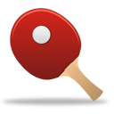
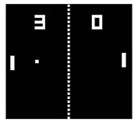
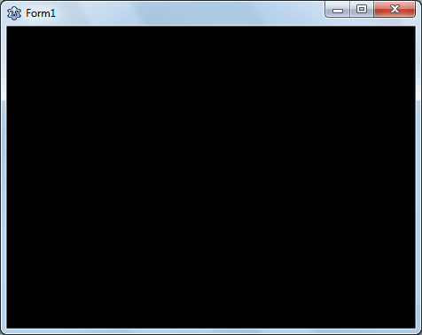
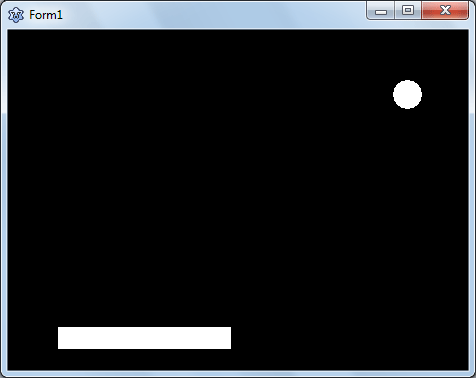
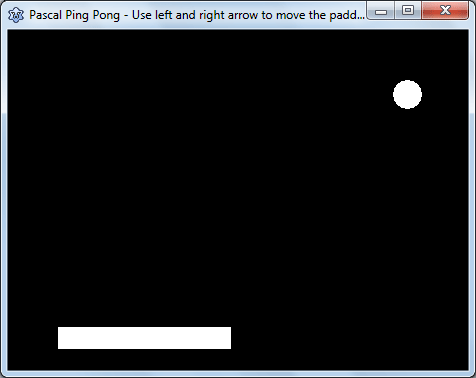
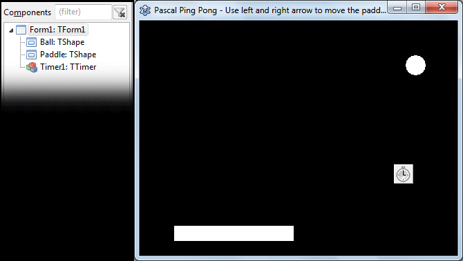
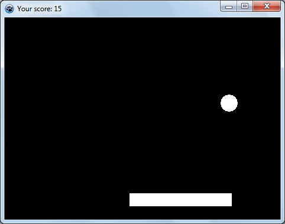

Everybody likes to play games. It gets even better if you play the game you made yourself.
<!-- more -->
  
[Pong game](http://en.wikipedia.org/wiki/Pong) was one of the most primitive [graphical computer game](http://lazplanet.blogspot.com/search/label/Games) made in the early 1970s. Since then the gaming industry has evolved so much. And so did the graphics, bringing in many other types of games in the table. But still Pong game is considered to be the Hello World of Game Development. If you want to try learning to make games you should try to make a Pong Game first. It is easy to understand and easy to code.  
  

### The Pong Game

  
[The Pong game](http://en.wikipedia.org/wiki/Pong) was first introduced in 1972 by Atari Inc. It was in minimalistic game having two dimensional graphics. With the graphical capabilities just flourishing for the computers the Pong game was exciting for the gamers. Atari even made cabinet style gaming machine for Pong game. It is the game that basically started the video game industry. So it was a real game-changer.  
  

The Pong game

  
  
The game consists of two "paddles" and a ball. Among the two paddles, one is controlled by the user and another is controlled by the computer. The ball bounces from one paddle to another. And if the ball misses the paddle, it's game over. Simple.  
  
In this tutorial we will implement a single paddle game with very basic physics and with only 2 components on the form. And instead of placing the paddle in the side we will position it to the bottom.  
  
The original game has Artificial Intelligence but ours wouldn't have that. So relax!  
  
This tutorial will let you eliminate the complexity of drawing and focus on the logic of the game.  
  

### Tutorial

  
Start [Lazarus](http://lazarus.freepascal.org/).  
  
Create a new Application Project (Project -> New Project -> Application -> OK). First resize the form to a comfortable size. I have resized mine to: Width = 460 & Height = 340 .  
  
Set the form's Color to clBlack. This color will be the background of our game. Games are better in Black backgrounds, don't you think?  
  

  
Draw 2 TShapes on the form (TShape is available in the Additional tab). Set one Component's name as "Ball" and another as "Paddle". Set the Shape of the "Ball" to stCircle. It is better to set both the Width and Height of the ball to same. Size the "Paddle" to something you like.  
  

  
Set the Form's Caption to "Pascal Ping Pong - Use left and right arrow to move the paddle". This text will be shown when the player hasn't scored yet. This will help a newbie player to understand how play the game.  
  

  
Draw a TTimer in the form (from System tab). Place it anywhere you like because it is going to be hidden in runtime. Set its Interval property to 30.  
  

  
See how our form looks and look at the Object Inspector to check if yours look the same (click to zoom).  
  
  
  

### Coding...

  
Now, let's get to our coding. Switch to Code View by pressing F12. Add code below before the first type clause:  
  

const  
  // This determines how much the paddle moves in one  
  // press of an arrow key  
  PaddleMoveAmount = 15;

  
Also, add the LCLType unit in the uses clause because we would need keyboard keycodes to capture user input (VK\_LEFT, VK\_RIGHT etc.):  
  

uses  
  ..., LCLType;

  
Now add the following code in the first var clause in the unit:  
  

var  
  //...  
  
  // We store the player's score in this variable  
  // We would reset this to zero on Game Over  
  score: integer;  
  
  // We set which direction the ball is moving.  
  // DirectionLeft defines horizontal direction.  
  // DirectionTop defines vertical direction.  
  DirectionLeft, DirectionTop: Boolean;

  
Now select the Form and go to Events tab on the Object Inspector. Then click the \[...\] button next to OnKeyDown and enter the code:  
  

procedure TForm1.FormKeyDown(Sender: TObject; var Key: Word; Shift: TShiftState  
  );  
begin  
  
  // ---- Move left or right ---- //  
  if key = VK\_LEFT then begin  
  
    if (Paddle.Left > PaddleMoveAmount ) then  
      Paddle.Left := Paddle.Left - PaddleMoveAmount  
  
    else if (paddle.Left > 0) then  
      Paddle.Left := 0;  
  
  
  end else if key = VK\_RIGHT then begin  
  
    if (Paddle.Left + Paddle.Width < ClientWidth - PaddleMoveAmount) then  
      Paddle.Left := Paddle.Left + PaddleMoveAmount  
  
    else if (Paddle.Left + Paddle.Width < ClientWidth) then  
      Paddle.Left := ClientWidth - Paddle.Width;  
  
  end;  
  
  
end;

  
What we are doing here is we are detecting if the user pressed left arrow. If he presses it we will make some less on the Left property to move the paddle to left. If the space on the left is less than 15 pixels then we make it move to 0 pixels to the left. Through the code we make sure that it does not go beyond the left boundary of the form.  
  
We will do the same for moving to the right. In this case we will move it until it hits the right edge.  
  
Now Double click Timer1 and enter:  
  

procedure TForm1.Timer1Timer(Sender: TObject);  
begin  
  
  // ---- Move the ball according to its direction ---- //  
  if DirectionLeft then Ball.Left := Ball.Left-5  
  else Ball.Left := Ball.Left+5;  
  
  if DirectionTop then Ball.Top := Ball.Top-5  
  else Ball.Top := Ball.Top+5;  
  
  // ---- Collision ---- //  
  // top boundary  
  if Ball.Top < 0 then  
    DirectionTop := not DirectionTop;  
  
  // left and right boundary  
  if (Ball.Left < 0) or (Ball.Left + Ball.Width > ClientWidth) then  
    DirectionLeft := not DirectionLeft;  
  
  // detect hit on the paddle  
  if (  
       (Ball.Left > Paddle.Left)  
       and (Ball.Left + Ball.Width < Paddle.Left + Paddle.Width)  
       and (Ball.Top + Ball.Height >= Paddle.top)  
       and (DirectionTop = False)  
     ) then begin  
  
       DirectionTop:=not DirectionTop;  
       inc(score); // same as score + 1  
       Caption:='Your score: '+IntToStr(score);  
  
  end;  
  
  // ---- You lose! The ball has sinked to the bottom ---- //  
  if Ball.Top > Paddle.Top then begin  
       Caption:='You lose! Your score was: '+IntToStr(score);  
       Timer1.Enabled:=False;  
  
       Sleep(5000);  
  
       Ball.Left:=0;  
       Ball.Top:=0;  
       score:=0;  
       Caption:='Your score: 0';  
       Timer1.Enabled:=True;  
  end;  
  
end;

  
The code is well-commented. So I think you will understand the code yourself.  
  
  
Now run the Project (Run->Run or F9). Move the paddle with Left and Right arrow keys on the keyboard and enjoy!  
  

  
  

#### Pause function

If you want to add the Pause functionality, then change the Form's OnKeyDown event procedure code like the following:  
  

procedure TForm1.FormKeyDown(Sender: TObject; var Key: Word; Shift: TShiftState  
  );  
begin  
  
  // ---- Move left or right ---- //  
  if Timer1.Enabled then begin  
  
    if key = VK\_LEFT then begin  
  
      if (Paddle.Left > PaddleMoveAmount ) then  
        Paddle.Left := Paddle.Left - PaddleMoveAmount  
  
      else if (paddle.Left > 0) then  
        Paddle.Left := 0;  
  
  
    end else if key = VK\_RIGHT then begin  
  
      if (Paddle.Left + Paddle.Width < ClientWidth - PaddleMoveAmount) then  
        Paddle.Left := Paddle.Left + PaddleMoveAmount  
  
      else if (Paddle.Left + Paddle.Width < ClientWidth) then  
        Paddle.Left := ClientWidth - Paddle.Width;  
  
    end;  
  
  end;  
  
  
  // ---- Pause or Unpause ---- //  
  if key = VK\_P then  
    Timer1.Enabled := not Timer1.Enabled;  
  
end;

  
At the bottom of the code we add an if statement for P keypress. On P key press we invert the Timer1.Enabled property. If it's True it will be made False. If it's False it will be made True. Our ball moving mechanism is in the Timer1. So if we Disable Timer1, the ball movement will stop making the game paused.  
  
We don't want the paddle to move when it's on pause mode. So we add an if statement to our previous left-right key code.  
  
Now whenever the user presses the P key, the game will pause. Another press on P will resume the game.  
  
So, there you have it. Your very own game made by you! Go on, have fun with it!  
  

### Download Sample Code ZIP

You can download the above example tutorial project's source code from [here](https://www.dropbox.com/s/0mo8d0vx23o6j9a/PingPong.zip?dl=1)  
Or here: [http://bit.ly/pascal\_pong\_game](http://bit.ly/pascal_pong_game)  
Size: 592 KB  
The package contains compiled executable EXE file.