In this holiday, gift yourself a nice little word processor that you can use yourself! You can further develop it. It happily supports Unicode and lets you learn the use of Toolbar, RichMemo, ImageLists, File Save Management and more.
<!-- more -->
  

  
[**Plain text**](http://en.wikipedia.org/wiki/Plain_text) means any text which has no special styling or formatting. All the text from start to end is of same style. It's just plain simple text and nothing else. For example, you can create plain text in [Windows Notepad](http://en.wikipedia.org/wiki/Notepad_%28software%29), [Notepad++](http://notepad-plus-plus.org/), [GEdit](http://en.wikipedia.org/wiki/Gedit) etc.  
  
[**Rich text**](http://en.wikipedia.org/wiki/Rich_Text_Format) on the other hand has special formatting added to it behind the scenes. For example, if you create documents in [MS Word](http://en.wikipedia.org/wiki/Microsoft_Word) or [Libre Office](http://en.wikipedia.org/wiki/LibreOffice), you can add styles to it, like bold, underline etc. Under the hood those style information are saved with the text. So it is not only the text. There has to be some style saved with it. It has complex styling involved.  
  
Today, we are going to make a simple rich text editor. Think of it as a Christmas gift to yourself!  
  
Lazarus has a good [component for rich text editing](http://wiki.freepascal.org/RichMemo) -- [TRichMemo](http://wiki.freepascal.org/RichMemo). If you think of all the complexities of managing all the characters and their styles then let me assure you that it is easier than you think. Don't worry a bit, it is going to be a breeze making that rich text editor. Just keep following my _gifty_ words. ;)  
  
( Thanks to [Jørn Erik](http://www.blogger.com/profile/00527934400910886340) for [requesting](http://lazplanet.blogspot.com/2013/07/how-to-crop-image-and-save-to-file.html) a tutorial for RichMemo. )  
  

### Tutorial

  

#### Install RichMemo

TRichMemo component doesn't come pre-installed with Lazarus. So first, download RichMemo component package.  
  
[The wiki](http://wiki.freepascal.org/RichMemo) has a direct download link. But for [this bug](http://bugs.freepascal.org/view.php?id=16758) **it is recommended to use the SVN** or Subversion ([Wikipedia](http://en.wikipedia.org/wiki/Apache_Subversion)). I have also used the SVN version. But if you are afraid to use SVN you can use [my copy which is RichMemo 3400 revision](https://www.dropbox.com/s/fn0ji6ec32bqexp/richmemo-revision-3400.zip?dl=1).  
  
For SVN, the URL is:  
https://lazarus-ccr.svn.sourceforge.net/svnroot/lazarus-ccr/components/richmemo  
  

> \[ If you want to use the svn version, install [Subversion for windows](http://sourceforge.net/projects/win32svn/files/latest/download), then cd to a directory that you want to download. Such as:  
> **cd /D C:lazaruscomponents**  
> After that run:  
> **svn co https://lazarus-ccr.svn.sourceforge.net/svnroot/lazarus-ccr/components/richmemo richmemo**  
> The above command will save the package in richmemo folder in the components folder of Lazarus. So you won't have to manually copy it. Cool! Just check if the Lazarus installation directory is ok in the cd command. \]

  
Now copy the directory to **C:lazaruscomponents** (if you used the direct link option).  
  

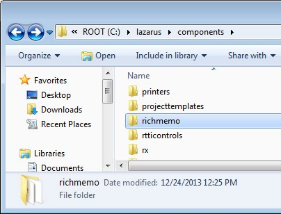

  
Now enter into the directory and double click **richmemopackage.lpk** file. [Lazarus](http://www.lazarus.freepascal.org/) will open with an extra window having the title package name.  
  

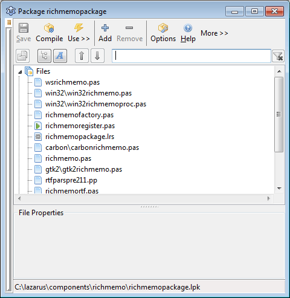

  
  
Now click **Compile**. After the compiling is completed, you will see a message in the Messages window. Then click **Use** -> **Install**. A message will appear that if we want to rebuild Lazarus. Click **Yes**.  
  
Eventually Lazarus will restart with the new TRichMemo installed. If you can't find the component, look for it under the **"Common Controls" tab**. Congratulations, if you have installed it!  
  

#### Starting with the basics

So go ahead and create a new Application Project (Project -> New Project -> Application -> OK). Resize the form to an appropriate size to make room for the components.  
  
And now, the center of our attention -- Drop a **TRichMemo** on the form. Set the **ScrollBars** property to **ssBoth**.  
  
Now the toolbar. Draw a **TToolBar** on the form (from Common Controls tab). Resize it from the bottom to a gentle size. Draw a **TImageList** as well, anywhere in the form (from the Common Controls tab). It doesn't matter where you put it because it will disappear on runtime. This image list will contain our toolbar icons.  
  
Here is our form so far:  
  

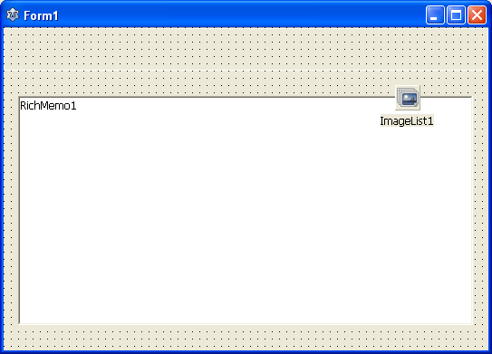

  
  
We'll now add items to the toolbar. Right click the **Toolbar1** component then select **New Button**.  
  

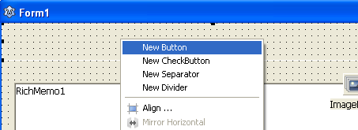

  
You will notice that a new TToolButton appearing on the **Object Inspector**.  
  

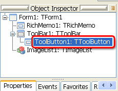

  
The Ttoolbar and TToolButton is two separate object. You will see a little area at the top left corner of TToolbar.  
  

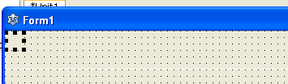

  
If you click on it you can select the toolbar button. On the other hand you can click on the sunk area to select the TToolbar object. To make the buttons more visible to us, go ahead and select the TToolbar object. Then set its **ShowCaptions** property to **True**. Now you can easily see the toolbar buttons' **Caption**s.  
  

  

#### Prepping the Image List

We will now prepare our Image list. Yes, the little component that will keep our toolbar icons. **Right click** it and select **ImageList Editor**... (or you can **double click** it as well).  
  

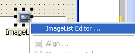

  
  
Now add the images for the toolbar in the following manner. I have used [FamFamFam.com Slik Icons](http://www.famfamfam.com/lab/icons/silk/). You can also download it. So here are the indexes and the file names for icons:  
  
0\. page\_white\_office.png  
1\. folder\_page.png  
2\. disk.png  
3\. text\_bold.png  
4\. text\_italic.png  
5\. text\_underline.png  
  
Your ImageList Editor dialog should look like this:  
  

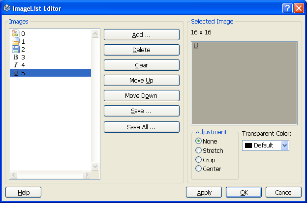

  
Now select the **Toolbar1** component and set its **Images** property as **ImageList1**. This will let us set images from the ImageList through the index of the icons. You will get it in a moment.  
  
  

#### Cooking the toolbar!

Now prepare your toolbar elements like this:  
  
**1\. btnNew: TToolButton** (which means right click the toolbar and create a new toolbar button and set its name as btnNew)  
(Now set its properties as follows:)  
**Caption = New**  
**ImageIndex = 0** (You can see the icons in the drop down menu of this property. Its very easy to understand which icon you are selecting.)  
  
You will probably see the icons being cut. That's normal. This is because the toolbar button size is so little. So set the Toolbar1's ButtonHeight property to 36. Also set its AutoSize to True which will set the height of the toolbar automatically.  
  
**2\. btnOpen: TToolButton**  
**Caption = Open**  
**ImageIndex = 1**  
  
**3\. btnSave: TToolButton**  
**Caption = Save**  
**ImageIndex = 2**  
  
**3.** Right click the toolbar and click **New Separator**. It will make some distance between the buttons.  
  
**4.** (Right click the toolbar and select **New CheckButton**) **btnBold: TToolButton**  
**Caption = Bold**  
**ImageIndex = 3**  
  
New CheckButton creates a TToolButton but sets its Style as tbsCheck. You can create a new button and change its Style property manually. Its the same.  
  
**5.** (Again, **New CheckButton**) **btnItalic: TToolButton**  
**Caption = Italic**  
**ImageIndex = 4**  
  
**6.** (**New CheckButton**) **btnUnderline: TToolButton**  
**Caption = Underline**  
**ImageIndex = 5**  
  
**7.** Right click the toolbar and click **New Separator**.  
  
**8.** Now we have to create a Font selector combobox. Since TCombobox cannot be created with right clicking toolbar, we will create it manually. And we will also include with it a Label saying "Font:". We can nicely blanket the label and the combobox in a Panel so that we can keep some space. If we create those two without the panel, there can be no space between components. Also, when you will resize the form and the toolbar buttons has to be shown in two or more lines, the whole Panel would stay together:  
  

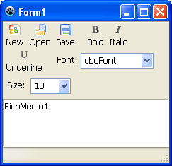

  
  
So, first create a **TPanel** inside the Toolbar (when drawing it, **start drawing from inside the toolbar** are to create the panel as a child of the toolbar.) Its height will be automatically set to ButtonHeight of the toolbar.  
  

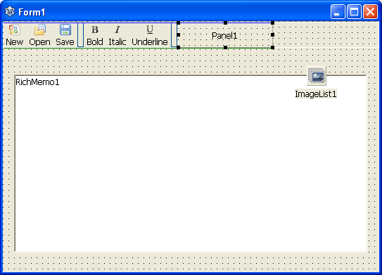

  
  
**Empty its caption**. Create a **TLabel** inside it and set its **Caption to "Font:"**.  
  

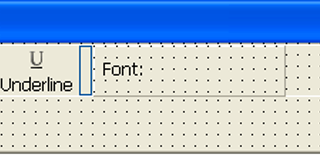

  
Now create a **TComboBox** inside it. Set its Name as **cboFont**. Now you will see that you can freely keep space between these two and you can even center them vertically, which would've been impossible without the Panel. Keep the combobox the way it is. We are going to load the fonts with the help code, later.  
  

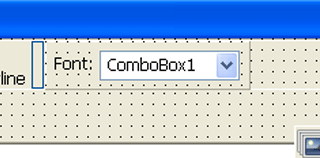

  
  
Oh! and set the **BevelOuter** to **bvNone** of the **Panel** to get rid of the border.  
  
9\. Create another **TPanel** inside the toolbar for **Font Size**. Set its **caption to blank** and **BevelOuter to bvNone**. Create a **TLabel** inside the panel. Set its **Caption to "Size:"**. Create a **TComboBox** and set its name as **cboFontSize** and its Items to:  
  
8  
10  
12  
14  
16  
18  
26  
36  
72  
  

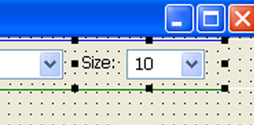

  
You can optionally set its **ItemIndex** as 1, just as a default value.  
  
Yaaay! The Toolbar is finished! It was the greatest complexities of this project! Now you are ready to face the rest of the project with a shine in your eyes.  
  

#### Have a first look!

Now for giving it more professional look, draw a TStatusBar on the form (from Common Controls tab). The RichMemo1 is not in an exact position. Select the **RichMemo1** and set its **Align** property to **alClient**.  
  
Go ahead and test it (Run->Run or F9).  
  

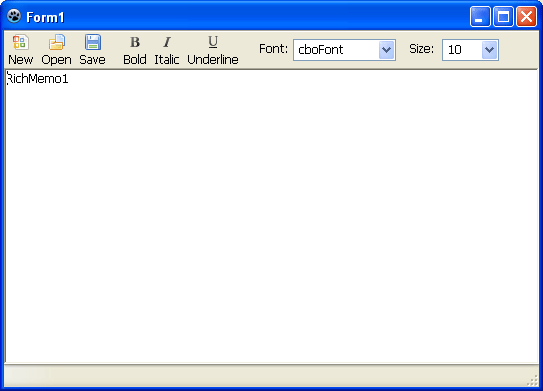

  
It certainly _looks_ good but its not functional. So let's get cookin'!  
  

#### Coding it

We're now going to bring our gorgeous new word processor to life, with code.  
  

#### File management

First, the **New** button. Double click it and enter:  
procedure TForm1.btnNewClick(Sender: TObject);  
begin  
  RichMemo1.Clear;  
  Saved:=False;  
  Filename:='Untitled.rtf';  
  Filepath:='';  
  Caption:=Filename;  
end;  
  
Add the following variable under the **first var clause**:  
  Filename: String = 'Untitled';  
  Filepath: String;  
  Saved: Boolean;  
  
So, we tell the RichMemo to be cleared and we make the Saved boolean to False, meaning that the new document is not saved. So later we can use this value to check whether the document is saved or not. May be a "Save?" dialog box would be nice, right?  
  
Whenever the user changes the document, the Saved boolean should be turned to False. So on the **OnChange** event of RichMemo1 we should set it to False. So, double click **RichMemo1** and enter:  
  
procedure TForm1.RichMemo1Change(Sender: TObject);  
begin  
  Saved:=False;  
end;  
  
  
Now to Open button. For a open dialog to show up we need TOpenDialog. Create one (from the Dialogs tab). Set its DefaultExt to .rtf and Filter as:  
RTF Files (\*.rtf)\*.rtf  
  
Now double click **btnOpen** and enter:  
  
procedure TForm1.btnOpenClick(Sender: TObject);  
var  
  fs : TFileStream;  
begin  
  if OpenDialog1.Execute then begin  
    fs := nil;  
    try  
      // Utf8ToAnsi is required for windows  
      fs := TFileStream.Create(Utf8ToAnsi(OpenDialog1.FileName), fmOpenRead or fmShareDenyNone);  
      RichMemo1.LoadRichText(fs);  
      Saved:=True; // since we opened a saved file  
      Filename:=ExtractFileName(OpenDialog1.FileName);  
      Filepath:=ExtractFilePath(OpenDialog1.FileName);  
      Caption:=Filename;  
    except  
    end;  
    fs.Free;  
  end;  
end;  
  
(I have copied the above code from the accompanying sample project of RichMemo package. B-) )  
  
For the Save button, create a **TSaveDialog** (from Dialogs tab). Set its **DefaultExt** to **.rtf**, and **Filter** to:  
RTF Files (\*.rtf)\*.rtf  
  
Double click **btnSave** and enter:  
procedure TForm1.btnSaveClick(Sender: TObject);  
var  
  fs : TFileStream;  
begin  
  if SaveDialog1.Execute then begin  
    fs := nil;  
    try  
      fs := TFileStream.Create( Utf8ToAnsi(SaveDialog1.FileName), fmCreate);  
      RichMemo1.SaveRichText(fs);  
      Saved:=True;  
      Filename:=ExtractFileName(SaveDialog1.FileName);  
      Filepath:=ExtractFilePath(SaveDialog1.FileName);  
      Caption:=Filename;  
    except  
    end;  
    fs.Free;  
  end;  
end;  
  
Now add the following procedure to the **Form**'s **OnCloseQuery** event (Select Form, then Object Inspector -> Events -> OnCloseQuery -> \[...\]):  
\[ If you have difficulty selecting Form1, then select it from Object Inspector. \]  
procedure TForm1.FormCloseQuery(Sender: TObject; var CanClose: boolean);  
var  
  Response: Integer;  
begin  
  
  if not Saved then begin  
  
    Response:=MessageDlg('Save?', 'Do you wish to Save?',  
              mtConfirmation, mbYesNoCancel,0);  
  
    if Response = mrYes then begin  
      btnSaveClick(Sender); // we save it  
      CanClose:=True; // we let it close  
    end else if Response = mrNo then begin  
      CanClose:=True; // we let it close (but not save)  
    end else begin  
      CanClose:=False; // we don't need to close  
    end;  
  
  end;  
  
end;  
  

#### Other Toolbar Buttons

Now that the basic file management is out of the way, we can focus on the more fun parts. We have Font list. We have to load the fonts automatically into the combobox. So on the **Form**'s **OnCreate** event procedure we enter:  
procedure TForm1.FormCreate(Sender: TObject);  
begin  
  cboFont.Items.Assign(Screen.Fonts);  
  cboFont.ItemIndex:=0; // we select the first font  
end;  
  
Now we will create a procedure to update the toolbar based on where the cursor is. But first, add the variable to the **first var clause** of the unit:  
  
var  
  ...  
  SelFontFormat: TFontParams;  
  
The formatting information would be stored in this variable. You see, to change the formatting, (1) first we'll have to get the formatting in a TFontParams variable, (2) then change it and (3) apply it to the selection. For example, for making a selection Bold we'll have to get the formatting at the beginning point of the selection, make it Bold, then set the whole selection by the new formatting. This formatting can be used in many procedures (Italic, Underline and so on) so we've added it in the var clause.  
  
Then the procedure:  
  
procedure TForm1.PrepareToolbar();  
begin  
  cboFont.Caption:=SelFontFormat.Name;  
  cboFontSize.Caption:=inttostr(SelFontFormat.Size);  
  
  if (fsBold in SelFontFormat.Style = true) then  
    btnBold.Down:=True  
  else  
    btnBold.Down:=False;  
  
  if (fsItalic in SelFontFormat.Style = true) then  
    btnItalic.Down:=True  
  else  
    btnItalic.Down:=False;  
  
  if (fsUnderline in SelFontFormat.Style = true) then  
    btnUnderline.Down:=True  
  else  
    btnUnderline.Down:=False;  
end;  
  
Add the above procedure under the implementation clause and take your cursor in the procedure and press Ctrl+Shift+C. A forward declaration would be added under the TForm1's declarations.  
  
Add the following procedure to the **RichMemo1**'s **OnMouseDown** event (Select RichMemo1, then Object Inspector -> Events -> OnMouseDown -> \[...\]):  
procedure TForm1.RichMemo1MouseDown(Sender: TObject; Button: TMouseButton;  
  Shift: TShiftState; X, Y: Integer);  
begin  
  RichMemo1.GetTextAttributes(RichMemo1.SelStart, SelFontFormat);  
  PrepareToolbar;  
end;  
  
On the cursor position change, we get/update the formatting in SelFontFormat.  
  
If you now open an RTF and click in places, you will see that the toolbar will be updated (the font name, bold, italic, underline etc. changes). So, it can read the style. Now we'll write the styles.  
  
**BOLD BUTTON**  
  
Double click **btnBold** and enter:  
procedure TForm1.btnBoldClick(Sender: TObject);  
begin  
  if (fsBold in SelFontFormat.Style = False) then  
    SelFontFormat.Style:=SelFontFormat.Style + \[fsBold\]  
  else  
    SelFontFormat.Style:=SelFontFormat.Style - \[fsBold\];  
  
  RichMemo1.SetTextAttributes(RichMemo1.SelStart,  
              RichMemo1.SelLength, SelFontFormat);  
end;  
  
We already (1) got the formatting in the SelFontFormat, (2) we modify the formatting style and add fsBold to it (or unbold it if its already bold), (3) then apply it to the selection.  
  
Now Run it (F9 or Run->Run). Select a text and press Bold. Voila! Your first working formatting button! I see a little smile on your face already. :)  
  
**ITALIC BUTTON**  
Now double click **btnItalic** and enter:  
procedure TForm1.btnItalicClick(Sender: TObject);  
begin  
  if (fsItalic in SelFontFormat.Style = False) then  
    SelFontFormat.Style:=SelFontFormat.Style + \[fsItalic\]  
  else  
    SelFontFormat.Style:=SelFontFormat.Style - \[fsItalic\];  
  
  RichMemo1.SetTextAttributes(RichMemo1.SelStart,  
              RichMemo1.SelLength, SelFontFormat);  
end;  
  
**UNDERLINE BUTTON**  
Now double click **btnUnderline** and enter:  
procedure TForm1.btnUnderlineClick(Sender: TObject);  
begin  
  if (fsUnderline in SelFontFormat.Style = False) then  
    SelFontFormat.Style:=SelFontFormat.Style + \[fsUnderline\]  
  else  
    SelFontFormat.Style:=SelFontFormat.Style - \[fsUnderline\];  
  
  RichMemo1.SetTextAttributes(RichMemo1.SelStart,  
              RichMemo1.SelLength, SelFontFormat);  
end;  
  
**FONT LIST**  
Now on the **cboFont**'s **OnSelect** event procedure enter this:  
procedure TForm1.cboFontSelect(Sender: TObject);  
begin  
  SelFontFormat.Name:=cboFont.Text;  
  RichMemo1.SetTextAttributes(RichMemo1.SelStart,  
              RichMemo1.SelLength, SelFontFormat);  
  RichMemo1.SetFocus; // get focus to the rich memo  
end;  
  
**FONT SIZE**  
For font size change, add the following procedure on **cboFontSize**'s **OnSelect** event:  
procedure TForm1.cboFontSizeSelect(Sender: TObject);  
begin  
  SelFontFormat.Size:=StrToInt(cboFontSize.Text);  
  RichMemo1.SetTextAttributes(RichMemo1.SelStart,  
              RichMemo1.SelLength, SelFontFormat);  
end;  
  

#### Touching it up

Add the following line at the end of **Form1**'s **OnCreate** procedure:  
  btnNewClick(Sender);  
  
This will do as if the user has clicked on btnNew at the form startup. So it will create a new document, set the form's Caption and some variables (Filename, Saved etc.) correctly.  
  
Optionally, you can add some menus if you like to give it more professional look. You would need to draw a **TMainMenu** for that, **double click** it, and add some menus. When you select an item, the Object Inspector lets you change its properties add click event to it etc.  
  
Now Run it (F9 or Run->Run).  
  

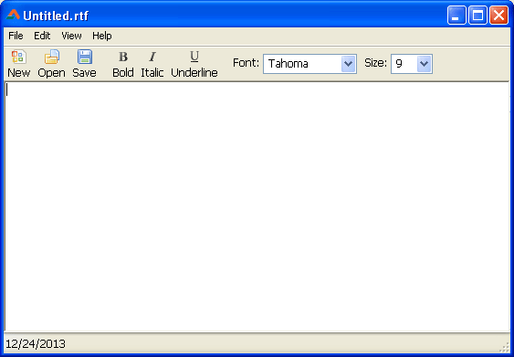

  
  
  
  
  
  
  
Type in, open documents and test it.  
  

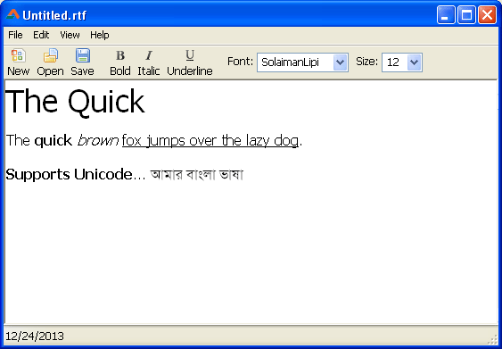

  
  
There you have it! Your very own Christmas Gift! :-)  
  

**Further Improvements**

Improving any source code is one of the best way to practice programing skills. You can improve the project in many ways:  

*   Menu commands. I have added some dummy menus. They don't have any menus or command associated to them. You can [create menus by yourself](http://lazplanet.blogspot.com/2013/08/3-ways-to-use-popup-menus-in-lazarus.html).
*   Undo/Redo. There is built in undo redo feature which you can use. Add buttons in the toolbar and drag to reorder them if necessary.
*   Text Color. You can easily change color through SelFontFormat.Color, just like the formatting buttons.
*   Strikethrough. By using fsStrikeOut, just as we used fsBold.
*   [Drag and drop file feature](http://lazplanet.blogspot.com/2013/05/drag-drop-files-lazarus-form.html).
*   [Right click menu](http://lazplanet.blogspot.com/2013/08/3-ways-to-use-popup-menus-in-lazarus.html) having cut, copy, paste, delete etc. You could use TRishMemo's CutToClipboard, CopyToClipboard and PasteFromClipboard.

  

**Known Issues**

It is just a basic implementation of RichMemo. It has some issues.  
\- The buttons for formatting change doesn't work well when the selection has multiple styles applied to them. For example, if your selection has both Bold and Italic text and you click Underline, the bold and italic style will be reset making the selection underline. You can use RichMemo1.GetStyleRange to get each style and modify it accordingly. You can look into the sample project included with the component package. It has a "Next Style Range" button that detects each diferent style. The code is like this:  
procedure TForm1.Button6Click(Sender: TObject);  
var  
  ofs, len  : Integer;  
begin  
  RichMemo1.GetStyleRange( RichMemo1.SelStart, ofs, len );  
  if (ofs = RichMEmo1.SelStart) and (len = RichMemo1.SelLength) then begin  
    ofs := ofs + len;  
    RichMemo1.GetStyleRange( ofs, ofs, len );  
  end;  
  RichMemo1.SelStart := ofs;  
  RichMemo1.SelLength := len;  
end;  
  
\- When you close the program with an unsaved document, press Yes, then in the dialog press Cancel, the program closes and the document is lost!  
  
  
  

### Download Sample Code ZIP

You can download the above example tutorial project's source code from here: [https://db.tt/S2Pz77A7](https://db.tt/S2Pz77A7)  
Size: 550 KB  
The package contains compiled executable EXE file.  
  
EDIT 1 (31JUL14): A download link for SVN pull has been given. Thanks to Tail for pointing out an error in his SVN pull.