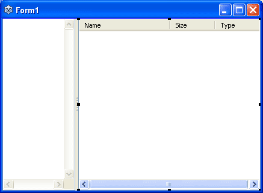

File browsers are very useful in our everyday lives. What if you can create a file browser in 2 Minutes? ...without writing code? Yes! That's how we do it in Lazarus.  
  
  
Lazarus is a Rapid Application Development Environment (RAD in short). It is possible to create complex applications in minutes. Form designer is very handy at designing layouts faster than Cheetah!  
  
Today we try out the speed Lazarus. We will create a File Manager in 2 Minutes, plus, without a single line of code to be written. It will have a drive list (in Windows machines), and the files will be shown in a component at the right upon selection of a folder from the Treeview in left.  
  
  

### (Very) Quick Tutorial

  
  
  
Select ShellTreeView1 and set its Align property to alLeft. The treeview control will jump and sit on the left.  
  
  
  
  
Go to Additional tab and click on the TSplitter button and then click TShellTreeView. This will allow us to resize the treeview area at runtime.  
  
  
  
  
Select the TShellListview and set its Align property to alClient and ShellTreeview property to ShellTreeView1.  
  
  
  
Voila! Its done!  
  
Now Run it (F9 or Run-> Run).  
  
  
  

### Download Sample Code

You can download an example source code zip file from here: [http://db.tt/LOmni33C](http://db.tt/LOmni33C)  
Size: 550 KB  
The package contains compiled executable EXE file.  
  
_Image: [http://www.iconarchive.com](http://www.iconarchive.com/show/hydropro-v2-icons-by-media-design/Folder-icon.html)_  
  
  
Ref:  
[http://www.youtube.com/watch?v=Vee9x90Qm4E](http://www.youtube.com/watch?v=Vee9x90Qm4E)