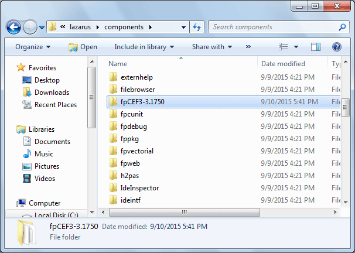
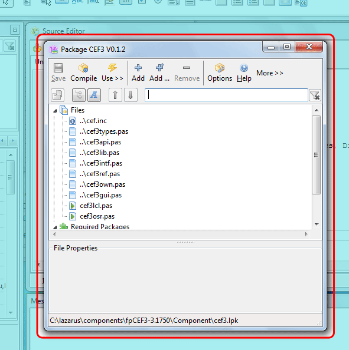
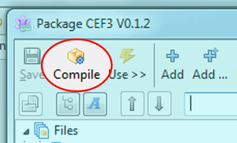
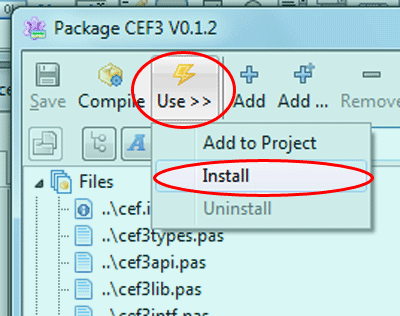
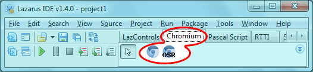
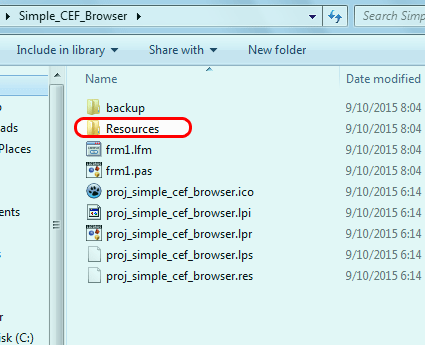
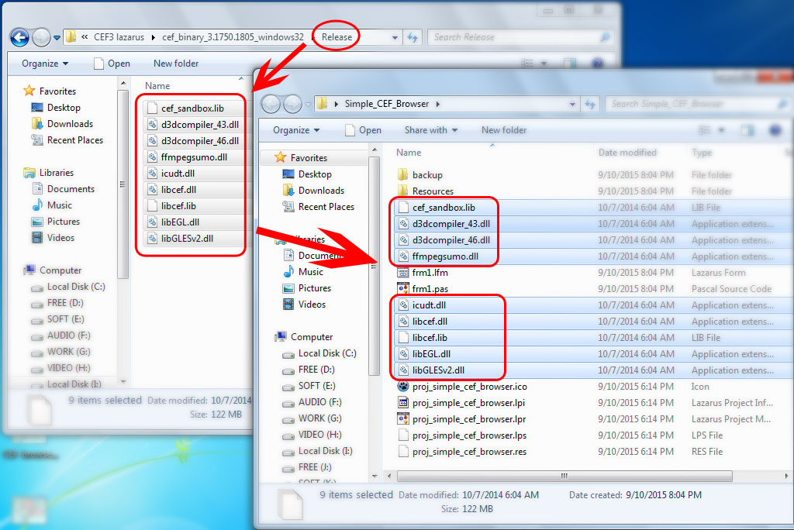
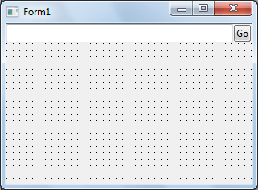
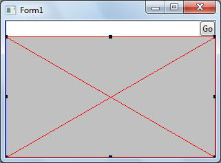
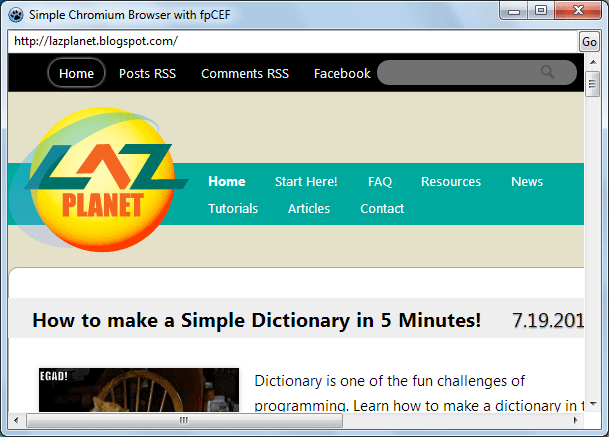

We'll learn how to create a web browser even quicker than you can install one! All using the people's favorite chromium engine!
<!-- more -->
  
Well, we had a popular post on LazPlanet about [creating a web browser using the GeckoPort v1](http://localhost/wp-lazplanet/2013/10/29/create-a-web-browser-in-lazarus-with-gecko-part-1/). That was a great way to create a browser and I love Gecko because it is the darling of open source! But it was an old version of Gecko and the newer version does not seem to work.  
  
So, today, we have a solution for a browser made with a more updated engine. It will harness the pure goodness of the [Chromium Embedded Framework (CEF)](https://bitbucket.org/chromiumembedded/cef) and [its implementation on Free Pascal, named fpCEF3](http://wiki.freepascal.org/fpCEF3).  
  
Although Chrome [has done](http://www.forbes.com/sites/anthonykosner/2012/08/02/googles-new-chrome-browser-can-take-over-your-webcam-should-you-be-scared/) [things](http://www.dailymail.co.uk/sciencetech/article-2544539/Is-Chrome-spying-YOU-Cyber-criminals-use-Google-browsers-voice-recognition-software-listen-conversations.html) that [truly-privacy-minded people don't like](https://www.privateinternetaccess.com/blog/2015/06/google-chrome-listening-in-to-your-room-shows-the-importance-of-privacy-defense-in-depth/). But it is a fast web browser engine that is increasingly becoming popular. We all know that [Opera ditched its own-coded engine "Presto"](http://readwrite.com/2013/02/13/browser-maker-opera-ditches-presto-in-favor-of-webkit#!) and [started using "Blink"](http://webscripts.softpedia.com/blog/Opera-Will-Use-Google-s-Blink-Not-WebKit-Like-It-Announced-Initially-342806.shtml), a variant of the Chromium engine, as their focused engine. [Google Chrome also has a good bite in browser market share](https://en.wikipedia.org/wiki/Usage_share_of_web_browsers#Summary_tables). Chrome is also running in the [Chromebooks](https://en.wikipedia.org/wiki/ChromeBook) pioneered by Google. So, we can say that Chromium has done something right and we're going to learn to build a browser out of that goodness.  
  
[FpCEF3](https://github.com/dliw/fpCEF3) is a great project that we should all adore. It will let us use the Chromium engine right in our Lazarus project. And it is possible to use it in Windows, Linux and Mac OS platforms. But in this article, we are using Windows. (You can adopt this tutorial for the other platforms quite easily if you know your way around.)  
  
So without further ado, let's make this browser...  
  
  

### Download & Install fpCEF3

1\. First of all, we need to download fpCEF3. You can [download revision 23 (or version 3.1750)](https://github.com/dliw/fpCEF3/releases) from [here](https://github.com/dliw/fpCEF3/archive/v3.1750.zip) . (I have used the revision no 23 which is very important for the next step. I'll explain later.)  
  
\[  
But if you are ready to experiment any later revisions, feel free to do so. (I have instructions for it later, don't worry.) For getting the latest revision, you can use [Win32SVN](http://sourceforge.net/projects/win32svn/) and summon the commands in terminal:  
  

cd /D c:lazaruscomponents  
svn co https://github.com/dliw/fpCEF3

  
(You can always change the c:lazarus part with your Lazarus installation if you have lazarus installed elsewhere in your computer. If you've done this, then skip the next step, step 2, and continue after that.)  
\]  
  
2\. **Extract & Copy** the folder to the **Components** directory inside your **Lazarus installation** (this is usually **C:LazarusComponenets**).  
  

  
  
3\. Now go inside the folder, then inside "**Component**" folder, then double click **cef3.lpk**. (You can also use Package->Open Package file (lpk)... from inside Lazarus to open this file.)  
  
This will open up Lazarus with a "Package" window for CEF3 like below:  
  

  
  
4\. Click on **Compile**.  
  

  
5\. After the Compiling has completed (the messages window will show a "**Success**" message), click **Use -> Install**. Click **Yes** to rebuild Lazarus.  
  

  
Give it some time to rebuild. Lazarus will restart. Upon restart you'll now see a new "Chromium" tab in the toolbar.  
  

  
  
In the meanwhile let's download CEF...  
  

### Download CEF

\[ Note: I was very specific about [getting the 23 revision (or version 3.1750) of FPCEF3](https://github.com/dliw/fpCEF3/releases). This version is able to use CEF version 3.1750. If you have got yourself any other revision of fpCEF3, be sure to check the version number or commit messages to look for the appropriate version of CEF to be downloaded for it to work. \]  
  
1\. **Download CEF** (version 3.1750) from [here](http://www.magpcss.net/cef_downloads/index.php?file=cef_binary_3.1750.1738_windows32.7z) or [here](https://cefbuilds.com/) .  
  
2\. Download & Install **7-zip** from [here](http://www.7-zip.org/). You'll need 7-zip to extract the file above.  
  
3\. Now **extract** the file and keep it that way. We'll only need the "**Release**" & "**Resources**" folders from this hotchpotch and jam packed file.  
  

### Create the browser in 3 minutes!

The previous steps were just preparations -- which you'll only have to do once. Now that we're done with those boring setups now we get back in our real business... the browser.  
  
Start [Lazarus](http://www.lazarus-ide.org/).  
  
Create a new Application project (**Project->New Project->Application->OK**).  
  
Save the Project (**File -> Save All**) in a directory.  
  
Now, in the project directory copy the **Resources** Folder from **CEF package**.  
  

  
And then copy all the **files inside** the **Release** folder from CEF package, and paste it directly into the **project directory**. See the screenshot below if you need help understanding (click to enlarge).  
  

  
Drop a new TEditButton (from Misc tab) in to the form. Set its properties like this:  
Name = edtURL  
Align = alTop  
ButtonCaption = Go  
  
The result is as follows:  
  

  
Now we'll have a nice Location bar/Address bar at the top.  
  
Now Drop a new TChromium (from Chromium tab) in the form. Set its properties:  
  
Name = Chromium  
Align = alClient  
  
It will fit the Chromium component nicely in the form's blank area.  
  

  
  
Now double click the Form1 item in the Object Inspector and enter the code:  
  

procedure TForm1.FormCreate(Sender: TObject);  
begin  
  CefResourcesDirPath:='Resources';  
  CefLocalesDirPath:='Resourceslocales';  
  CefInitDefault;  
  edtURL.Text:='http://lazplanet.blogspot.com';  
end;

  
Now that you are in the Code view, add the cef3types & cef3lib unit in the uses clause:  
  

uses  
  ..., ..., ...  
  , cef3types, cef3lib;

  
Now add the following code on edtURL's OnButtonClick event (select the edtURL component, go to Event tab, click the \[...\] button beside OnButtonClick item):  
  

procedure TForm1.edtURLButtonClick(Sender: TObject);  
begin  
  
  Chromium.Load(UTF8Decode(edtURL.Text));  
  
end;

  
Now add the following code on Chromium's OnLoadEnd event (select the Chromium component, go to Event tab, click the \[...\] button beside OnLoadEnd item):  
  

procedure TForm1.ChromiumLoadEnd(Sender: TObject; const Browser: ICefBrowser;  
  const Frame: ICefFrame; httpStatusCode: Integer);  
begin  
  
  edtURL.Text:=UTF8Encode(Browser.MainFrame.Url);  
  
end;

  
Voila! Done! Well under 3 minutes!  
  
Now Run the project (F9 or Run -> Run). Click the "Go" button.  
  

  
You'll see the LazPlanet website load in your newly made web browser! You can change the code on the TForm1.FormCreate procedure to set another URL as the homepage.  
  
Now browse all you want with your new browser! Happy surfing!  
  

### Download Sample Code ZIP

You can download the above example tutorial project's source code from [here](https://db.tt/MWPFjW2v).  
  
Size: 926 KB  
The package contains compiled executable EXE file.  
  
**Ref:**  
[http://wiki.freepascal.org/fpCEF3](http://wiki.freepascal.org/fpCEF3)  
[https://github.com/dliw/fpCEF3](https://github.com/dliw/fpCEF3)  
[http://www.magpcss.net/cef\_downloads/](http://www.magpcss.net/cef_downloads/)