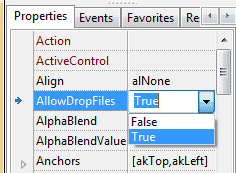
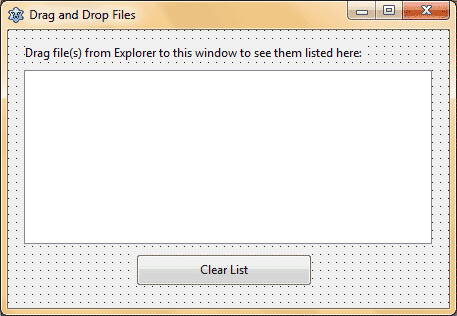
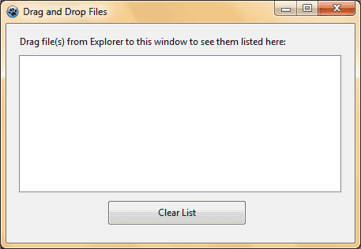

You can drag and drop files to softwares, that's old news. But can you drag & drop files over YOUR own software? Yes. And we learn how to...
<!-- more -->
  
  
Dragging and dropping files over an application is a good thing. Especially, when you don't want to use the Open dialog when you have the files open in your File Explorer. Why would you want to navigate through the directories and find the file, when you can just drag and drop the files on the software? Simple- you wouldn't. Because we will implement Drag and Drop in your own little program!  
  
We would learn how to enable dragging and dropping of files on our Form.  
  

### What we need to do

The basics is that :  
1\. we need to make AllowDropFiles property of the form to True.  
2\. Then on the form's OnDropFile event we will have to add something like this:  
  
procedure TForm1.FormDropFiles(Sender: TObject; const FileNames: array of String);  
var  
  i: Integer;  
begin  
  for i := Low(FileNames) to High(FileNames) do  
     DoSomeThingWithFile(FileNames\[i\]);  
end;  
  

### Quick Tutorial

  
First, create a new Application Project (Project-> New Project-> Application-> OK).  
  

#### Step-1

Then with the form being selected, go to the Object Inspector and change the AllowDropFiles to True.  
  

  
This will capture the files that are dragged over the form.  
  
Create a TLabel, TListbox and a TButton to reproduce the form design below:  

  

#### Step-2

Then go to the Events tab in Object Inspector and click the \[...\] button beside the OnDropFile item and enter the following code:  
  
var  
  i: Integer;  
begin  
  for i := Low(FileNames) to High(FileNames) do  
    ListBox1.Items.Add(FileNames\[i\]);  
end;  
  
**Explanation:**  
The code supports both single and multiple files. It also supports files and directories. So you can process almost any type of file drag and drop scenario.  
  
  for i := Low(FileNames) to High(FileNames) do  
  
We loop through all the files that has been dragged and dropped over the form.  
  
    ListBox1.Items.Add(FileNames\[i\]);  
  
We add all the dropped files to the listbox. FileNames is the array that has all the dropped files/folders path.  
  
Finally, double click on the TButton and enter the following code for clearing the list:  
  
begin  
  ListBox1.Clear;  
end;  
  

#### Run It

Now run the project (F9 or Run->Run).  
  

  
Now drag some files and folders and test if gets listed in the list. Clear the list if you wish. Enjoy!  
  

### Download Sample Code ZIP

You can download example source code zip file from here: [http://db.tt/BrvWq8WL](http://db.tt/BrvWq8WL)  
Size: 514 KB  
The package contains compiled executable EXE file.  
  
Ref:  
[http://forum.lazarus.freepascal.org/index.php?topic=17336.0](http://forum.lazarus.freepascal.org/index.php?topic=17336.0)