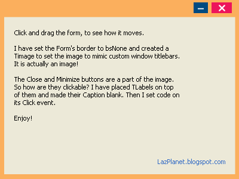

Moving a window is not new! We move windows by its title bar at the top. But what if we want to move a window/form by dragging its body? Could we remove the title bar of our form and have fancy interface going on? Yes. And here's how...
<!-- more -->
  
  
Imagine you are creating a cool interface for an MP3 Player. For the intended coolness, you got rid of the title bar of the form. Instead you have a roundish form shape with a titlebar looking area. You want the user to be able to move the form by dragging the whole form. How can you do that? We'll see how...  
  
  

### Quick Tutorial

  
Start Lazarus. Create a new project (Project-> New Project-> Application-> OK).  
  
Switch to code view by pressing F12. Find the first var clause and add these variables:  
  
  MouseIsDown: boolean;  
  PX, PY: integer;  
  
Now switch to form view (F12) and make sure the form is selected. Then add the following code to its OnMouseDown Event. (Go to Object Inspector-> Events tab-> OnMouseDown-> \[...\] and enter the following code):  
  
  if Button = mbLeft then begin  
    MouseIsDown := True;  
    PX := X;  
    PY := Y;  
  end;  
   
Similarly, add the following code to its OnMouseMove event:  
  
  if MouseIsDown then begin  
    SetBounds(Left + (X - PX), Top + (Y - PY), Width, Height);  
  end;  
  
We use SetBounds() for shortcut. We can also use:  
Form1.Left := Form1.Left + (X - PX);  
Form1.Top := Form1.Top + (Y - PY);  
  
Add the following code on its OnMouseUp Event:  
  
MouseIsDown:=False;  
  
Run it now (F9 or Run-> Run). Move the form to test your code.  
  
  

#### Explanation:

Here are some short explanation behind the code. If you need more detailed explanation, please use the comment form below to ask.  
  
The magic lies in the code in the MouseMove event:  
  if MouseIsDown then begin  
    SetBounds(Left + (X - PX), Top + (Y - PY), Width, Height);  
  end;  
  
We are calculating the difference of how much the mouse has travelled with (X - PX). PX is the X where the mouse was down (or where the drag has started). So, how much the mouse has moved? Current X - Previous X.  
  
If the we drag the form 100 pixels rightwards, then the difference would be 100 (X-PX=100). Then we add the difference (100) to its Left property. Easy!  
  
Y - PY is similar. It works with the vertical distance of how much the form has been dragged.  
  

### Enhancement

  
You can now set the form's BorderStyle property to bsNone. This will remove the title bar and only keep the form's main area/body. You can use a TImage for a cool background/skin, as you wish. Don't forget to keep a Close button to close the form! Or else, you won't be able to quit the program!  
  
You can see a simple utilization of the code above to create a custom looking form border. You can improve it more with your ideas.  
  

  
  
How did I make the Close and Minimize buttons work? The button image is from the background image. There must be some invisible component to do that, right? :-) No. I have created some "invisible hotspots" by creating a TLabels and making their caption blank. Then you can double click it and enter any command. You can create invisible components with this method.  
  

### Download Sample Code ZIP

You can download an example source code zip file from here: [http://db.tt/vRg1pRtf](http://db.tt/vRg1pRtf)  
Or here: [http://bit.ly/17YkrUA](http://bit.ly/17YkrUA)  
Size: 638 KB  
The package contains compiled executable EXE file.