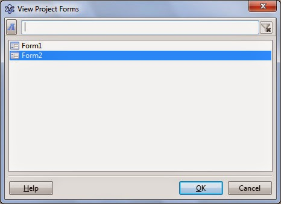
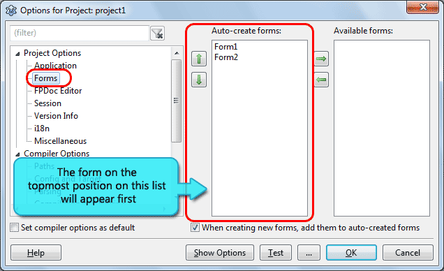

We love forms, right? So why have only one? Why not two?! Let's learn how to create multiple forms, manage them and use them as dialog boxes.  
  
When we create a new Application Project, we get one form with our project. We love forms because every GUI project that we start, it starts from a form, a blank form. Then it gradually grows to a full application. We could consider it a building block for our applications.  
  
For some projects it is okey to have one form. But for some others, we need extra forms. For example, a form might be needed for an About dialog, or a Settings dialog.  
  
There is a way for using multiple forms. And in this little must-read tutorial, we're gonna learn how to use and manage multiple forms in our project.  
  

### Creating the project (as usual)

Start [Lazaurs](http://lazarus.freepascal.org/).  
  
First we need a project. If you have one open it. But it is better to create a new project just for this practice. To create a new project start Lazarus and then click Project -> New Project, select "Application" from the list, then press OK.  
  
This will create a project with one Form in it. It is of no surprise that by default the form is named Form1. Okey, so let's continue...  
  

### Creating a new Form

We already have a single form. Now we want to add another form. So, **click File -> New Form**. You will see a new form titled "Form2" in the screen.  
  
  
Now that you have created another form it is better to save the project to understand how they work. So, go ahead and click File -> Save All... and save the project. You can use the default file names, don't worry!  
  
So you have saved project1.lpi, unit1.pas and unit2.pas.  
  

### How to see all your forms in current project and switch between them

If you have followed the instructions correctly, now you have 2 forms in your project. If you don't trust me, press **Shift + F12** to bring up the "View Project Forms" dialog. In this dialog you will see all the forms the current project has.  
  
  
You can **double click** on the forms from the list of that dialog to bring it up in the form design view. This will switch to that form to let you design it. You can also try the Window menu to switch between forms.  
  
Additionally, I hope you remember that we press **F12** to switch between form and code view.  
  

### Showing one Form from another Form

  
Suppose we want to show Form2 from Form1. Form1 will have a button. When the user clicks it, Form2 will show.  
  
So, switch to Form1, draw a TButton on the form. Set its Caption as "Show Form2" from the Object Inspector. Double click it and enter...  
Well wait. We want to use Form2 in our code. But that **won't work**. Try writing "form2" and pressing Ctrl+Space. It won't autocorrect. That means **Form2 is not found by Form1**!  
  
Although you have saved both unit1.pas and unit2.pas in the same project directory, Pascal won't find it right away. You will have to manually add it to the uses clause of Form1's code (Unit1). We will have to point a finger and tell Pascal that we want to use the TForm present in Unit2 in our code. If we don't, Pascal won't find it itself. It is similar to the situation when you add path to a library directory, still you need to add the unit name(s) in the uses clause. Or else, pascal won't add the library unit itself. That's the way Pascal works.  
  
So in the Form1 code's uses clause, we'll have to add Unit2 in order to use Form2 in our code.  
  

unit Unit1;  
  
//...  
//...  
  
uses  
  ..., ...,  
  Unit2;

  
**(Remember, uses clause only knows the Unit name, not the form name. So we've used Unit2, not Form2.)**  
  
To show Form2, the code would be: Form2.Show; Now we can write it since we have added Form2 in the uses clause. You will have to add the unit name to uses clause whenever you want to use one form from another.  
  
Now let's get back to the button. Double click it then add the code:  
  

procedure TForm1.Button1Click(Sender: TObject);  
begin  
  Form2.Show;  
end;

  
Now Run the Project (F9 or Run -> Run). Then click the button. Form2 will show. That means our code is working!  
  
The code is working. But when you would want to use Form1 from Form2 it will give you a circular reference error. To avoid this, we should add an implementation clause then dump our reference under it. We'll be looking into this problem a bit further. But for now, delete the Unit2 from uses and add an implementation clause and keep it there:  
  

unit Unit1;  
  
//...  
//...  
  
uses  
  ..., ... {,  
  Unit2};  
  
implementation  
uses  
  Unit2;

  

### Accessing Form1 from Form2

  
We tried accessing Form2 from Form1. Now its time to to do the opposite: access Form1 from Form2.  
  
Now here's an important note, if you add unit1 in the uses clause of unit2, it wouldn't work. It will raise unit2.pas(xxx,yyy) Fatal: Circular unit reference between Unit2 and Unit1.  
  

unit Unit2;  
  
uses  
  ..., ..., unit1;  
  // This code is wrong! It will raise a Circular unit reference error.

  
So a solution to this problem is adding ANOTHER uses clause under implementation clause.  
  

unit Unit2;  
  
uses  
  ..., ...;  
  
implementation  
uses  
  Unit1;

  
And also in Unit1 if you haven't done it, go ahead and make the change:  
  

unit Unit1;  
  
//...  
  
uses  
  //...  
    
//...  
  
implementation  
  
uses  
  Unit2;

  
Now, with this cool tip you can use both forms back and forth.  
  
  

### Testing the link

  
You can add some buttons to test whether the link between the forms work.  
  
Draw 2 buttons on Form1. Code Button1click like:  

Form2.Show;

  
Code Button2click like:  

Form2.Color:=clRed;

  
Draw 1 button on Form2 and code on its click event:  

Form1.Color:=clGreen;

  
You get the idea.  
  

### Making Form2 appear first

When we run the project, Form1 usually comes first on the screen. How can we set some other form as the first one? Let's see...  
  
Go to Project -> Project Options. Then under Project Options click Forms. You would see 2 lists. The list on the right doesn't matter to us right now.  
  
  
Select Form2 from the list on the left and click the Up arrow icon. Make sure that Form2 is the topmost item. Then click OK.  
  
The topmost item on that list appears first.  
  

### Showing Forms as Dialog Boxes

  
If you want to show a form as a dialog box, its easy! Here's the code:  
  
Form2.ShowModal;  
  
It does the following:  
(1) It shows the form  
(2) Locks the parent form from which it was triggered  
(3) Halts running code after the line Form2.ShowModal.  
  
When the user closes the form (or hits the OK button or maybe something else to close it) the code after the line resumes to execute.  
  
We can use this behavior to capture the settings that the user put in the dialog.  
  

### Reading settings from a Modal form

Suppose, the modal form is our dialog box. So we want to update something according to the settings that the user changed. How could we do it?  
  
There are many ways to do that. One of the ways is described in the [Free Pascal/Lazarus Wiki](http://wiki.freepascal.org/Form_Tutorial#Passing_Variables_to_Other_Forms). Well, you can follow that instructions. But I think I should write in my own way which I find simpler.  
  
We would use something called a [ModalResult property](http://docs.embarcadero.com/products/rad_studio/delphiAndcpp2009/HelpUpdate2/EN/html/delphivclwin32/Forms_TCustomForm_ModalResult.html) of the modal form. The default value for ModalResult is mrNone. If the value of it changes, the modal form automatically closes and the .ShowModal returns the value of the ModalResult. We can set its value to mrOK, mrCancel, mrIgnore etc. In that case the value will be returned to the parent form. This is a very logical workflow for handling modal forms and great for handling all the cases possible.  
  
Let's suppose we have 2 forms - Form1 is our parent form and Form2 is our modal form. On form1 I drop a button. And on form2 I create TEdit and two buttons btnOK and btnCancel. So:  
  
1\. On the OK button of the Form2 I set ModalResult to mrOK.  
  

procedure TForm2.btnOKClick(Sender: TObject);  
begin  
  // the parent form will get the mrOK value  
  ModalResult:=mrOK;  
end;

  
...And the Cancel button would have:  
  

procedure TForm2.btnCancelClick(Sender: TObject);  
begin  
  ModalResult:=mrCancel;  
end;

  
2\. This will let the parent form's code to continue where it left off. So, we can now access every component in modal form.  
  

procedure TForm1.Button1Click(Sender: TObject);  
begin  
  // we detect that ok button has been pressed  
  if Form2.ShowModal = mrOK then begin     
    Form1.Caption:=Form2.Edit1.Text;  
  end;  
end;

  
All the possible values for ModalResult (copy-pasted from the Controls unit):  

  mrNone = 0;  
  mrOK = mrNone + 1;  
  mrCancel = mrNone + 2;  
  mrAbort = mrNone + 3;  
  mrRetry = mrNone + 4;  
  mrIgnore = mrNone + 5;  
  mrYes = mrNone + 6;  
  mrNo = mrNone + 7;  
  mrAll = mrNone + 8;  
  mrNoToAll = mrNone + 9;  
  mrYesToAll = mrNone + 10;  
  mrClose = mrNone + 11;  
  mrLast = mrClose;

  
So, now you are ready to make multiple forms appear in your project.  
So go on and make some forms!