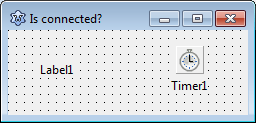
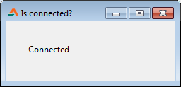

If you are doing something that depends on an internet connection, you would probably want to check if internet is available. That's what we are going to detect today.
<!-- more -->
  
  
  
Today we will learn to check if the computer that our program is running is connected to the internet or not.  
  
This is just like a code snippet. In fact I found this one accidentally when searching for something. I found delphidabbler.com which is made for delphi, but most of the things also apply to Lazarus/Free Pascal. Delphidabbler.com is a great website if you know what you are doing.  
  
  
So the code I found is:  
  

uses  
  ..., windows, wininet;  
  
function IsInternetConnected: Boolean;  
var  
  Flags: Windows.DWORD; // flags to pass to API function  
begin  
  Flags := 0;  
  Result := WinInet.InternetGetConnectedState(@Flags, 0);  
end;

  
The function will return True if the machine is connected to internet and False if its not.  
  
(By the way, it uses windows unit. So you can guess that it will not work with any platforms other than Windows.)  
  
We can use this code to build an example project.  
  

### Tutorial

Start [Lazarus](http://lazarus.freepascal.org/).  
Create a new Application Project (Project -> New Project -> Application -> OK).  
Place a TLabel and a TTimer (from System tab). You can resize your form and customize it the way you like. My form looks like this:  
  

  
Double click the TTimer (or Timer1) and enter the following code:  
  

// credits: delphidabbler.com  
procedure TForm1.Timer1Timer(Sender: TObject);  
var  
  Flags: Windows.DWORD; // flags to pass to API function  
begin  
  Flags := 0;  
  if (WinInet.InternetGetConnectedState(@Flags, 0)) then  
    Label1.Caption:='Connected'  
  else  
    Label1.Caption:='Disconnected';  
end;

  
Now scroll to the top of the code and add the two units in the uses clause:  
  
  

uses  
  ..., ..., windows, wininet;

  
Now Run the project (F9 or Run -> Run).  
  

  
Now if the computer is connected to the internet, it will show "Connected". And if its not, the label will show "Disconnected".  
  
This code can be utilized in many ways. For example, if you're going to download a file from the internet you can check the connection before continuing. You can then prompt the user to get connected if he is not. Or maybe offering products to the user when he is online.  
  

### Download Sample Code ZIP

You can download the above example tutorial project's source code from [here](https://db.tt/XCO9id6W).  
Or [here](https://drive.google.com/uc?id=0B9WrDtlrEzlSaVBlX3lZMThJU3c&export=download)  
Size: 543 KB  
The package contains compiled executable EXE file.  
  
**Ref:**  
[http://snippets.delphidabbler.com](http://snippets.delphidabbler.com/)