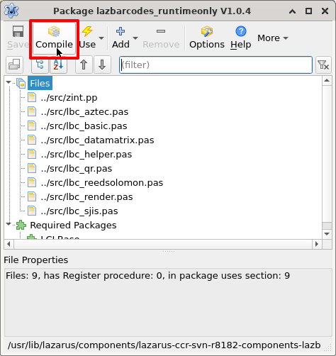
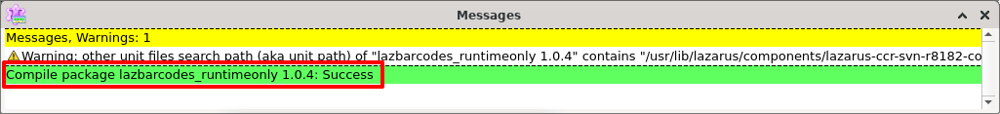
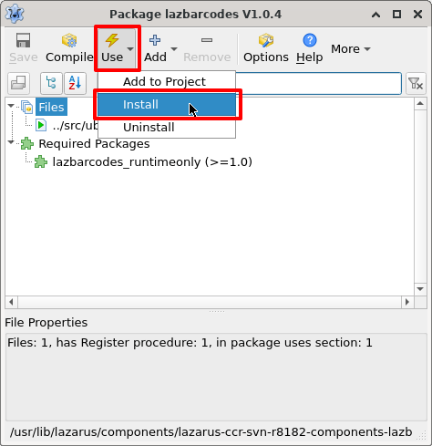
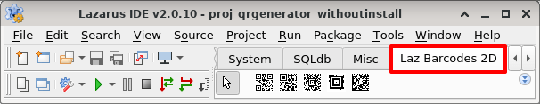
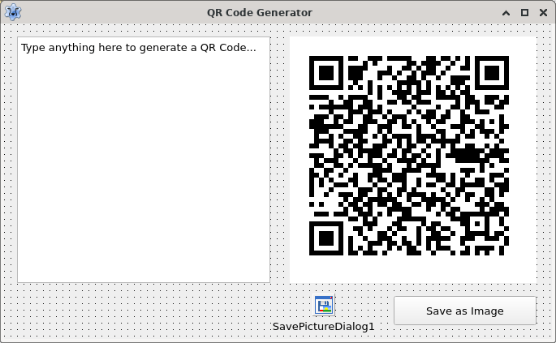
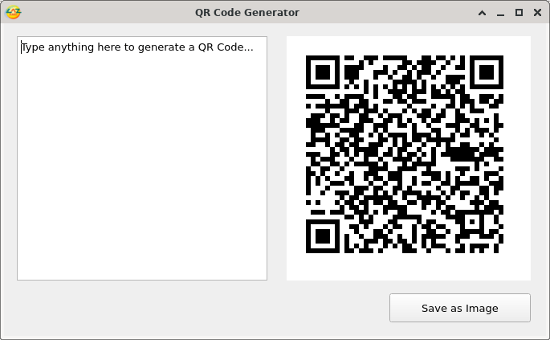
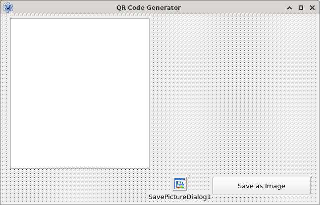
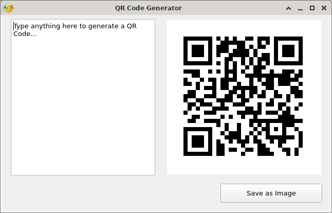

Learn this computer wizardry that let's you transfer some wildly huge text to your phone before you can snap your fingers!
<!-- more -->

QR codes are amazing. They are these pixelated images that can hold text data inside them. It can hold small and even impressively large text in them. Doing that with the help of just some dots in an image is impressive. And then when you point a smartphone camera with a special app, the code can magically send that text inside that QR Code to your phone. Isn't that amazing?!

So today we're going to generate QR Codes with Lazarus. Fun stuff!

## Intro to QR codes

QR Code is short for "Quick Response Code". If you are a curious fellow you can find more details on [this Wikipedia article](https://en.wikipedia.org/wiki/QR_code). QR codes are similar to [barcodes](https://en.wikipedia.org/wiki/Barcode) but QR Codes have dots both horizontally and vertically, while barcodes have only vertical lines.

Here is a QR Code:


Can you guess what's in it? Maybe some mystery code? Why not scan it and comment below?

There are many apps to use on your mobile phones. One of the apps I use is [Obsqr](https://trikita.co/obsqr/) which is a lightweight, MIT licensed QR Code scanner to do the job. There are many others which you can find on your app store by searching for "qr code scanner". Install and then point your phone camera at a QR Code anywhere, either on a screen or on the wall, it will show you the hidden text encoded in the image.

So how much data can these hold? Wikipedia says, it depends on the size and parameters, but usually 4,296 characters. This is more than enough for storing an URL, a coupon code, a short message, a poem, a phone number or anything really. But in order to keep your secret, you gotta make one, right? So let's get on with our tutorial.

Before we start, let me tell you that we're going to be using [LazBarcodes](https://wiki.lazarus.freepascal.org/LazBarcodes). There 2 ways of using LazBarcodes library. (A) One is to compile Lazarus and get it available in the toolbar then use it like any other component, (B) another is to just have it inside your project directory, change some settings and use it in the code without recompiling Lazarus. We'll see the recompile method first, then the other one.

But whichever you follow, you'll have to download LazBarcodes project source code. To do that just go to [Lazarus CCR for LazBarcodes](https://sourceforge.net/p/lazarus-ccr/svn/HEAD/tree/components/lazbarcodes/) and click **Download Snapshot**. You will get a zip file download.

## Tutorial

### A. By installing

**Installing component:**

- Extract the zip file somewhere. I usually extract in `C:\Lazarus\components` on Windows/ReactOS. On Linux, a terminal command like `sudo unzip lazarus-ccr-svn-*-components-lazbarcodes.zip -d /usr/lib/lazarus/components/` might do the trick. You can keep this on any other folder, but remember, do not rename or move it after installed, because if Lazarus can't find it on the same place it will replace it with a dummy component (by showing an error on startup) and you'll have to reinstall it again to fix it.

- After extracting, start Lazarus and go to **Package - Open package file (.lpk)**. Now go into that extracted folder, then `packages` and then double click `lazbarcodes_runtimeonly.lpk` file. Doing this will show a dialog box on screen titled **Package lazbarcodes_runtimeonly V1.0.4**. On that dialog box, click **Compile** and then let it compile.



Keep an eye on the Messages window (click **View - Messages** if not visible). It should show a green colored message saying "Success". Close the package dialog.



- Now click **Package - Open Package File (.lpk)**. This time open `lazbarcodes.lpk`. This will open a dialog titled something like **Package lazbarcodes V1.0.4**. Click on **Use - Install**.



It will ask if you want to automatically install the `lazbarcodes_runtime` package. Click **OK**. When asked if you want to rebuild Lazarus, click **Yes**. If it shows a message saying 2 units have the same name, click **Ignore All**.

This will gradually install LazBarcodes and restart Lazarus IDE. When done successfully you should see a new tab in the top toolbar named **Laz Barcodes 2D**.



Rest of the tutorial is easy.

**Actual tutorial:**

Just create a new Application project (**Project - New Project - Application - OK**).

Make sure the form is visible. If not, press **F12**. Now go to **Laz Barcodes 2D** tab and click **TBarcodeQR**, then draw a component on the form. It's best to keep the Width and Height the same since QR code is square. Draw a TMemo on the form and set it's **Lines** property to say something like "**Type anything here to generate a QR Code...**" or blank or anything you want. Double click the TMemo and enter:

```pascal
procedure TForm1.Memo1Change(Sender: TObject);
begin
  BarcodeQR1.Text:=Memo1.Text;
end;
```

Now we'll let the users save the QR Code to file. Don't worry. With Lazarus we can implement with just 2 lines of command. Draw a TButton (or a TBitBtn if you like) and TSavePictureDialog (from Dialogs tab) on the form . Set **DefaultExt** property of TSavePictureDialog to `.png`. Now double click the button and enter:

```pascal
procedure TForm1.Button1Click(Sender: TObject);
begin
  if SavePictureDialog1.Execute then
    BarcodeQR1.SaveToFile(SavePictureDialog1.FileName);
end;
```

The `SavePictureDialog1.Execute` will trigger the save dialog and allow the user to choose a location and filename to save the QR Code image to. If the user cancels the dialog it will return `False` and nothing will happen.

The form layout should be something like this:



Now Press **F9** (or **Run - Run**) to run the project. The form should show you a QR Code or if you emptied the Lines property a blank image.



Change the text of the Memo to generate a QR Code for that text.

Amazing! Barely any coding needed!

**Uninstalling component**:

If for some reason you want to uninstall the LazBarcodes library, all you have to do is go to **Package - Install/Uninstall packages**, type "**lazb**" under the text **Install**, select **lazbarcodes**, click **Uninstall** selection and click **Save and rebuild IDE**, then **Continue**.

### B. Without installing

Start [Lazarus](https://lazarus-ide.org).

Create a new Application project (**Project - New Project - Application - OK**).

Save the project with **File - Save all** and save inside a new blank folder.

Inside that folder create, create a new directory named `libs`. Now extract the LazBarcodes zip file into that folder. Rename the folder to `lazbarcodes`. Make sure that there is a file in `<your project folder>/libs/lazbarcodes/README.txt` Now go to **Project - Project Options - Compiler Options**. Under **Other Unit Files (-Fu)**, enter `libs/lazbarcodes/src`.

Now go to code view (**F12**) and under uses, add `ubarcodes`:

```pascal
uses
  ..., ...
  , ubarcodes;
```

Under the first `var` clause, add a variable to hold the TBarcodeQR component object:

```pascal
var
  ...
  QR: TBarcodeQR;
```

Switch to form view (**F12**) and double click the form. Then enter:

```pascal
procedure TForm1.FormCreate(Sender: TObject);
begin
  try
    QR := TBarcodeQR.Create(nil);
    with QR do begin
      Parent := Form1;
      Top := 0;
      Left := 0;
      SetBounds(0, 40, 300, 300);
      Text := Memo1.Text;
      Show;
    end;
  finally
  end;
end;
```

Switch to form view again (**F12**), select the form, go to **Object Inspector - Events - OnDestroy - [...]** then enter:

```pascal
procedure TForm1.FormDestroy(Sender: TObject);
begin
  if QR <> nil then QR.Free;
end;
```

The `if QR <> nil then` is to check whether the `QR` variable has been actually initialized (has not been `Free`-d by something else). If so, we Free the variable when exiting the program.

Now switch to form view (**F12**) and draw a TMemo on the form. Set its **Lines** property to "**Type anything here to generate a QR Code...**" or empty or anything you want. Double click on it and then enter:

```pascal
procedure TForm1.Edit1Change(Sender: TObject);
begin
  QR.Text := Memo1.Text;
end;
```

Form layout should be something like this:



Layout looks the same because I'm trying the same idea but show two ways of doing it.

Now Run the project (**F9** or **Run - Run**). It would show a blank QR Code if you chose to keep the Lines property of the Memo empty. But no worries, just continue.



Now type something in the Memo box and it will generate a QR Code for you.

Open a QR code scanner app on your phone and point your camera at the QR code. You'll see your message back.

**Ref:**
\- <https://wiki.lazarus.freepascal.org/LazBarcodes>
\- <https://www.keyence.com/ss/products/auto_id/codereader/basic_2d/qr.jsp>

_Thumbnail stock image is by [Andrea Piacquadio](https://www.pexels.com/photo/woman-in-white-long-sleeve-shirt-wearing-eyeglasses-3776138/)_
