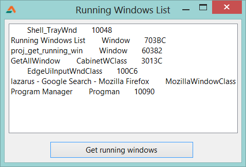

With this simple little code you can list the windows/software that are running. You can identify if some specific software is running or do some magic tricks with Windows API. It is up to you...  
  
  

### Quick Tutorial

Create a new Application Project. Project->New Project->Application->OK.  
Add a TListbox and a TButton in the form.  
  
Switch to source (F12). Add windows in the uses clause.  

uses  
..., windows, ...; 

  
Add the following function _below_ **implementation** and **{$R \*.lfm}** line:  
  

function EnumWindowsProc(WHandle: HWND; LParM: LParam): LongBool;StdCall;Export;  
var Title,ClassName:array\[0..128\] of char;  
    sTitle,sClass,Linia:STRING ;  
  
begin  
 Result:=True;  
  
 GetWindowText(wHandle, Title,128);  
 GetClassName(wHandle, ClassName,128);  
  
 sTitle:=Title;  
 sClass:=ClassName;  
  
 if IsWindowVisible(wHandle) then  
 begin  
  Linia:=sTitle+'        '+sClass+'       '+IntToHex(wHandle,4);  
  Form1.ListBox1.Items.Add(Linia);  
 end;  
  
end;

  
  
This is the function which will help us to list all the windows. Add its declaration before the implementation line:  

function EnumWindowsProc(WHandle: HWND; LParM: LParam): LongBool;StdCall;Export; 

  
Double click the button and write:  
  

begin  
  ListBox1.Clear;   
  EnumWindows(@EnumWindowsProc,0);  
end;

  
Do additional changes to beautify your form.  

### Run It

Press F9 or Run->Run. The program will compile and run. Click the button. You will see a bunch of programs' titles that are currently running. Click the button again to get an updated list. (You may also implement a timer.)  
  
  

### Concept

The above code depends on windows unit, which is not cross-platform. It is strictly based on the Windows API. Our primary procedure is **EnumWindows**. If we have EnumWindows, why do we have another function? Because it does not return any values. It takes a function's name/pointer through which the output is sent to our program. The syntax is:  

BOOL EnumWindows(  
  
WNDENUMPROC lpEnumFunc, // pointer to callback function  
LPARAM lParam // application-defined value  
); 

  
A enumeration function should be given, which will, well, enumerate. In our case all windows' titles.  
  
  

### Download source zip

You can download the sample source code from here: [http://db.tt/Sa19lv4u](http://db.tt/Sa19lv4u)  
Or here:  [http://bit.ly/XzHRed](http://bit.ly/XzHRed)  
Size: 519KB  
  
Ref:  
[http://delphi.about.com/od/windowsshellapi/l/aa080304a.htm](http://delphi.about.com/od/windowsshellapi/l/aa080304a.htm)  
[http://www.lazarus.freepascal.org/index.php?topic=13007.0](http://www.lazarus.freepascal.org/index.php?topic=13007.0)