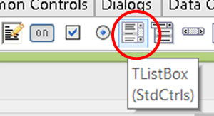
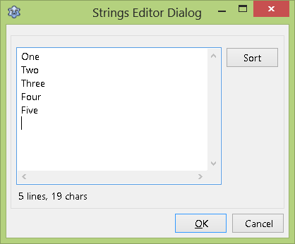
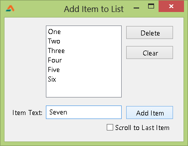

Learn how to code a program to list different things. Make your own lists with your own program! Utilize this article to list many things that you have never listed before!
<!-- more -->
  
  
  
There can be lists of every kind, list of foods, games, shopping items, books, likes, dislikes, strengths etc. Today we are going to learn how to create a list and how to add items on it. We are also going to learn (as a bonux) how to delete items and clear the list.  
  

### Quick Tutorial

Create a new Application Project (Project->New Project->Application->OK).  
  

  
Create a TListBox in the form. We will perform our actions with this ListBox.  
  
Now you can add some initial list items for the list to appear for testing. Select the ListBox. Go to Items property and click \[...\] button.  
  

  
You will see a window titled String editor dialog. Enter your desired items each in new line. You can set the MultiSelect property to True for enabling the selection of multiple list items (by Ctrl+clicking).  
  
Add 3 Tbuttons or TBitBtns, named: btnDelete, btnClear, btnAdd.  
Add a TEdit and name it edtItem.  
Add a TCheckbox as well and name it chkScroll, and set its caption to "Scroll to Last Item".  
Optionally, you can add a TLabel with Caption "Item Text:".  
  
You should have a layout like this:  
  

  
  

### Adding an Item

Double click btnAdd and enter:  
  
begin  
  ListBox1.Items.Add(edtItem.Text);  
  
  if chkScroll.Checked = True then  
    // Scroll to the last item of the listbox  
    ListBox1.TopIndex := -1 + ListBox1.Items.Count;  
end;  
  
  ListBox1.Items.Add(edtItem.Text);  
  
TListBox.Items is the array of all the list items. We add our item with the above code.  
  
  if chkScroll.Checked = True then  
    ListBox1.TopIndex := -1 + ListBox1.Items.Count;  
  
We use the above code to scroll to the last item that has been added to the list, if the Checkbox is checked.  
  

### Deleting Item(s)

Double click btnDelete and enter:  
  
var  
  i: integer;  
begin  
  if ListBox1.SelCount > 0 then begin  
  
    // we go through all the list items  
    For i := ListBox1.Items.Count - 1 downto 0 do  
      // if we found a selected item...  
      if ListBox1.Selected \[i\] then  
        // ...delete it  
        ListBox1.Items.Delete (i);  
  
  end else begin  
      ShowMessage('Please select an item first!');  
  
  end;  
end;  
  
( Just to let you know, the code above respects the MultiSelect property of the Listbox.)  
Now the explanation-  
  
  if ListBox1.SelCount > 0 then begin  
  
    For i := ListBox1.Items.Count - 1 downto 0 do  
      if ListBox1.Selected \[i\] then  
        ListBox1.Items.Delete (i);  
  
First we check if the user has selected 1 or more (>0) items. If he has selected then we enumerate from the last item of the list to the first item. If we find a selected item then we delete that item.  
  
The list item index is zero based. The first item has index of 0 (zero) and the last item has index of ListBox1.Items.Count - 1. For example, if a list has 5 items then the ListBox1.Items.Count will return 5, so the last item index would be 5 - 1, thus equal to ListBox1.Items.Count - 1.  
  
  end else begin  
      ShowMessage('Please select an item first!');  
  
If the user does not select at least 1 item, then we show a Message Box requesting the user to select an item.  

### Clearing the List

Clearing the list is the easiest. Double click the btnClear and enter:  
  
begin  
  ListBox1.Clear;  
end;  
  

### Run It

Run it (F9 or Run->Run). Test by using the buttons. Don't forget to test the CheckBox too.  
  

  
  

### Download Sample Code ZIP

Download Example code Zip file from here: [http://db.tt/VPbShvQ1](http://db.tt/VPbShvQ1)  
Or here: [http://bit.ly/107Klzf](http://bit.ly/107Klzf)  
Size: 519 KB  
The zip file contains compiled executable EXE file.  
  
_Image: iphoneicon.net_