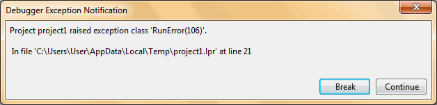
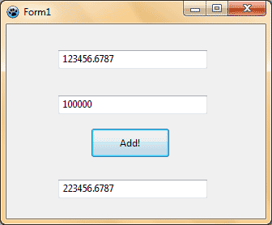

Okey. Adding is not the first thing you did. But teaching a computer how to add two numbers is something worth learning.
<!-- more -->


### Simple program

We start by a simple command line program. It will ask for two numbers and then add the numbers and show the result.

Create a new project: **Project -> New Project -> Application -> OK**. Copy-paste the following code into appropriate part:

```pascal
var
  num1, num2: Integer;
begin
  // A simple program for adding two numbers.

  WriteLn('This program will add two numbers');
  WriteLn();

  WriteLn('Enter the first number:');
  ReadLn(num1);

  WriteLn('Enter the second number');
  ReadLn(num2);

  WriteLn('The result is: ', num1 + num2);

  WriteLn('Press ENTER to end.');
  ReadLn();
end.
```

Now press **F9** or click **Run -> Run** to run the program. Test it with as many numbers as you like, for as many times. Hey, that's a good thing about computers - they never get tired!

But try a number with decimals. For example: `2.5` or `10.6`. And you will get an error like this:




### Enhancing the program

This error occurred because we have defined our two variables `num1` and `num2` as integers. And integers cannot hold any number greater than `2147483647` or less than `-2147483648`. No decimal place is allowed. See this [reference wiki](http://wiki.freepascal.org/Variables_and_Data_Types). So we will use the type double which can hold numbers with decimal point. We will solve the problem by slightly changing the code.

Change the line `num1, num2: Integer;` with `num1, num2: Double;`. Now run the program. Test it.


#### The graphical interface

Well, there are many people out there who like the glitz and glamor of a graphical interface. Me too. If you test things yourself, a command line program is enough. If you want to give it to your friend you will probably have to have a GUI (Graphical User Interface). Let's make that:

Start [Lazarus](https://lazarus-ide.org).

Create a new Application project. **Project -> New Project -> Application -> OK**.

Click the **TEdit** control button on toolbar and click and drag in the form to create a **TEdit** control. Change the property `Text` to blank. Right click the **TEdit** and click **Copy**. Then right click on the form and select **Paste**. Create a **TButton**. Change its `Caption` to `Add!` You may change the `Name` properties of the `TEdit`boxes and the `TButton`. But I will leave it to you. The summary of the properties are below:

```
Edit1
  Text = (Delete the value)
Edit2
  Text = (Delete the value)
Edit3
  Text = (Delete the value)
Button1
  Caption = "Add!"
```


#### Coding

Double click the button and enter the following code:

```pascal
var
  num1, num2: double;
begin
  num1 := StrToFloat(Edit1.Text);
  num2 := StrToFloat(Edit2.Text);
  Edit3.Text := FloatToStr(num1+num2);
end;
```

Now **Run** it (**F9** or **Run -> Run**). Then test it with the decimal place numbers or whatever.



Now you have it! Your very own adding machine! Add your modifications to the form design to make it perfect.


#### Here is an explanation of the code:

We use `StrToFloat` to convert our Editbox text to double. If we did not convert the `string` (`TEdit.Text`) to `Double` then we could not sum them up (`num1 + num2`). We cannot sum strings because computer sees that as text and not a number! That's why the conversion.

Then again we cannot assign a `Double` value to a `string`/`TCaption` (`TEdit.Text`). So we need to convert the numerical result to a string through `FloatToStr()` function. That's why `Edit3.Text := FloatToStr(num1+num2);`
