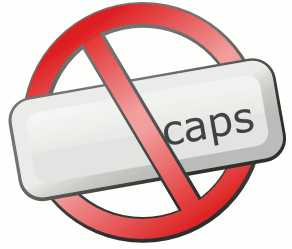
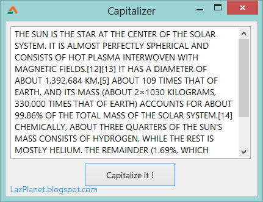

We write the words in the middle of the sentence in lowercase letters. Capitalizing is sometimes necessary to emphasize things. Any text (or string) can be converted to uppercase (capitalize). Here's how...  
  
  

### Quick Tutorial

  
Create a new Application Project. Project->New Project->Application->OK.  
  
Drop a TMemo and a TButton in the form. Select the TMemo and set the Scrollbars style to ssAutoVertical. Set the caption of the TButton to "Capitalize it !". Double click the button. Then write the following:  
  

procedure TForm1.Button1Click(Sender: TObject);  
begin  
  
  Memo1.Text := UpperCase(Memo1.Text);  
  
end;

  

### Run It

Press F9 (Run->Run). Enter some text in the memo and then click the button.  
  

### Concept

Well it is easy! Just find out what you want to capitalize and then use the [Uppercase()](http://www.freepascal.org/docs-html/rtl/sysutils/uppercase.html) function to capitalize it. The function comes from sysutils unit.  
  
For example,  

uses  
..., sysutils, ...;  
  
...  
  
begin  
  
  Caption := Uppercase('John Doe');  
  
end;

  
The above function will set the form's caption as JOHN DOE.  
  
So the syntax is:  

function UpperCase(  
  const s:  
):;

  
It will return the uppercase/capitalized version of s. You can capitalize letters, words, sentences etc.  

### Download source zip

Download the sample source code zip file from here: [http://db.tt/lKVYnRYc](http://db.tt/lKVYnRYc)  
Or from here: [http://bit.ly/111WGlk](http://bit.ly/111WGlk)  
  
Size: 518 KB  
  
The zip file contains executable EXE file.