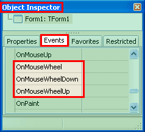
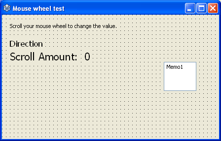
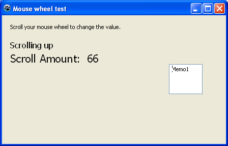

Mouse wheel is very common in modern day mouse. It helps us scroll text, image and sometimes do something amazing in 3D software. So how do we know when the user has scrolled the mouse wheel?
<!-- more -->


We all have these mice. They idly sit beside the computer to let us click them, drag them and most importantly, scroll them. We use mouse wheels very often. We usually have a scroll wheel at the middle of any computer mouse. We use them to scroll any webpage when we surf the net, edit a document, browse/zoom images etc. We can do many cool things with mouse scroll wheel.

Today we are going to see how to capture mouse wheel event in Lazarus IDE.


### Introduction

Start [Lazarus](https://lazarus-ide.org).

If you create a new Application project (**Project -> New Project -> Application -> OK**) and then in the **Object Inspector -> Events** tab you will see 3 mouse scroll related events.





That's what they do:

**OnMouseWheel**: Triggered whenever the user scrolls the mouse wheel, in any direction.
**OnMouseWheelDown**: Triggered when the user scrolls the mouse wheel up.
**OnMouseWheelUp**: Triggered when the user scrolls the mouse wheel down.


Not every component type has the Mouse Wheel events. For example, TLabel does not have them, but TForm, TImage and TMemo etc. have them. There are many components which has mouse wheel. Go on, find out yourself which component has and which doesn't. It will be a great learning experience.

Another thing to note is that the events don't work when the mouse pointer is outside the component.


### Quick Tutorial

We will have a value increase and decrease with mouse scroll. And we will also have a direction indicator to show us if we are scrolling up or down.

Start [Lazarus](http://www.lazarus.freepascal.org/).
Create a new Application Project (**Project -> New Project -> Application -> OK**).

Create some **TLabel**s and a **TMemo** to create a form layout like the following screenshot:





**TMemo** has no function. We just placed it to test whether the mouse wheel events work on it, when only form has the event procedures with code.

`Name` the label which will show direction as `lblDirection` and the label showing scroll amount as `lblAmount`. (`lblAmount` only holds the `0` in the above screenshot. It is separate from the label with the caption: `Scroll Amount:`.)

Switch to code view (**F12**) and then enter the code below to declare a variable to store the scroll amount. Enter it under the first var clause. (I usually put it under the `Form1: TForm1;` line because form is the most important variable, then the others.)

```pascal
var
  ...
  ScrollAmount: Integer;
  ...
```

Now select your form and go to **Object Inspector -> Events -> OnMouseWheelDown -> \[...\]**. Then enter the following code:

```pascal
procedure TForm1.FormMouseWheelDown(Sender: TObject; Shift: TShiftState;
  MousePos: TPoint; var Handled: Boolean);
begin
  lblDirection.Caption:='Scrolling down';

  ScrollAmount:=ScrollAmount-1;
  lblAmount.Caption:=inttostr(ScrollAmount);
end;
```

**Explanation:**

We want to show "Scrolling down" whenever the user scrolls downward. So we set the caption of `lblDirection` for this.

We decrease the value of `ScrollAmount` variable when the mouse wheel is scrolled down. And finally we show the value to `lblAmount`.

Now switch to form view (**F12**) then with the form remaining selected go to **Object Inspector -> Events -> OnMouseWheelUp -> \[...\]**, then enter the following code:

```pascal
procedure TForm1.FormMouseWheelUp(Sender: TObject; Shift: TShiftState;
  MousePos: TPoint; var Handled: Boolean);
begin
  lblDirection.Caption:='Scrolling up';

  ScrollAmount:=ScrollAmount+1;
  lblAmount.Caption:=inttostr(ScrollAmount);
end;
```

The explanation for the above code is similar to `OnMouseWheelDown`'s codes. But in this case we do the opposite. We show "Scrolling up" in `lblDirection` and we increase the amount stored in `ScrollAmount` variable.


#### Run It

Run the project (**F9** or **Run -> Run**).





Now point your mouse in the form and scroll in any direction to make the value increase or decrease. If you take your mouse pointer over the TMemo and scroll, then it will not work. Because we haven't written any code for it to use the mouse scroll event. It works only when you place the mouse over the component and scroll.

You can utilize this concept to create a image viewer which uses mouse scroll to zoom in or zoom out... or may be even scrolling the image to a specific part.
