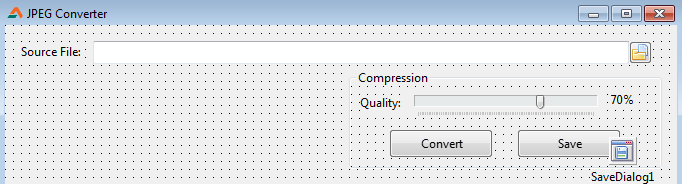
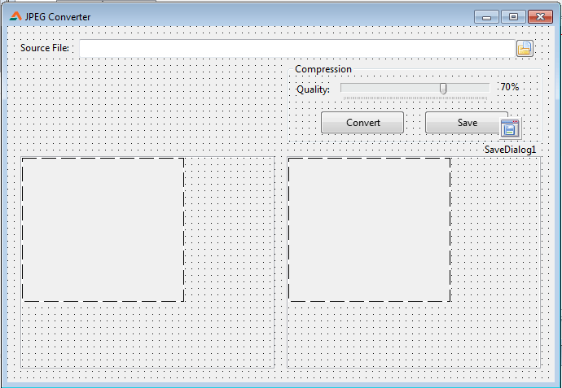
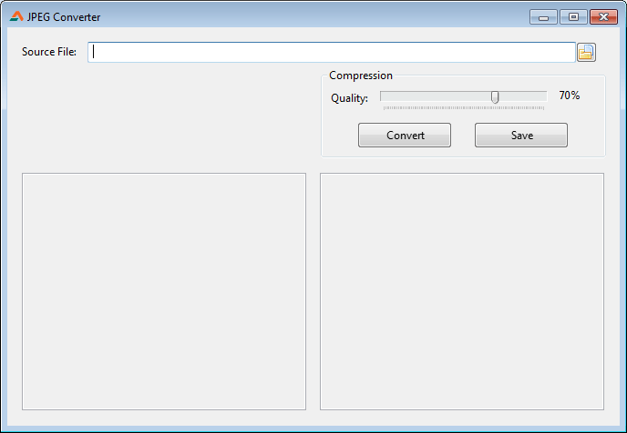

Today we'll make a JPEG compressor. Sounds exciting, doesn't it? It can convert and compress from any other image formats too!
<!-- more -->


Very often we find out that we take a screenshot and we look for a tool to compress it in a snap. Because people can't load 1mb~ images in a website or blog. But I personally end up opening [Krita](https://krita.org) and saving the image from there and optionally cropping it. How if we could have our own program do it for us? It would be time-saving and fun.

Lazarus / Free Pascal has a handy `TJPEGImage` class which has the ability to open JPEG files as well as  them. We can easily utilize that feature and use it to make our very own JPEG . And may be we could  in it and may be even . May be even add some custom code to add frame or watermark of a website/company logo. Cool right! We could forget photoshop for just this simple task!


### Basic code


To compress any [supported image formats](http://wiki.lazarus.freepascal.org/Developing_with_Graphics#Image_formats) to Compressed JPEG you can use this simple code snippet:

```pascal
var
  pic: TPicture;
  jpg: TJPEGImage;
begin
  pic:=TPicture.Create;  jpg:=TJPEGImage.Create;
  try
    pic.LoadFromFile('C:\lena.jpg');
    jpg.Assign(pic.Bitmap);
    jpg.CompressionQuality:=70; // Enter desired quality (1~100)
    jpg.SaveToFile(Utf8ToSys('C:\test3.jpg'));
  finally
    FreeAndNil(jpg);  FreeAndNil(pic);
  end;
end;
```

It's very straightforward and simple. `TJPEGImage` cannot load any file other than `.JPG`s. If we want to load, for example, BMP, PNG, GIF, TIFF etc. then we need to use [TPicture](http://wiki.lazarus.freepascal.org/Developing_with_Graphics#Loading.2FSaving_an_image_from.2Fto_the_disk). We would have to load our image into the TPicture.

```pascal
    pic.LoadFromFile('C:\lena.jpg');
```

We would also initialize the `TJPEGImage` and assign the Bitmap instance of our loaded picture from `TPicture`. (We could have chosen png or jpeg, but bitmap is uncompressed. This way we are taking the most crude image and then convert it to JPEG.) We also set the compression level for the quality. The quality should be a value between 1 and 100.

```pascal
    jpg.CompressionQuality:=70; // Enter desired quality (1~100)
    jpg.Assign(pic.Bitmap);
```

After assigning the picture to `TJPEGImage`, when we try to `SaveToFile` or `SaveToStream`, it will give us the compressed jpeg image.

Now, I have tried to only use `TJPEGImage` to compress JPEG to JPEG. But it doesn't apply the compression. But the above code works perfectly. I don't know if its a bug. But anyways, let's get on with it...


### Tutorial

Start [Lazarus](http://www.lazarus.freepascal.org/).

Create a new Application Project (**Project -> New Project -> Application -> OK**).


#### Form Design

Draw a **TFileNameEdit** in the form (from **Misc** tab). We will open our image file in this component. You can also add a **TLabel** and set its **Caption** appropriately. Change the **Filter** property of the **TFileNameEdit** to (no need to click the \[...\] button):

```
Supported Files (*.bmp;*.xpm;*.png;*.pbm;*.ppm;*.ico;*.icns;*.cur;*.jpg;*.jpeg;*.jpe;*.jfif;*.tif;*.tiff;*.gif)|*.bmp;*.xpm;*.png;*.pbm;*.ppm;*.ico;*.icns;*.cur;*.jpg;*.jpeg;*.jpe;*.jfif;*.tif;*.tiff;*.gif|All Files|*.*
```

Name the `TFileNameEdit` as `SourceFileEdit`.

Draw a **TGroupBox**. Inside it draw a **TTrackBar** (from **Common Controls** tab) and a **Tlabel** (as the compress level indicator). Name those 2 components `QualitySlider` and `lblQuality` respectively. Set the `Min` property of `QualitySlider` to `1` and Max to `100`.

Draw 2 **TButton**s. Name one of them `btnConvert` and another one `btnSave`. Set their `Caption` accordingly. Also, draw a **TSaveDialog** (from **Dialogs** tab). Set its `Filter` property to:

```
JPEG File (*.jpg)|*.jpg
```

Now your form layout should look like this (click on the image to see in original size):





Draw a **TScrollBox** in the left half of the form (from **Additional** tab). This should be named `ScrollBox1` automatically. The specialty of **TScrollBox** is that if you put large components inside it, scrollbars will show up to scroll to see the whole component. We will put a **TImage** inside it to load the original/source image. This way we would be able to scroll and see the whole image. Set its **HorzScrollBar -> Tracking** and **VertScrollBar -> Tracking** to `True`. It will make sure that the components inside it will scroll at the time of scrolling, not on mouse up.

Draw a **TImage** inside it. This should be named `Image1` automatically.

Now right click on `ScrollBox1` (not `Image1`) and then select **Copy**. Right click on the form (and not in any components) then select **Paste**. Both the **ScrollBox** and **Image** will be copied and will be named `ScrollBox2` and `Image2` automatically. (Don't we love Lazarus?! Yes we do. Yes we do.)

Position `ScrollBox2` accordingly.

Your form should look like this:





#### Now to coding...

Switch to code view (**F12**) and add these variables under the first `var` clause:

```pascal
var
  ...
  pic: TPicture;
  jpg: TJPEGImage;
```

Press **F12** again to switch to form view. Now double click **SourceFileEdit** and enter:

```pascal
procedure TForm1.SourceFileEditChange(Sender: TObject);
begin
  if FileExistsUTF8(SourceFileEdit.FileName) then begin
    if Assigned(pic) then FreeAndNil(pic);
    pic:=TPicture.Create;
    pic.LoadFromFile(SourceFileEdit.FileName);
    Image1.Picture.Assign(pic);
  end;
end;
```

This procedure mainly will load the source image into the `Image1` and will save the image in a `TPicture` variable. We could've used `Image1.Picture` which is also a `TPicture`, but I thought, it would be cool to store it in a variable so that it can be played with/tweaked later on. Also, the code can be used even without a `TImage`.

Since we have `Create`-d a variable (in the above code) we have to write code to Free it. So click the form to select it. Go to **Object Inspector**, then **Events** tab, then click the **\[...\]** button next to **OnDestroy**. Enter the following code:

```pascal
procedure TForm1.FormDestroy(Sender: TObject);
begin
  if Assigned(pic) then FreeAndNil(pic);
  if Assigned(jpg) then FreeAndNil(jpg);
end;
```

You have noticed that we are using `FreeAndNil` instead of `Free`. "Why?" -- you may ask. This is explained in a post on [LazPlanet's Facebook page](https://www.facebook.com/pages/LazPlanet/394517107328349) :


> MUST SEE!! -------------------------------------------
> Tip/Suggestion: Do not .Free, use FreeAndNil()
> \----------------------------------------------------------
>
> If you create (an instance of) a class, such as a TBitmap then .Free it, then check with assigned() and free it, twice by any chance, you will see a SIGSEGV error message. Try it:
> \----------------------
> var
> bmp:TBitmap;
>
> begin
> bmp:=TBitmap.Create;
> if Assigned(bmp) then bmp.Free;
> if Assigned(bmp) then bmp.Free;
> \----------------------
>
> This is especially true if your TBitmap is a global variable and you want a procedure to reset it every time you run that procedure. It seems that when you use .Free, it keeps the reference pointer untouched. So Assigned() sees the variable as assigned, so the second if condition (in the above code) passes and it tries to Free it again.
>
> If this is the case, then use FreeAndNil() instead of .Free. It resets the variable to an initial stage when it was born (or declared ). And you can then check it with Assigned() and relax.
>
> \----------------------
> var
> bmp:TBitmap;
>
> begin
> bmp:=TBitmap.Create;
> if Assigned(bmp) then FreeAndNil(bmp);
> if Assigned(bmp) then FreeAndNil(bmp);
> \----------------------
>
> No matter how many times you use "if Assigned(bmp) then FreeAndNil(bmp)" you are safe!
>
> This is true for any class you can use, not only TBitmap.


I would recommend you to Like our [Facebook page](http://www.facebook.com/pages/LazPlanet/394517107328349) to get such tiny updates from LazPlanet that do not get a separate post. It also makes asking questions easier.

Now, we have to update the `lblQuality` label's caption to indicate the value of the Compression slider/Trackbar. Double click the `QualitySlider` and enter the following code:

```pascal
procedure TForm1.QualitySliderChange(Sender: TObject);
begin
  lblQuality.Caption:=inttostr(QualitySlider.Position)+'%';
end;
```

Now, the code that we all been waiting for... Double click the `btnConvert` button and enter:

```pascal
procedure TForm1.btnConvertClick(Sender: TObject);
var
  MyStream: TMemoryStream;
begin
  if Assigned(pic) then begin

    if Assigned(jpg) then FreeAndNil(jpg);
    jpg:=TJPEGImage.Create;

    try
      jpg.CompressionQuality:=QualitySlider.Position;
      jpg.Assign(pic.Bitmap);
      MyStream := TMemoryStream.create;
      jpg.SaveToStream(MyStream);
      MyStream.Position:=0;
    finally
      image2.Picture.LoadFromStream(MyStream);
      FreeAndNil(MyStream);
    end;

  end;
end;
```

We have used `MemoryStream` because we want to show the compressed JPEG preview in `Image2`. To show the compressed image we either have to save it to a file or save it in a memory stream. We have our **Convert** button. If the user clicks it, we would have to show how the image would look after compression, before saving it. So we have the option to save it in a temporary stream and show the image through `LoadFromStream`. Sweet!

Now to saving... Double click the `btnSave` button and enter the following code:

```pascal
procedure TForm1.btnSaveClick(Sender: TObject);
begin
  if SaveDialog1.Execute then begin
    jpg.SaveToFile(SaveDialog1.FileName);
  end;
end;
```


#### Run it!

Now Run the Project for testing (**F9** or **Run -> Run**).





Now Select a source file, Change the quality, click on Convert. This should show you a preview of how the compressed image would look. Now click the Save button to save the compressed image.


### Enhance it!

Developing the code even further is great exercise to improve your skills as a programmer. Try these enhancements as a challenge to push yourself:


*   Implement a "Paste Image from Clipboard" feature. ()
*   Crop feature. ()
*   Let users draw on the source image, rectangle, circle, scribble, text etc. (Help  and )
*   Screen capture feature ([Help here](http://wiki.lazarus.freepascal.org/Developing_with_Graphics#Taking_a_screenshot_of_the_screen))
