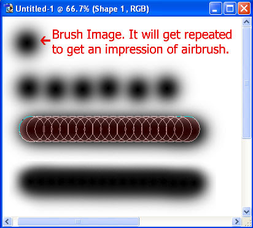
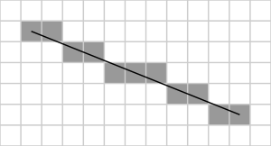
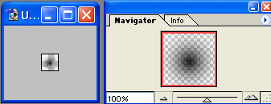
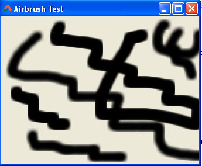

You know  and . But how do you make an airbrush tool in Lazarus? Here's how...
<!-- more -->


You can draw consecutive lines and make a . The lines have to be drawn at every point where the mouse cursor stops or gets a new position. We could make a pencil tool because we can draw lines in a canvas. Just a `Canvas.Line()` is enough for that. We can also control its width by using for example, `Canvas.Pen.Width := 10;` This will create pretty opaque kind of thick lines. But what if we want airbrush style lines?


### Introduction

Well, first of all, airbrush has a soft, gradually blending transparent area. Second, `Canvas.Line()` cannot use such a pen to draw. So we will have to create a procedure of our own to do that. But it is quite similar to drawing lines.

First, look at the image below to have a proper understanding of how airbrush tool works:





From the image above, we can see that there is a brush image. The image gets repeated after certain intervals (displayed by circles). If the image gets repeated in more intervals, the airbrush tool will not work (as shown in the second image).

Now, the question is how would we draw the brush instead of a line?
We know that Lazarus's `Line()` procedure can't draw an "airbrushy" line, so we need our own procedure to draw our kind of airbrushy line. A custom procedure would give us more freedom to draw whatever we like instead of plain lines.

There are many line drawing algorithms. But [Bresenham's line algorithm](http://en.wikipedia.org/wiki/Bresenham%27s_line_algorithm) is known to be much simpler. As you can see in the image below, if you provide the algorithm of Bresenham, the two points, then it can calculate and draw the pixels needed to make a line.





The basic version of the algorithm is given below in [pseudocode](http://en.wikipedia.org/wiki/Pseudocode). (If you don't understand it, then you can skip it):

```
 function line(x0, x1, y0, y1)
     int deltax := x1 - x0
     int deltay := y1 - y0
     real error := 0
     real deltaerr := abs (deltay / deltax)    // Assume deltax != 0 (line is not vertical),
           // note that this division needs to be done in a way that preserves the fractional part
     int y := y0
     for x from x0 to x1
         plot(x,y)
         error := error + deltaerr
         if error = 0.5 then
             y := y + 1
             error := error - 1.0
```

It seems too common for us to see a line in the screen that we almost forget the real way to draw a line. But that's how the lines in the paint software are drawn. These algorithms lie deep within the codes that even some of the experts don't know about these algorithms.

If you are one of our Facebook fans then may be you have found the function working before. We have posted a Free Pascal version of the above pseudocode algorithm to draw a line. The `plot` procedure in the above code actually draws a single pixel in the `(x,y)` position. So ultimately a line gets drawn. The fun part is, we can use anything instead of `plot` to customize the drawing. For example, we can draw a `Canvas.Ellipse()` to create a paintbrush (not airbrush)! We can even create a rectangular brush, if we use `Canvas.FillRect()`! How cool is that?!


### Quick Tutorial


Enough talk! Now straight to the tutorial.

Create a new Application Project (**Project -> New Project -> Application -> OK**). Save it in a folder. (See the [FAQ](../../../../faq) on how to save a project, if you need.) I have saved the project file as `proj_airbrush_test.lpi`.

Now create the brush image as a png file. I have used Photoshop but you can use [Gimp](http://www.gimp.org/) too, which is free. I have created a new file, 20 by 20 pixels. Then chose a 21 size brush to draw a brush image.





You can also use a gradient, but that may take bit of tweaking to make it perfect. You can also create bigger or smaller size image if you like.

You can download the image below if you can't reproduce it (right click it then choose Save image as):


Save the image as `brush.png` in the same directory in the project that you saved earlier.


Add the variables under the first `var` clause of the unit:

```pascal
var
...

  BrushPNG: TPortableNetworkGraphic;

  MouseIsDown: Boolean=False;
  PrevX, PrevY: Integer;

  AirBrushMode: Boolean=True;
  BrushWidth, BrushHeight: Integer;
  SkipPixels: Integer; // this will keep count of the skipped pixel
```

Add these 2 procedures under the `{ TForm1 }` line:

```pascal
procedure TForm1.BrushPoint(x, y: Integer; theCanvas: TCanvas);
begin
  // Paintbrush mode
  if AirBrushMode = False then begin

    theCanvas.Draw(x - 10, y - 10, BrushPNG);

  // Airbrush mode
  end else begin

    if (SkipPixels = 0) or (SkipPixels = 4) then begin
      theCanvas.Draw(x-10,y-10,BrushPNG);
      SkipPixels:=1;
    end else begin
      SkipPixels:=SkipPixels+1;
    end;

  end;
end;


procedure TForm1.BrushDraw(x1, y1, x2, y2: Integer; theCanvas: TCanvas);
var
  dx, dy, sx, sy: Integer;
  e2,err:Real;
  dummy: Boolean;
begin
  dx:=abs(x2-x1);
  dy:=abs(y2-y1);
  if x1 < x2 then sx := 1 else sx := -1;
  if y1 < y2 then sy := 1 else sy := -1;
  err := dx-dy;

  while dummy do begin
    BrushPoint(x1,y1,theCanvas);
    if (x1 = x2) and (y1 = y2) then Break;
    e2 := 2*err;
    if e2 > -dy then begin
      err:=err-dy;
      x1:=x1+sx;
    end;
    if (x1 = x2) and (y1 = y2) then begin
      BrushPoint(x1,y1,theCanvas);
      Break;
    end;
    if e2 < dx then begin
      err:=err+dx;
      y1:=y1+sy;
    end;
  end;
end;
```

I have used the [simplified version](http://en.wikipedia.org/wiki/Bresenham%27s_line_algorithm#Simplification) of the Bresenham's algorithm.

Now take your cursor over each procedure name and press **Ctrl+Shift+C** to declare it at the top of the unit.

Double click the form and enter:

```pascal
procedure TForm1.FormCreate(Sender: TObject);
begin
  Canvas.Brush.Color:=clBlack;

  BrushPNG:=TPortableNetworkGraphic.Create;
  BrushPNG.LoadFromFile(Application.Location+'brush.png');

  BrushWidth:=BrushPNG.Width;
  BrushHeight:=BrushPNG.Height;
end;
```

On Form's **OnMouseDown** event enter the following (select the form and go to **Object Inspector -> Events -> OnMouseDown -> \[...\]**):

```pascal
procedure TForm1.FormMouseDown(Sender: TObject; Button: TMouseButton;
  Shift: TShiftState; X, Y: Integer);
begin
  if (Button = mbLeft) or (Button = mbRight) then begin
    MouseIsDown:=True;
    PrevX:=X;
    PrevY:=Y;

    if button = mbLeft then
      AirBrushMode:=True
    else
      AirBrushMode:=False;
  end;
end;
```

On Form's **OnMouseMove** event enter:

```pascal
procedure TForm1.FormMouseMove(Sender: TObject; Shift: TShiftState; X,
  Y: Integer);
begin
  if MouseIsDown = true then begin
    BrushDraw(PrevX,PrevY,X,Y,form1.Canvas);
    PrevX:=X;
    PrevY:=Y;
  end;
end;
```

On Form's **OnMouseUp** event enter:

```pascal
procedure TForm1.FormMouseUp(Sender: TObject; Button: TMouseButton;
  Shift: TShiftState; X, Y: Integer);
begin
  MouseIsDown:=False;
end;
```

Now Run the project (**F9** or **Run -> Run**).





Drag you mouse to draw with airbrush mode. Right click and drag your mouse to draw with Paintbrush mode.

You can also [use BGRA Bitmap Library](http://wiki.freepascal.org/BGRABitmap_tutorial_5) to create the brush image in the memory by making a gradient. Then you can change the color and size of the brush by generating a gradient of according to the size and color chosen.
