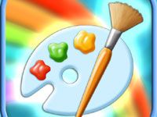
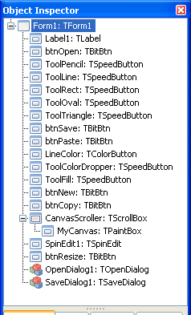
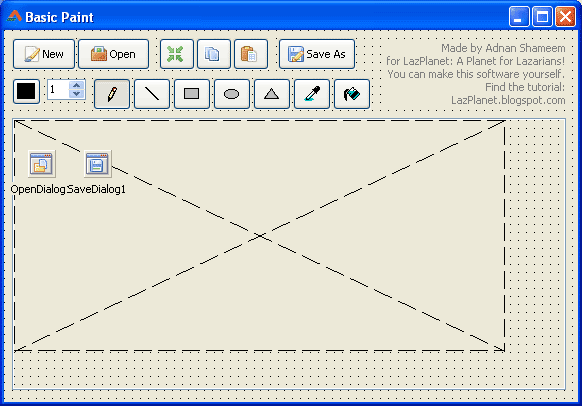
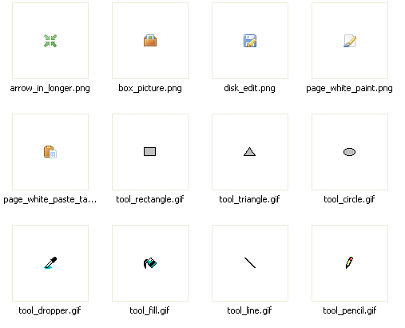
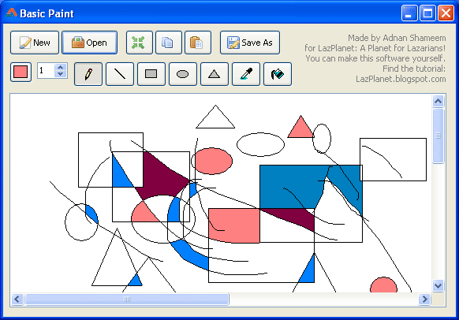

Today, in our special post, we see how to create a basic paint software in Lazarus with some basic drawing tools and Open, Save, Resize options. A must see for Lazarians!
<!-- more -->
  
  
Painting is a fun exercise of creativity. People form kids to professionals like to draw something just to have fun. Creating a drawing software is more fun than drawing (at least to me ;-) ). As the 50th post of [LazPlanet](http://lazplanet.blogspot.com/), I am honored to present to you a simple paint software code made in Lazarus (Free Pascal). Enjoy!  
  
The software answers the following questions:  

*   How to open an image in a canvas?
*   How to create a pencil tool to draw in a canvas (for scribbling)?
*   How to create a line tool for drawing lines?
*   How to create a (Color) Flood Fill tool?
*   How to create a toolset with toggling buttons?
*   How to create a color picker tool?
*   How to make the tools work with the selected color?
*   How to make the tools work with the selected border/pen width?
*   ...and many more according to how used to coding you are.

  
The tools in the software are:  

*   Pencil tool
*   Line tool
*   Rectangle tool
*   Circle tool
*   Triangle tool
*   Color dropper tool
*   Flood Fill (Color) tool

  
The toolbar buttons are:  

*   New Image
*   Open Image
*   Resize Canvas
*   Paste Image from Clipboard
*   Save Image As

\* The software only supports Bitmap files (.bmp). But [you can extend the support](http://wiki.freepascal.org/Developing_with_Graphics) by adding code for working with .jpg, .gif, .png, .ico etc.  
  
I sure had fun making it. And while making I understood again that how Lazarus / FreePascal is helpful in making modern day graphical applications.  
  
Now I want to share my enjoyment with you.  
  
Oh! And you can also check out this post : [How to scribble with a virtual pencil](http://lazplanet.blogspot.com/2013/05/how-to-scribble-with-virtual-pencil.html) to have a knowledge on drawing on a virtual canvas that the computer offers. It will certainly make this project seem easier to you. It also has an excellent explanation of how to draw something when the user drags the mouse cursor.  
  

### Quick Tutorial

This is a big project having a slightly bigger collection of components. So I will discuss in brief about the creation process, so that this post does not become gigantic to swallow for Lazarians.  
  

### Form Design and Properties

Start [Lazarus](http://www.lazarus.freepascal.org/).  
  
Here is a screenshot of the component's names and their type straight from the Object Inspector.  
  

  
That seems to be a lot of components! But remember the impressive result that you will get after doing such a hard work. (Plus, keep imagining what the Photoshop and Gimp programmers has done for those software! They are indeed hard workers.)  
  
Add those components and name them according to the screenshot. Here is a screenshot of the form's design view to make positioning the components easier for you:  
  

  
  
Use appropriate Glyphs/Icons for the toolbar icons. (I have used icons from [Silk Companion](http://damieng.com/creative/icons/silk-companion-1-icons) and [famfamfam Mini Icons](http://www.famfamfam.com/lab/icons/mini/) collection. I have used these because they free for any project, even commercial ones. Cool, right?) I have included the icons that I have used in the sample code zip file available from below this article. They are in the "icons4u" folder.  
  

  
  
Now we would make the tools' buttons to toggle on click. Have you noticed that when you select a tool in a drawing software (such as [MS Paint](http://en.wikipedia.org/wiki/Paint_%28software%29)/[Gimp](http://www.gimp.org/)/[Photoshop](http://en.wikipedia.org/wiki/Adobe_Photoshop)/[Illustrator](http://en.wikipedia.org/wiki/Illustrator) etc.) another tool gets de-selected. Select all the Tool Buttons and set its GroupIndex to 1. Select the first tool (Pencil tool SpeedButton). Make its Down property to True.  
  
  
Select the TScrollbox. Make its HorzScrollBar->Tracking and VertScrollBar->Tracking to True. This will smoothen the scrolling of the canvas when its bigger than the ScrollBox's area. Set its Anchors->AkBottom and Anchors->AkRight to True. This will resize the ScrollBox with the form resize. Set its Color to clAppWorkspace.  
  
You have created the TPaintbox \*inside\* the TScrollBox, right? If you haven't done so, then right click the TPaintbox/MyCanvas and select Change Parent-> CanvasScroller/TScrollbox. Then set its Left and Top to 0 (zero).  
  
Set the "Value" and "MinValue" property of TSpinButton to 1.  
  
Set Filter property of both OpenDialog1 and SaveDialog1 to:  

Bitmap Files (\*.bmp)\*.bmp

  
Without further ado let's get to coding--  
  

### Coding

Before proceeding with code, add these units to the uses clause: , Clipbrd, LCLIntf, LCLType.  
  

uses  
..., Clipbrd, LCLIntf, LCLType;

  
These are for using the clipboard.  
  
Declare some variables after the line "Form1: TForm1;":  

  paintbmp: TBitmap;  
  
  MouseIsDown: Boolean;  
  PrevX, PrevY: Integer;

  
paintbmp is our "virtual" canvas in which we will draw things. We will draw this exact TBitmap on TPaintBox's OnPaint event. If we don't do this, the TPaintbox will be blank when we move the window or resize it. MouseIsDown variable is to determine whether the user has pressed the mouse. PrevX and PrevY is where the user started the drag (on the canvas).  
  
**TIP:** You may have to use Toggle Form/Unit button on the toolbar or press F12 to switch between Code and Form view.  
  
  
Select MyCanvas and go to Object Inspector-> Events-> OnPaint-> \[...\] and enter:  

procedure TForm1.MyCanvasPaint(Sender: TObject);  
begin  
  
  if MyCanvas.Width<>paintbmp.Width then begin  
    MyCanvas.Width:=paintbmp.Width;  
    // the resize will run this function again  
    // so we skip the rest of the code  
    Exit;  
  
  end;  
  
  if MyCanvas.Height<>paintbmp.Height then begin  
    MyCanvas.Height:=paintbmp.Height;  
    // the resize will run this function again  
    // so we skip the rest of the code  
    Exit;  
  
  end;  
  
  
  MyCanvas.Canvas.Draw(0,0,paintbmp);  
  
end;

  
Again go to Object Inspector-> Events-> OnMouseDown-> \[...\] and enter:  

procedure TForm1.MyCanvasMouseDown(Sender: TObject; Button: TMouseButton;  
  Shift: TShiftState; X, Y: Integer);  
begin  
  MouseIsDown := True;  
  PrevX := X;  
  PrevY := Y;  
  
end;

  
Again go to Object Inspector-> Events-> OnMouseMove-> \[...\] and enter:  

procedure TForm1.MyCanvasMouseMove(Sender: TObject; Shift: TShiftState; X,  
  Y: Integer);  
  
begin  
  if MouseIsDown = true then begin  
  
    //// Pencil Tool ////  
    if ToolPencil.Down = true then begin  
      paintbmp.Canvas.Line(PrevX, PrevY, X, Y);  
      MyCanvas.Canvas.Line(PrevX, PrevY, X, Y);  
  
      PrevX:=X;  
      PrevY:=Y;  
  
    //// Line Tool ////  
    end else if ToolLine.Down = true then begin  
  
      // we are clearing previous preview drawing  
      MyCanvasPaint(Sender);  
  
      // we draw a preview line  
      MyCanvas.Canvas.Line(PrevX, PrevY, X, Y);  
  
  
    //// Rectangle Tool ////  
    end else if ToolRect.Down = true then begin  
  
      MyCanvasPaint(Sender);  
      MyCanvas.Canvas.Rectangle(PrevX, PrevY, X, Y);  
  
  
    //// Oval Tool ////  
    end else if ToolOval.Down = true then begin  
  
      MyCanvasPaint(Sender);  
      MyCanvas.Canvas.Ellipse(PrevX, PrevY, X, Y);  
  
  
    //// Triangle Tool ////  
    end else if ToolTriangle.Down = true then begin  
  
      MyCanvasPaint(Sender);  
      MyCanvas.Canvas.Line(PrevX,Y,PrevX+((X-PrevX) div 2), PrevY);  
      MyCanvas.Canvas.Line(PrevX+((X-PrevX) div 2),PrevY,X,Y);  
      MyCanvas.Canvas.Line(PrevX,Y,X,Y);  
  
      //MyCanvas.Canvas.Ellipse(PrevX, PrevY, X, Y);  
  
  
    end;  
  
  
  end;  
  
  
end;

  
Again go to Object Inspector-> Events-> OnMouseUp-> \[...\] and enter:  

procedure TForm1.MyCanvasMouseUp(Sender: TObject; Button: TMouseButton;  
  Shift: TShiftState; X, Y: Integer);  
var  
  TempColor: TColor;  
  
begin  
  
  if MouseIsDown then begin  
  
    //// Line tool  
    if ToolLine.Down = true then begin  
      paintbmp.Canvas.Line(PrevX, PrevY, X, Y);  
    //// Rect  
    end else if ToolRect.Down = true then begin  
      paintbmp.Canvas.Rectangle(PrevX, PrevY, X, Y);  
    //// Oval tool  
    end else if ToolOval.Down = true then begin  
      paintbmp.Canvas.Ellipse(PrevX, PrevY, X, Y);  
  
    //// Triangle tool  
    end else if ToolTriangle.Down = true then begin  
      paintbmp.Canvas.Line(PrevX,Y,PrevX+((X-PrevX) div 2), PrevY);  
      paintbmp.Canvas.Line(PrevX+((X-PrevX) div 2),PrevY,X,Y);  
      paintbmp.Canvas.Line(PrevX,Y,X,Y);  
  
    //// Color Dropper Tool ////  
    end else if ToolColorDropper.Down = true then begin  
      LineColor.ButtonColor:=MyCanvas.Canvas.Pixels\[X,Y\];  
  
    //// (Flood) Fill Tool ////  
    end else if ToolFill.Down = true then begin  
      TempColor := paintbmp.Canvas.Pixels\[X, Y\];  
      paintbmp.Canvas.Brush.Style := bsSolid;  
      paintbmp.Canvas.Brush.Color := LineColor.ButtonColor;  
      paintbmp.Canvas.FloodFill(X, Y, TempColor, fsSurface);  
      paintbmp.Canvas.Brush.Style := bsClear;  
      MyCanvasPaint(Sender);  
  
    end;  
  
  end;  
  
  MouseIsDown:=False;  
  
end;

  
Double click btnNew and enter:  

procedure TForm1.btnNewClick(Sender: TObject);  
begin  
  
    // if our bitmap is already Create-ed (TBitmap.Create)  
    // then start fresh  
    if paintbmp <> nil then  
      paintbmp.Destroy;  
  
    paintbmp := TBitmap.Create;  
  
    paintbmp.SetSize(Screen.Width, Screen.Height);  
    paintbmp.Canvas.FillRect(0,0,paintbmp.Width,paintbmp.Height);  
  
    paintbmp.Canvas.Brush.Style:=bsClear;  
    MyCanvas.Canvas.Brush.Style:=bsClear;  
  
    MyCanvasPaint(Sender);  
  
end;

  
Double click btnOpen and enter:  

procedure TForm1.btnOpenClick(Sender: TObject);  
begin  
  
  OpenDialog1.Execute;  
  
  if (OpenDialog1.Files.Count > 0) then begin  
  
    if (FileExistsUTF8(OpenDialog1.FileName)) then begin  
      paintbmp.LoadFromFile(OpenDialog1.FileName);  
      MyCanvasPaint(Sender);  
  
    end else begin  
      ShowMessage('File is not found. You will have to open an existing file.');  
  
    end;  
  
  end;  
  
end;

  
Double click btnResize and enter:  

procedure TForm1.btnResizeClick(Sender: TObject);  
var  
  ww, hh: string;  
  ww2, hh2: Integer;  
  Code: Integer;  
  
begin  
  
  ww:=InputBox('Resize Canvas', 'Please enter the desired new width:', IntToStr(paintbmp.Width));  
  
  Val(ww, ww2, Code);  
  
  if Code <> 0 then begin  
    ShowMessage('Error! Try again with an integer value of maximum '+inttostr(High(Integer)));  
    Exit; // skip the rest of the code  
  
  end;  
  
  hh:=InputBox('Resize Canvas', 'Please enter the desired new height:', IntToStr(paintbmp.Height));  
  
  Val(hh, hh2, Code);  
  
  if Code <> 0 then begin  
    ShowMessage('Error! Try again with an integer value of maximum '+inttostr(High(Integer)));  
    Exit; // skip the rest of the code  
  
  end;  
  
  paintbmp.SetSize(ww2, hh2);  
  MyCanvasPaint(Sender);  
  
end;

  
Double click btnCopy and enter:  

procedure TForm1.btnCopyClick(Sender: TObject);  
begin  
  Clipboard.Assign(paintbmp);  
  
end;

  
Double click btnPaste and enter:  

procedure TForm1.btnPasteClick(Sender: TObject);  
var  
  tempBitmap: TBitmap;  
  PictureAvailable: boolean = False;  
  
begin  
  
  // we determine if any image is on clipboard  
  if (Clipboard.HasFormat(PredefinedClipboardFormat(pcfDelphiBitmap))) or  
    (Clipboard.HasFormat(PredefinedClipboardFormat(pcfBitmap))) then  
    PictureAvailable := True;  
  
  
  if PictureAvailable then  
  begin  
  
    tempBitmap := TBitmap.Create;  
  
    if Clipboard.HasFormat(PredefinedClipboardFormat(pcfDelphiBitmap)) then  
      tempBitmap.LoadFromClipboardFormat(PredefinedClipboardFormat(pcfDelphiBitmap));  
  
    if Clipboard.HasFormat(PredefinedClipboardFormat(pcfBitmap)) then  
      tempBitmap.LoadFromClipboardFormat(PredefinedClipboardFormat(pcfBitmap));  
  
    // so we use assign, it works perfectly  
    paintbmp.Assign(tempBitmap);  
  
    MyCanvasPaint(Sender);  
  
    tempBitmap.Free;  
  
  end else begin  
  
    ShowMessage('No image is found on clipboard!');  
  
  end;  
  
end;

  
Double click btnSave and enter:  

procedure TForm1.btnSaveClick(Sender: TObject);  
begin  
  
  SaveDialog1.Execute;  
  
  if SaveDialog1.Files.Count > 0 then begin  
    // if the user enters a file name without a .bmp  
    // extension, we will add it  
    if RightStr(SaveDialog1.FileName, 4) <> '.bmp' then  
      SaveDialog1.FileName:=SaveDialog1.FileName+'.bmp';  
  
    paintbmp.SaveToFile(SaveDialog1.FileName);  
  
  end;  
  
end;

  
Select the LineColor (TColorButton) and go to Object Inspector-> Events-> OnColorChanged-> \[...\] and enter:  

procedure TForm1.LineColorColorChanged(Sender: TObject);  
begin  
  
  paintbmp.Canvas.Pen.Color:=LineColor.ButtonColor;  
  MyCanvas.Canvas.Pen.Color:=LineColor.ButtonColor;  
  
end;

  
Select the SpinButton1 (TSpinButton) and go to Object Inspector-> Events-> OnChange-> \[...\] and enter:  

procedure TForm1.SpinEdit1Change(Sender: TObject);  
begin  
  
  paintbmp.Canvas.Pen.Width:=SpinEdit1.Value;  
  MyCanvas.Canvas.Pen.Width:=SpinEdit1.Value;  
  
end;

  
Double click on the form to create a procedure for OnCreate event. Now enter the code below (the code will run on startup):  

procedure TForm1.FormCreate(Sender: TObject);  
begin  
  
  // We create a new file/canvas/document when  
  // it starts up  
  btnNewClick(Sender);  
  
end;

  
Select the form. Then go to Object Inspector-> Events-> OnClose-> \[...\] and enter the code below (This will run when the user exits the software):  

procedure TForm1.FormClose(Sender: TObject; var CloseAction: TCloseAction);  
begin  
  
  paintbmp.Free;  
  
end;

  

### Run it!

Run the project (F9 or Run-> Run).  
  

  
Now, do your thing! Create your next masterpiece!  
  

### Further Practice

You can improve the code / project further by adding following features:  

*   Multiple format support (.jpg, .png, .gif, .ico, .tif [and more](http://wiki.freepascal.org/Developing_with_Graphics#Image_formats)) Look here for how to
*   Gradient tool, Crop tool, Polygon tool, Eraser tool, Curve tool
*   Drawing by angle when Shift is pressed while drawing
*   Selection tool (Rectangle, Circle, Polygon, FreeHand)
*   Moving the selection area
*   Magnifier tool
*   Undo, Redo options
*   Filters

  
You can create practically a second Photoshop if you want!  
  

### Download Sample Code ZIP

You can download an example source code from here: [http://db.tt/kZsqnbzw](http://db.tt/kZsqnbzw)  
Or here: [http://bit.ly/ZHUouW](http://bit.ly/ZHUouW)  
Size: 682 KB  
The package includes compiled executable EXE file inside.