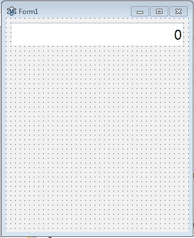
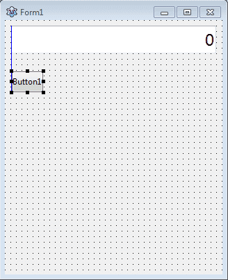
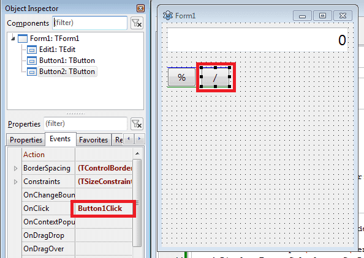
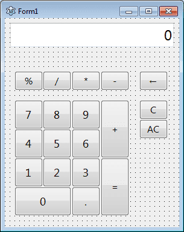
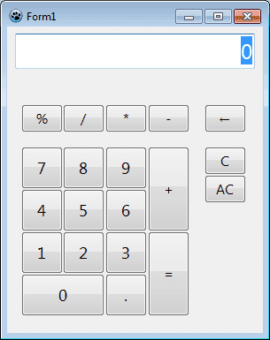
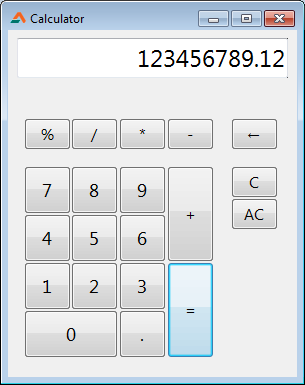

Computers are huge calculators. But how about making your own program to calculate things?! ...And under 5 minutes? How is it even possible?! Let's find out!
<!-- more -->


We have made  in the past. It was a simple one, just to get an idea on how to do things around. But what about something more practical? Here you go, a nice new tutorial just for you.

In this one, we'll create a simple calculator in under 5 minutes. Lazarus is a tool made for speed. So it is no wonder it is possible.

Actually, I had made a calculator class some years back and forgot that I made it. About some weeks ago I got a notification on GitHub, so I thought to check back on old repos. There I found [this little gem](https://github.com/adnan360/simple-calculator-lazarus). I was amazed to see how easy it was to create a calculator. To say how easy it is, just 4 lines! And it works within this limit! How crazy!

It's very easy, trust me. It comes down to just copy-pasting and dragging and dropping some components on the form.


### Tutorial

Start [Lazarus](https://www.lazarus-ide.org/).

Create a new project (**Project - New Project - Application - OK**).

We will use a ready-made unit/class file for our calculator so that our work becomes easier. So first, save the project (**File - Save All**) in a folder of its own.

Next, download and keep [this file](https://gitlab.com/adnan360/simple-calculator-lazarus/-/blob/master/calculatorunit.pas) inside the project folder. Make sure the name is `calculatorunit.pas`.

Now add the `calculatorunit` under your `uses` clause:

```pascal
uses
  ..., ...
  , calculatorunit;
```

Also, add this under your first `var` clause in the unit:

```pascal
var
  ...;
  Calculator: TCalculator;
```

Now switch to form view (**F12** or **View -> Toggle Form/Unit View**) then double click the form and enter:

```pascal
procedure TForm1.FormCreate(Sender: TObject);
begin
  Calculator:=TCalculator.Create;
end;
```

Now click on the **Object Inspector -> Events**, click on **OnDestroy**, then click the **\[...\]** button next to it and enter:

```pascal
procedure TForm1.FormDestroy(Sender: TObject);
begin
  Calculator.Free;
end;
```

Now that we have got the boring stuff out of the way, let's design the form...

Swith to form view (**F12**) and resize your form to a comfortable size. It's really your choice how you want it to look, so go ahead and give it the size you want.

Now place a **TEdit** on the form. From **Object Inspector - Properties**, set **Name** to **edtDisplay**, set its **Font** to bigger size, maybe 16 or 18. We don't want anybody type in something on our display, so set **ReadOnly** to **True**. Also, we don't want the default "`Edit1`" text inside, so change **Text** to `0`.

Is it done? Not yet. If you look at calculators, you would see that they always start showing the digits from the right and when digit gets longer it gradually gets to the left. To achieve this, we will have to set the **Alignment** property to **taRightJustify**.





Next we'll create the buttons. Draw a single **TButton** on the form to make the start.





Set its **Font size** property to be a bit bigger, maybe `12`. Now double click on the button and enter:

```pascal
procedure TForm1.Button1Click(Sender: TObject);
begin
  Calculator.SendInput( TButton(Sender).Caption );
  edtDisplay.Text:=Calculator.GetDisplay;
end;
```

This procedure will get the button caption that was clicked and will pass it to the class. The `TButton(Sender).Caption` part takes care of that. Thanks to this code we don't need to say the name the button in order to get its `Caption`. This means we can use this procedure on any button regardless of Name it is given. The code gets the caption of the clicked button and passes it to the class for processing. Then we use the `GetDisplay` from our class to return the result of the input. Simple!

You won't have to do anything special, for example, taking inputs, validating etc. The class will do all the hard work for you. Isn't she a beauty?!

Also, we can use the same procedure for all the buttons. We'll now copy the buttons and forget about setting event procedures. When we copy something it keeps the original Event procedures automatically. This will keep this procedure linked with all the new buttons we copy and paste without a glitch.

Below you can see, that if we copy the button, the original Button1Click procedure is also copied to the new button.





Sweet!

Now, your our work is easy. Just copy the button around and change **Caption** properties to make it into something like this:





I have used Font size 12 for smaller buttons and 14 for number buttons.
For backspace/erase button I used this character: `←`

That's it! You are done with building, now try running. Run the project (**F9** or **Run -> Run**).





You will see that the calculator is working as it should. But when it is run, a selection selects the `0` in the `edtDisplay`. To fix that select `edtDisplay` and set `TabStop` to `False`.

Now Run again (**F9** or **Run -> Run**) and enjoy!





This is not the end, of course. How about a retro styled calculator? We can search for a [retro electric calculator](https://commons.wikimedia.org/wiki/File:Vintage_Texas_Instruments_TI-1250_Red_LED_Pocket_Electronic_Calculator,_Made_in_USA,_Circa_1975_-_Price_Was_19.95_USD_(10649611933).jpg), then . Also, we can show the digits in the exact glowing way the original electric calculator shows by following the digit display method used on the  tutorial. The possibilities are endless!
