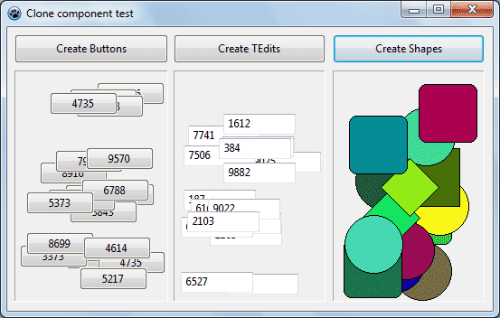

The good thing about programming is that you can do almost anything you wish. Even create components out of thin air!
<!-- more -->
  
Today we are going to learn how to create Buttons, Labels, Edits right at the time when the exe is running.  
  

### Basics

Before getting our hands dirty, let's get our basics straight. Before this article, LazPlanet had another article quite similar to this: [How to clone your forms into many](http://lazplanet.blogspot.com/2013/04/clone-your-form-into-many.html). Be sure to check that out if you're interested.  
  
If you are scared that the code might be difficult, don't worry. Creating components are just dead simple. We create an instance of class of the component and then more gracefully give some properties to it. That's it! It's just that simple.  
  
If you want to add some event to it, it's easy as well.  
  
Let's see this sample code for creating buttons:  
  

var  
  
  btn:Tbutton;  
  
begin  
  
  btn:=Tbutton.Create(nil);  
  
  // we say that place button inside Form1  
  
  btn.parent := Form1;  
  
  
  
  // set properties for new button  
  
  btn.top := 10;  
  
  btn.Left := 10;  
  
  btn.Caption := 'Click me!';  
  
end;  
  

  
So, we have 3 steps to creating a component on the fly (or in the runtime):  
1\. Create an instance of the component class  

btn:=Tbutton.Create(nil);

  
2\. Set its parent  

btn.parent := Form1;

  
3\. Set properties to it (just like we always do in the Object Inspector->Properties):  

  btn.top := 10;  
  
  btn.Left := 10;  
  
  btn.Caption := 'Click me!';

  
Additionally if you want to have an event attached to it, just point a procedure to the event:  
  

btn.OnClick := @btnClickEvent;

  
And btnClickEvent might be like this:  
  

procedure TForm1.btnClickEvent(Sender: TObject);  
  
begin  
  
  ShowMessage('Button clicked!');  
  
end;

  
I said it was easy! Right!  
  

### Tiny project

Let's get a tiny project running before the actual sample project.  
  
Start [Lazarus](http://www.lazarus-ide.org/).  
  
Create a new Application Project (Project->New Project->Application->OK).  
  
Draw a TButton on the form. It would be named "Button1".  
  
Double click on it and enter:  

procedure TForm1.Button1Click(Sender: TObject);  
  
var  
  
 btn: TButton;  
  
begin  
  
 btn := TButton.Create(Button1);  
  
 btn.parent := Form1;  
  
  
  
 // set properties for new button  
  
 btn.top := (random(300));  
  
 btn.Left := (random(300));  
  
 btn.Caption := inttostr(random(9999));  
  
  
  
 // set the click event to this procedure  
  
 // so that new buttons also have 'cloning'  
  
 // on its click event  
  
 btn.OnClick := @Button1Click;  
  
end;

  
Now run the project (F9 or Run->Run).  
  

  
  
Now click the Button several times. You will see the button get 'cloned'.  
  

  

### Real Project

Now that we got our simple project working, we can focus on the real project. This project will be easy as well. We will just structure it a bit better, that's all.  
  
Start [Lazarus](http://www.lazarus-ide.org/).  
  
Create a new Application Project (Project->New Project->Application->OK).  
  
Draw 3 Tbuttons side by side. Set caption like below:  
button1 -> Create Buttons  
button2 -> Create TEdits  
button3 -> Create Shapes  
  
Resize the form if you need to.  
  

  
Now Draw 1 TPanel below the first Tbutton. While you have it selected change some properties from the Object Inspector. Set its BevelOuter to bvLowered. Also, empty its Caption, so that there is no "Panel 1" text in the middle of the panel.  
  

  
Now right click the TPanel and select Copy. Then right click the form and choose Paste. The Panel will be copied with the name Panel2. Position it under the second Tbutton.  
  
Again Copy the last TPanel, select the form and paste. The new Tpanel will be automatically named Panel3. Position it under the third Tbutton.  
  

  
Double click the button1 and enter the code below:  
  

procedure TForm1.Button1Click(Sender: TObject);  
  
var  
  
  btn:TButton;  
  
begin  
  
  // we create an instance of a 'virtual' Tbutton  
  
  btn := TButton.Create(nil);  
  
  // we place the button inside Panel1  
  
  btn.parent := Panel1;  
  
  
  
  // position the button randomly & set caption  
  
  btn.top := (random( Panel1.Height - btn.Height ));  
  
  btn.Left := (random( Panel1.Width - btn.Width ));  
  
  btn.Caption := inttostr(random(9999));  
  
  
  
  // set the click event  
  
  btn.OnClick := @WhatToDo;  
  
end;

  
Now that we are in code view, let's do another thing. Paste the procedure somewhere under the implementation clause. If you are unsure, place it before the last line that says "end." (not end semicolon).  
  

procedure TForm1.WhatToDo(Sender: TObject);  
  
begin  
  
  ShowMessage('Click event works!');  
  
end;

  
Now put your cursor on the procedure name and press Ctrl+Shift+C.  
  
WhatToDo is just a test to see if the click event works on the 'virtually' created buttons. You can do whatever you want.  
  
If you want to use any properties of the clicked button, use it with (Sender as TButton).PropertyName. But this only works for TButton. We want to reuse our function to be used with other type of components as well. So we would use another solution... (Sender as TControl).PropertyName.  
  

#### \*\*How to use property when type of Sender component is unknown

Simple. Use (Sender as TControl).PropertyName  
  
For example, if you want to get the Caption of the clicked component use (Sender as TControl).Caption, like as follows:  
  

procedure TForm1.WhatToDo(Sender: TObject);  
  
begin  
  
    ShowMessage('Clicked on ... '+(Sender as TControl).Caption);  
  
end;

  
If you want to get the type of the sender in a string, use Sender.ClassName:  
  

procedure TForm1.WhatToDo(Sender: TObject);  
  
begin  
  
    ShowMessage('You clicked on a '+Sender.ClassName);  
  
end;

  
Seems like a lot of discussion. But don't worry, we are all set.  
  
Now back to our tutorial.  
  
Go to form view if our are not (press F12). Go ahead and double click button2 and enter:  
  

procedure TForm1.Button2Click(Sender: TObject);  
  
var  
  
  edt: TEdit;  
  
begin  
  
    // we create an instance of a 'virtual' Tbutton  
  
  edt := TEdit.Create(nil);  
  
    // we place the tedit inside Panel1  
  
  edt.parent := Panel2;  
  
  
  
  // position the tedit randomly & set caption  
  
    edt.top := (random( Panel2.Height - edt.Height ));  
  
  edt.Left := (random( Panel2.Width - edt.Width ));  
  
  edt.Text := inttostr(random(9999));  
  
  
  
  // set the click event  
  
  edt.OnClick := @WhatToDo;  
  
end;

  
Go to form view (F12). Now again double click button3 and enter:  
  

procedure TForm1.Button3Click(Sender: TObject);  
  
var  
  
  shp: TShape;  
  
begin  
  
  // we create an instance of a 'virtual' Tbutton  
  
  shp := TShape.Create(nil);  
  
  // we place the tedit inside Panel1  
  
  shp.parent := Panel3;  
  
  
  
  // position the tedit randomly  
  
    shp.top := random( Panel3.Height - shp.Height );  
  
  shp.Left := random( Panel3.Width - shp.Width );  
  
    // we make the shape random  
  
  shp.Shape := TShapeType(random( 8 ));  
  
    // we make its color random  
  
    shp.Brush.Color := RGBToColor(  
  
                                  random(255),  
  
                                  random(255),  
  
                                  random(255)  
  
                                  ) ;  
  
  
  
  // set the click event  
  
  shp.OnClick := @WhatToDo;  
  
end;

  
Here, the command is like before. We only give our shapes a random shape and we give each one a random color. So each shape is different than other.  
  
Now Run the project to see your hard work! (Press F9 or Run-> Run.)  
  

  
Now click the buttons to test!  
  

  

### Download Sample Code ZIP

You can download the above example tutorial project's source code from [here](https://db.tt/Ivkd1Pbq).  
Or [here](https://drive.google.com/uc?export=download&id=0B9WrDtlrEzlSYmFNNldUaWphbnc)  
Size: 588 KB  
The package contains compiled executable EXE file.