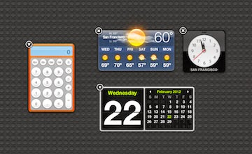
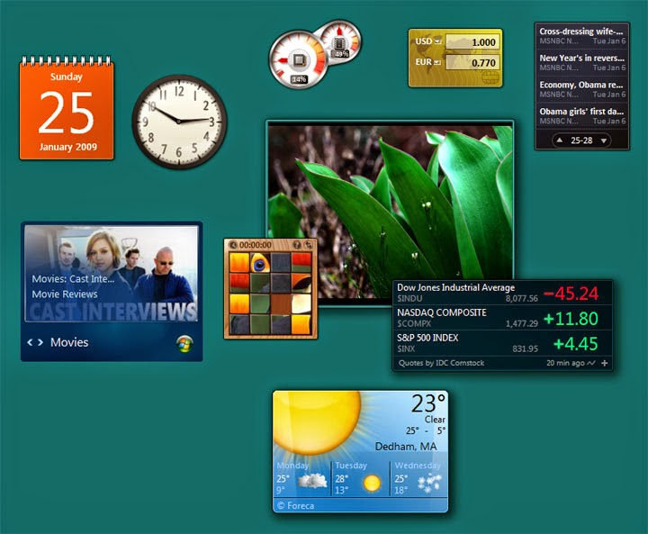
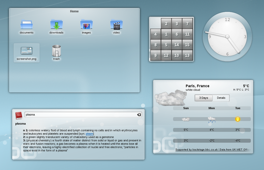

Discover the path to cool widget programming. Learn how to show your form only on desktop and nowhere else. Great for Widgets and To-do apps.
<!-- more -->


Every developer wants to develop something fancy in his life. And what is more fancy than a desktop widget? Widgets are such a "Form" or "Window" which **always stays on bottom** or on the desktop and provides eyecandy or displays information (such as weather, calendar etc.) which is the exact opposite of . It is also great for creating tiny desktop apps, such as a To-do list app. Or if you want to to something special, why not ?

Here's some examples from 3 OS platforms to inspire you to create newer ideas:











Many have tried this with Windows API's `SetParent`, by making the program window a child of the desktop window. But it has [some potential problem](http://blogs.msdn.com/b/oldnewthing/archive/2004/02/24/79212.aspx) especially when a Modal form appears or a message box dialog is shown. So, I've searched for another solution. And luckily I found the solution that [Rainlendar](https://en.wikipedia.org/wiki/Rainlendar) have used, which is a desktop calender widget program for Windows, Mac and Linux. You will find the solution [here](http://stackoverflow.com/questions/365094/window-on-desktop) in the [answer from Artur Carvalho](https://stackoverflow.com/a/365270).


The solution states that if we make our program window a child of the Program Manager (or `Progman`) then it will always stay on the desktop but will not come up over other running windows. It also should solve the modal forms problem of locking the desktop. It is excellent for creating a desktop widget or a To-do list app.

So far I got it to work under Windows. I have had some failed attempts to get it to work under Ubuntu. If anyone knows a solution, please let me know.


### Code

Here is a simple code:

```pascal
uses
  ..., windows;

procedure TForm1.Button1Click(Sender: TObject);
var
  myhWnd, hWndProgMan: HWND;

begin

  myhWnd := Self.Handle;
  hWndProgMan := windows.FindWindow('Progman', nil);

  windows.SetParent(myhWnd,hWndProgMan);

end;
```

Here, we have added windows to the uses clause. We have placed a TButton on the form, then entered the above code on its OnClick event. Now if you run the project and press the button, the form will be placed on desktop. You can , set shape to the form, and use some background image to create some crazy cool looking stuff.


### Sample Project


Start [Lazarus](http://lazarus.freepascal.org/).

Create a new Application Project (**Project -> New Project -> Application -> OK**).

Switch to Code View (by pressing **F12**).

Add `windows` to the `uses` clause:

```pascal
uses
  ..., windows;
```

This will enable us to use Windows API functions, like `FindWindow` and `SetParent`.

Now switch to Form view (**F12**) and double click the Form and enter the following code:

```pascal
procedure TForm1.FormCreate(Sender: TObject);
var
  myhWnd, hWndProgMan: HWND;

begin

  myhWnd := Self.Handle;
  hWndProgMan := windows.FindWindow('Progman', nil);

  windows.SetParent(myhWnd,hWndProgMan);

end;
```

Now run the project (**F9** or **Run -> Run**). The form window will appear on desktop and stay on desktop. Try opening some windows and test it.

Now that you have a window that stays on desktop you can create desktop widgets. If you can't, wait a few days and I'll write a weather widget project.

**Ref:**
[http://forum.lazarus.freepascal.org/index.php?topic=1574.0](http://forum.lazarus.freepascal.org/index.php?topic=1574.0)
[http://stackoverflow.com/questions/365094/window-on-desktop](http://stackoverflow.com/questions/365094/window-on-desktop)
