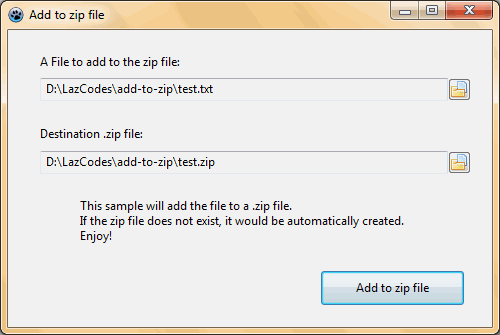

Zip files are a very common way of sharing multiple files compressed into a single file. Zip files are supported in various platforms (Windows, Mac, Linux etc.). We can use many softwares to create a zip file, such as [7-zip](http://www.7-zip.org/), [WinZip](http://www.winzip.com/), [WinRAR](http://www.rarlab.com/) etc. But today we are going to make zip files on our own program!
<!-- more -->


### 1\. Download:

Download the ZipFile library from here: [http://sourceforge.net/projects/lazarus-ccr/files/ZipFile/](http://sourceforge.net/projects/lazarus-ccr/files/ZipFile/)
Extract the zip file in the project directory (in which we will save the project later). You can use this as a package (lpk) in lazarus to drop it in a Form. But it will require us to rebuild Lazarus. We will use the second option. We will include the files in the project directory and call the functions using the library files sitting there.


### 2\. Create a new project.

Start [Lazarus](https://lazarus-ide.org).
Create a new project and click **File -> Save All** and save all the files to the project directory.

Go to **Project -> Project Options -> Compiler Options -> Paths**. In the Other unit files add the "zipfile" directory that you have extracted.


### 3\. Now design the form.

Press **F12** to switch to Form View. Drop 2 **TFileNameEdit**s, 1 **TButton** in the form.

Double click the form and write the following code.

```pascal
  FileNameEdit1.FileName:=Application.Location + 'test.txt';

  FileNameEdit2.FileName:=Application.Location + 'test.zip';
```

Here we set the default values of **TFileEdit**s. Do not forget to create a `test.txt` file in the project directory, in order to test the program with the default filenames.


### 4\. Button code.

Press **F12** to switch to code view. Add the `ZipFile` unit to the `uses` section at the top of the unit file code. For example my `uses` clause has turned to be like this:

```pascal
uses
  Classes, SysUtils, FileUtil, Forms, Controls, Graphics, Dialogs, StdCtrls,
  EditBtn, ZipFile;
```

Double click the **TButton** and write the following code:

```pascal
var
  OurZipper: TZipFile;
begin
  // we CREATE the component for zipping
  OurZipper := TZipFile.Create(Form1);

  try
    // we specify the zip file name
    OurZipper.FileName := FileNameEdit2.FileName;

    // activate the component for use
    OurZipper.Activate;

    // we add
    OurZipper.AppendFileFromDisk(FileNameEdit1.FileName, ExtractFileName(FileNameEdit1.FileName));

  finally
    OurZipper.Free;

  end;

end;
```


### 5\. Run the program


Press **F9** or click **Run -> Run** to Run the program we have made.





Click the button. And then visit the project directory. You will see a "test.zip" file created by the program.


You can check here for instructions on how to use `ZipFile` as a package component to use in the form view:
[http://wiki.freepascal.org/ZipFile](http://wiki.freepascal.org/ZipFile)
