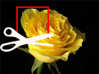

Not every pixel of a photo is important. Sometimes we need to just crop out some of the area of a photo. We learn how to crop an image and save the cropped version in a file.  
  
  
  
We all take photos. We take photos of people, trees, sky, objects and many unimaginable things. Among these photos there are some photos which are just not right. They have unnecessary portions that if got rid of, can make the photo more focused and a perfect one. So today we see how to crop an image.  
  

### Concept

Cropping an image means basically to eliminate some pixels and draw the rest of the picture. The user opens a photo, then selects a rectangular area to be cropped. We, the programers, then take only the part of the image that is inside the rectangular area and draw it somewhere. The image that we draw is the cropped image. We actually copy certain part of the image.  
  
  
  
  
It is very easy if you know how to use [TCanvas.CopyRect](http://lazarus-ccr.sourceforge.net/docs/lcl/graphics/tcanvas.copyrect.html) procedure. It has the following syntax:  
  

public procedure TCanvas.CopyRect(  
  const Dest: TRect;  
  SrcCanvas: TCanvas;  
  const Source: TRect  
); virtual;

  
The LCL Manual explains CopyRect:  

> Copies the rectangle found at Source in SrcCanvas to the destination position Dest

  
_Dest_ is the rectangular area where the cropped image will be shown.  
_SrcCanvas_ is the canvas from which we will get our original image.  
_Source_ is the cropped rectangular area. The part which we will copy.  
  
As you can see we are actually drawing a part of a TCanvas to somewhere else. We are not actually cropping the image.  
  

### Tutorial

Start [Lazarus IDE](http://www.lazarus.freepascal.org/).  
  
Create a new Application Project (Project-> New Project-> Application-> OK). Now drop a TFileNameEdit \[from Misc tab\] and a TButton on the form (or TBitBtn \[Additional tab\] if you are interested in using an icon for the button). Name the TButton as btnSave. These 2 components are for opening an image and then saving the cropped image.  
  
  
You can set the Filter property of FileNameEdit1 as "\*.bmp;\*.xpm;\*.png;\*.pbm;\*.ppm;\*.ico;\*.icns;\*.cur;\*.jpg;\*.jpeg;\*.jpe;\*.jfif;\*.tif;\*.tiff;\*.gif" (without the quotes). For saving the cropped file we would also need a TSaveDialog. Drop one TSaveDialog from the Dialogs tab and set its filter as "Bitmap File (\*.bmp)|\*.bmp" without the quotes.  
  
We will have 2 TImages. One will have the original image and another one will have the cropped image. The image will be cropped when the user drags a rectangle over the first TImage. But if the user opens a large image, then the TImage will have to have a scrolling function. So we will have to create a TScrollbox and put our TImage in it. We know that everything we put inside a TScrollbox automatically has scrollbars if its dimensions are outside its area.  
  
So, we will create 2 TScrollbox components on the form. Tscrollbox component can be found on Additional tab of the toolbar.  
  
  
  
Now, put 2 Timages inside those. If you are not sure how to put them inside the TScrollbox then I'd suggest you select the Timage tool from the toolbar then start dragging in the area of a TScrollbox. Then the TImage will be created inside the TScrollbox. Event the Object Inspector will show the hierarchy you achieved.  
  
  
  
Create another TImage inside the other TScrollBox. Image1 on the left will be our original image and Image2 at the right will be our cropped image. Set Image1's AutoSize property to True, so that it sizes automatically according to image size. Also, set the Left and Top property of both the images to 0 (zero).  
  
Now, to have a smoother scrolling behavior, we need to set the HorzScrollBar->Tracking and VertScrollBar->Tracking property to True.  
  
  
I'm sure you have done all the things I have said. Another little thing is the selection rectangle. Create a TShape \[form Additional tab\] inside the ScrollBox1 in the left. Set its Name property to Sel. You can customize it the way you like. I have set its Brush->Style property to bsClear; Pen->Color to clGreen and Pen->Style to psDot. Set its Visible property to False because we only want to show it when the user selects an area of the image, but not always.  
  
My form design is like below. I have also opened a default image for testing in Image1.  
  
  
  

#### Now to coding...

  
First, add the following variables under the first var clause (usually under the Form1: TForm1; line). If you need to switch to code view then use F12.  
  

var   
  ...  
  ...  
  PrevX, PrevY: Integer;  
  MouseIsDown: Boolean;  
  
  Bmp2: TBitmap;

  
Switch to Form view (F12). Double click the Form, then enter:  
  

procedure TForm1.FormCreate(Sender: TObject);  
begin  
  Bmp2:=TBitmap.Create;  
  
  Bmp2.Width:=Screen.Width;  
  Bmp2.Height:=Screen.Height;  
  
  Bmp2.Canvas.Brush.Color:=clWhite;  
  Bmp2.Canvas.FillRect(0,0, Bmp2.Canvas.Width, Bmp2.Canvas.Height);  
  // we trigger the OnPaint event to draw Bmp2  
  Image2Paint(Sender);  
end;

  
Now let's let the user open images. Double click the FileNameEdit1 and enter:  

procedure TForm1.FileNameEdit1Change(Sender: TObject);  
begin  
  if FileExistsUTF8(FileNameEdit1.FileName) then  
    Image1.Picture.LoadFromFile(FileNameEdit1.FileName);  
end;

  
Now select Image1 and add the following code on its OnMouseDown event (Object Inspector-> Events-> OnMouseDown-> \[...\]):  
  

procedure TForm1.Image1MouseDown(Sender: TObject; Button: TMouseButton;  
  Shift: TShiftState; X, Y: Integer);  
begin  
  if Button = mbLeft then begin  
    MouseIsDown:=True;  
    PrevX:=X;  
    PrevY:=Y;  
    Sel.Visible:=True;  
    Image1MouseMove(Sender,Shift,X,Y);  
  end;  
end;

  
On Image1's OnMouseMove event, add:  
  

procedure TForm1.Image1MouseMove(Sender: TObject; Shift: TShiftState; X,  
  Y: Integer);  
begin  
  if MouseIsDown = true then begin  
    Sel.SetBounds(prevx,prevy,X-prevx,y-prevy);  
  end;  
end;

  
On Image1's OnMouseUp event, add:  
  

procedure TForm1.Image1MouseUp(Sender: TObject; Button: TMouseButton;  
  Shift: TShiftState; X, Y: Integer);  
var  
  rect1, rect2: TRect;  
  destwidth, destheight: Integer;  
begin  
  MouseIsDown:=False;  
  Sel.Visible:=False;  
  // if we do not refresh, then the Sel will  
  // be also drawn !  
  Image1.Refresh;  
  
  // we keep width and height in variables  
  // because we will need it many times  
  destwidth:=X-PrevX;  
  destheight:=Y-PrevY;  
  
  //// We prepare 2 rects for cropping ////  
  // Destination rectangle  
  // ...where the cropped image would be drawn  
  with rect1 do begin  
    Left:=0;  
    Top:=0;  
    Right:=Left+destwidth;  
    Bottom:=Top+destheight;  
  end;  
  
  // Source rectangle  
  // ...where we crop from  
  with rect2 do begin  
    Left:=PrevX-abs(ScrollBox1.HorzScrollBar.Position);  
    Top:=PrevY-abs(ScrollBox1.VertScrollBar.Position);  
    Right:=Left+destwidth;  
    Bottom:=Top+destheight;  
  end;  
  
  // we do the actual drawing  
  Bmp2.SetSize(destwidth, destheight);  
  Image2.SetBounds(0,0,destwidth,destheight);  
  Bmp2.Canvas.CopyRect(rect1, Image1.Canvas, rect2);  
  
  Image2Paint(Sender);  
end;

  
(UPDATE: The above code has been updated to fix a drawing misbehavior when scrolled before cropping.)  
  
On Image2's OnPaint event, enter:  
  

procedure TForm1.Image2Paint(Sender: TObject);  
begin  
  Image2.Canvas.Draw(0,0,Bmp2);  
end;

  
Double click on btnSave and enter:  
  

procedure TForm1.btnSaveClick(Sender: TObject);  
begin  
  SaveDialog1.Execute;  
  if (SaveDialog1.FileName <> '') then  
    bmp2.SaveToFile(SaveDialog1.FileName);  
end;

  

### Run It

Now Run the project (F9 or Run-> Run).  
  
  
  
Now open an image using the FileNameEdit. The image will show in the left TImage. Now drag to select a rectangular area over the image. It will produce a cropped image on the right. Click the button to save the cropped image to a file of your choice.  
  
  
  
Let me know if you need explanations of these codes. I'd be happy to explain it for you. Just post a comment and ask.  
  
You can also make it do the following. Extending is a great practice for programing.  

*   [Paste image from clipboard](http://lazplanet.blogspot.com/2013/05/image-copy-paste-clipboard.html) to let it resize. We often need to take a screenshot and crop it to share it over the internet.
*   Take a snapshot of the screen and offer to crop it (without need to press Print Screen button).
*   Save as many formats, such as compressed JPEGs or GIFs.
*   Use a single TImage to show both original and cropped image (Just like Gimp or Photoshop has a single canvas for showing both, not two canvases).

  

### Download Sample Code ZIP

You can download the above example tutorial project source code from [here](https://www.dropbox.com/s/gkqmtrz6a4oeufo/ImageCrop.zip?dl=1)  
Or here: [http://bit.ly/1aqGaCh](http://bit.ly/1aqGaCh)  
Size: 947 KB  
The package contains compiled executable EXE.