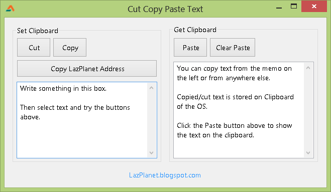

Word processors and even browsers have cut, copy, paste functions. You have used them many times in your life. But now make yours!
<!-- more -->
  
  
When you cut or copy a text, it lives on the virtual space called "Clipboard". The clipboard is stored in the memory and Operating Systems manage the storage of it.  
  
Using the clipboard will ease the use of your program in many ways. You can use the clipboard when you have generated data which is hard to remember or type. For example, a long serial number or some weird unicode characters.  
  

### Using the clipboard

Using the [clipboard](http://wiki.lazarus.freepascal.org/Clipboard) for text is very easy in Lazarus.  
  
For using the Clipboard commands you will have add the Clipbrd unit to the uses clause:  
uses  
..., Clipbrd;  
  
To store something in the clipboard:  
Clipboard.AsText := 'Hello clipboard!';  
  
To retrieve the text from the clipboard:  
ShowMessage('Clipboard content: ' + Clipboard.AsText);  
  

### Text Oriented Components

Some text oriented components have procedures to make it easy to access the clipboard.  
  procedure CopyToClipboard;  
  procedure CutToClipboard;  
  procedure PasteFromClipboard;  
  
The above procedures can be used in:  

*   TEdit
*   TMemo
*   TStringGrid
*   TLabeledEdit
*   TMaskEdit
*   TSpinEdit
*   TFloatSpinEdit

The good thing about these procedures is, that you don't need to get even the selected portion of the text. If the user selects a portion of the text and you run CopyToClipboard, only the selected text would be automatically copied to the clipboard! It is also true for CutToClipboard.  
  
When you use PasteFromClipboard, the text would be pasted where the cursor position is.  
  

### Writing the code for clipboard

Suppose we have a TMemo named Memo1 in our form.  
  
If we want to **copy** the **selected text** in it then we can create a button and use:  
Memo1.CopyToClipboard;  
  
If we want to **copy** the **whole text** we would use the component's procedures (because we don't want to copy the selected text, we want the whole text):  
Clipboard.AsText := Memo1.Text;  
  
To **cut** the **selected part** of the text:  
Memo1.CutToClipboard;  
  
To **cut** the **whole text** we would have to copy the whole text to the clipboard then clear the text:  
Clipboard.AsText := Memo1.Text;  
Memo1.Text := '';  
  
To **paste (or insert)** the text in the clipboard in our Memo1 _where the cursor is_:  
Memo1.PasteFromClipboard;  
  
To **paste** when we want **only the text** in the clipboard (and we don't want the existing text):  
Memo1.Text := Clipboard.AsText;  
  
_Or,_  
Memo2.Text := '';  // we clear the memo  
Memo2.PasteFromClipboard;  
  
You can see the Wiki for more information: [http://wiki.lazarus.freepascal.org/Clipboard](http://wiki.lazarus.freepascal.org/Clipboard)  
  

### Download Sample Code zip

You can download a sample source code zip as an example of the above discussion: [http://db.tt/5jI8AO61](http://db.tt/5jI8AO61)  
Or here: [http://bit.ly/YnWIsL](http://bit.ly/YnWIsL)  
   
Size: 520 KB  
The package has a compiled executable (EXE).  
_Image: www.artistsvalley.com_