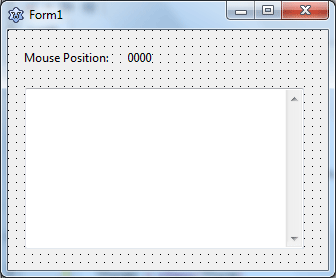
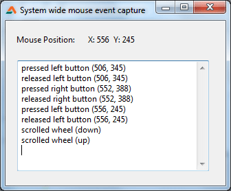

In this article we find out what the user is doing with his mouse, even outside of the program. Let's conquer the whole system!  
  
  
We have events on components, such as OnClick, OnMouseDown, OnScrollDown etc. But unfortunately these events only work when the mouse is inside the form. But sometimes we need to get a view of what the user is doing on other programs or other windows (or in other words "System-wide"). These "System wide" events can be "caught" through a crazy thing called "hooks".  
  
A Hook is a function that you can tell Windows to run whenever something special happens. You can create a hook for keyboard to run it whenever a key is pressed. Then you can do something based on which key is pressed (in whichever window it is pressed). Today we are going to focus on mouse events. We will catch what the mouse is doing system wide. Wherever the mouse goes, we catch what the user is doing with it.  
  

#### What we'll do

We will catch when the left, middle and right mouse button is pressed, and additionally when the mouse wheel is scrolled up or down. These things are especially useful in cases like, to create such a program which can record a macro and repeat those tasks later, or create mouse gestures on touching the corner of the screen (like in Gnome 3), or maybe creating a form which acts like a menu so when the user clicks outside it closes... the possibilities are endless.  
  
  

####   
  
Optionally, you can set the **FormStyle** to **fsSystemStayOnTop**. It will [keep the form always on top](http://localhost/wp-lazplanet/2014/01/12/how-to-make-your-form-always-on-top/) and let you see the events even when you click outside of the form.  
  
Switch to code view (F12). Now add "windows" unit to uses:  
  

uses  
  ..., ..., windows;

  
Under the type clause enter this:  
  

type  
  ...  
  ...  
    
  MouseLLHookStruct = record  
    pt          : TPoint;  
    mouseData   : cardinal;  
    flags       : cardinal;  
    time        : cardinal;  
    dwExtraInfo : cardinal;  
  end;

   
Before the var clause enter:  
  

...  
...  
  
function LowLevelMouseHookProc(nCode, wParam, lParam : integer) : integer; stdcall;  
  
var

...

... 

  
This function will be our hook function. Windows will run it whenever there is a mouse event.  
  
Under the var clause declare a variable:  
  

var  
  ...  
  ...  
  mHook : cardinal;

   
Now we enter code for our hook function. Under the implementation clause enter:  
  

function LowLevelMouseHookProc(nCode, wParam, lParam : integer) : integer; stdcall;  
// possible wParam values: WM\_LBUTTONDOWN, WM\_LBUTTONUP, WM\_MOUSEMOVE, WM\_MOUSEWHEEL, WM\_RBUTTONDOWN, WM\_RBUTTONUP  
var  
  info : ^MouseLLHookStruct absolute lParam;  
begin  
  result := CallNextHookEx(mHook, nCode, wParam, lParam);  
  with info^ do begin  
    Form1.Label1.Caption := 'X: '+IntToStr(pt.x)+'  Y: '+ IntToStr(pt.y);  
    case wParam of  
      wm\_lbuttondown : Form1.Memo1.Lines.Append(format('pressed left button (%d, %d)'    , \[pt.x, pt.y\]));  
      wm\_lbuttonup   : Form1.Memo1.Lines.Append(format('released left button (%d, %d)'   , \[pt.x, pt.y\]));  
      wm\_mbuttondown : Form1.Memo1.Lines.Append(format('pressed middle button (%d, %d)'  , \[pt.x, pt.y\]));  
      wm\_mbuttonup   : Form1.Memo1.Lines.Append(format('released middle button (%d, %d)' , \[pt.x, pt.y\]));  
      wm\_rbuttondown : Form1.Memo1.Lines.Append(format('pressed right button (%d, %d)'   , \[pt.x, pt.y\]));  
      wm\_rbuttonup   : Form1.Memo1.Lines.Append(format('released right button (%d, %d)'  , \[pt.x, pt.y\]));  
      wm\_mousewheel  : begin  
        if smallInt(mouseData shr 16) > 0  
        then Form1.Memo1.Lines.Append('scrolled wheel (up)')  
        else Form1.Memo1.Lines.Append('scrolled wheel (down)');  
      end;  
    end;  
  end;  
end;

  
Switch to Form view (F12), then double click on the form, and enter:  
  

procedure TForm1.FormCreate(Sender: TObject);  
const  
  WH\_MOUSE\_LL = 14;  
begin  
  
  mHook := SetWindowsHookEx(WH\_MOUSE\_LL, @LowLevelMouseHookProc, hInstance, 0);  
    
end;

  
Switch to form view again (F12), then select the form, go to Object Inspector -> Events, then click OnDestroy, then click the \[...\] button beside it. Now enter:  
  

procedure TForm1.FormDestroy(Sender: TObject);  
begin  
  
  UnhookWindowsHookEx(mHook);  
    
end;

  
Now run the project (F9 or Run -> Run).  
  
  
Now, when you use this code on your project you will need to customize the LowLevelMouseHookProc() function to suit your needs. Try things yourself. The sky is the limit here!  
  
...And for the mouse position, it is better to [use the Mouse.CursorPos.x or .y](http://localhost/wp-lazplanet/2013/04/06/how-to-get-your-mouse-cursor-position-bonus-set-position-also/) because the solution in this article sometimes begets negative values, which might not be what you would like. The code is kept just to show how it is done in the hooks style.  
  

### Download Sample Code ZIP

You can download the above example tutorial project's source code from [here](https://db.tt/VSs3JIJ9).  
Or [here](https://drive.google.com/uc?export=download&id=0B9WrDtlrEzlSYlgtWGRIQmdrcjQ).  
Size: 561KB  
The package contains compiled executable EXE file.  
  
Ref:  
[https://www.experts-exchange.com/questions/21838717/Delphi-detect-a-left-right-mouse-click-anywhere-on-the-screen.html](https://www.experts-exchange.com/questions/21838717/Delphi-detect-a-left-right-mouse-click-anywhere-on-the-screen.html) - thanks to ZhaawZ, his answer helped greatly