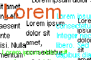We can use TLabel to show any text just to show any text, not editing. But what could we do to show text on a canvas? Then we would need to draw the text. Here's how...  
  
  
For showing any normal text that doesn't usually react to any user events, which only lies idle on the form can be made by using a TLabel. We use TLabels for captions for input fields and instructions to how to use the program we have made.  
  

### Printing your text on a Canvas

TLabel is for forms, right? But what about if we want text on a Canvas. We cannot actually put a TLabel on a Canvas! Sure we can place them over a component which has a canvas, but it is not really being printed into the canvas. And don't even get me started on invisible virtual canvases (Canvases of image variables, such as TBitmap.Canvas). It is not possible to use TLabels on that. If we want our text to be printed on a Canvas we need to use procedures like TextOut() and TextRect(). And if we are in the mood of experimenting, we can [also try DrawText() procedure](http://wiki.freepascal.org/Developing_with_Graphics#Drawing_a_text_limited_on_the_width) from LCL. But I prefer something from the canvas itself.  
  

### Examples of drawing text on a Canvas

To run these examples, you may need to create an Application Project (Project-> New Project-> Application-> OK) and then enter these codes on the form's onPaint Event (Object Inspector-> Events-> OnPaint-> \[...\]).  
  

#### Example 1: Text at the top left corner

  
We use the Tcanvas.TextOut procedure to draw text.  
  

begin  
  Canvas.TextOut(0,0,'Hello');  
end;

  
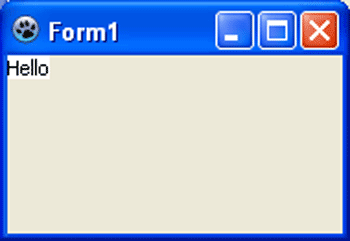  
The text will be printed on the form's canvas in the top left position (0,0...).  
  

#### Example 2: Text at a certain position

  

begin  
  Canvas.TextOut(80,60,'Hello');  
end;

  
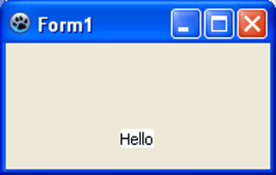  
The text will be drawn at 50 pixels from left and 60 pixels to the right.  
  

#### Example 3: Text and background color

  
By default the text is drawn with white background and with black text color. The colors are set as a default for canvas. But we can change that...  
  

begin  
  Canvas.Brush.Color:=RGBToColor(0,166,81);  
  Canvas.Font.Color:=RGBToColor(255,255,255);  
  Canvas.TextOut(80,60,'Hello World');  
end;

  
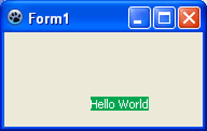  
The background is set by Brush.Color and the text color is set by Font.Color. You can also set any TColor as a value, such as clGreen, clBlack, clWhite etc.  
  

#### Example 4: Text without no background

  
We can draw text with transparent background (or in other words, eliminate the background color).  
  

begin  
  Canvas.Brush.Style:=bsClear;  
  Canvas.TextOut(80,60,'Hello World');  
end;

  
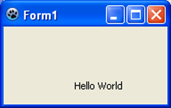  
  

#### Example 5: Setting text size

  
Now we need to change the font size, because it looks tiny in our form!  
  

begin  
  Canvas.Font.Size:=18;  
  Canvas.TextOut(80,60,'Hello World');  
end;

  
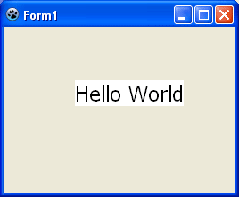  
  

#### Example 6: Getting the text size before drawing (and drawing a rectangle around it as border)

  
We can even get the width and height of the area which the text would take to be drawn. For example, it can determine how much vertical space it would going to take to draw a text even with a specific font size. We can do it before we have done our drawing of text.  
  

var  
  ww, hh: Integer;  
begin  
  Canvas.Font.Size:=18;  
  Canvas.Font.Color:=clRed;  
  Canvas.Brush.Style:=bsClear;  
  
  ww:=Canvas.TextWidth('Hello World');  
  hh:=Canvas.TextHeight('Hello World');  
  //// Or...  
  //Canvas.GetTextSize('Hello World', ww, hh);  
  
  Canvas.Rectangle(80, 60, 80+ww, 60+hh);  
  Canvas.TextOut(80,60,'Hello World');  
end;

  
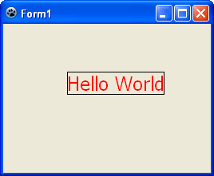  
Canvas.TextWidth returns the width and Canvas.TextHeight returns the height of the probable drawing area before actually printing the text. We can also use Canvas.GetTextSize, which assigns the width and height to the variables given (without returning anything).  
  

#### Example 7: Center a text

  
If we can get the area in which the text is going to be drawn, then we can obviously draw the text on the center.  
  

var  
  ww, hh: Integer;  
begin  
  Canvas.Font.Size:=18;  
  Canvas.Font.Color:=clRed;  
  Canvas.Brush.Style:=bsClear;  
  
  Canvas.GetTextSize('Hello World', ww, hh);  
  
  Canvas.TextOut((Width-ww) div 2, (Height-hh) div 2, 'Hello World');  
end;

  
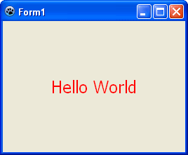  

#### Example 8: Drawing text in a rectangular area (good for paragraphs)

  
Now we will see how to draw text inside a specific rectangular area.  
  
var  
  textarea: TRect;  
  mytext: string;  
  mytextstyle: TTextStyle;  
begin  
  Canvas.Font.Size:=14;  
  Canvas.Font.Color:=clRed;  
  Canvas.Brush.Color:=clBlack;  
  
  mytext:='Lorem ipsum dolor sit amet, consectetur adipiscing elit. Integer nec odio. Praesent libero. Sed cursus ante dapibus diam. Sed nisi. Nulla quis sem at nibh elementum imperdiet. Duis sagittis ipsum. Praesent mauris. Fusce nec tellus sed augue semper porta. Mauris massa. Vestibulum lacinia arcu eget nulla. Class aptent taciti sociosqu ad litora torquent per conubia nostra, per inceptos himenaeos. Curabitur sodales ligula in libero. Sed dignissim lacinia nunc. Curabitur tortor. Pellentesque nibh. Aenean quam. In scelerisque sem at dolor.';  
  textarea:=Rect(0, 0, 250, 400);  
  mytextstyle := Canvas.TextStyle;  
  mytextstyle.Wordbreak:=True;  
  mytextstyle.SingleLine:=False;  
  
  Canvas.TextRect(textarea, 20, 20, mytext, mytextstyle);  
  Canvas.FrameRect(20, 20, textarea.Right, textarea.Bottom);  
end;  
  
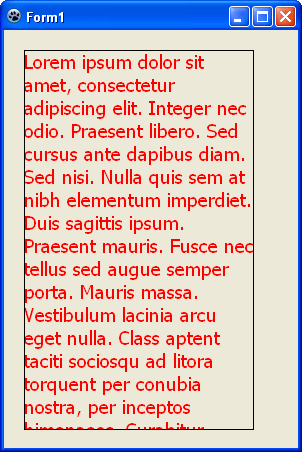  
  
We set the the Brush.color for the FrameRect procedure later on, which will draw a rectangle showing the area in which we have drawn the text. We define a TRect to define the area in which we want our text to be shown. We use a variable mytextstyle to tweak the drawing rules for our text. We set wordbreak to True and SingleLine to False just to indicate that we want to have our text not in a single line but in a paragraph style inside the TRect. Be my guest and comment out the 2 lines to see what happens if we wouldn't have written these lines.  
  

### Sample Project

We have learned quite a bit from the examples above. Now we would create a sample application to demonstrate the usability of the code. We would make a graphical interface to choose text, font, font size, font color and finally drawing area for the text. This is already a huge post, so I will go through the project creation in short.  
  
Create a new Application project (Project-> New Project-> Application-> OK).  
  
Create components and name them seeing the screenshot below of the Object Inspector.  
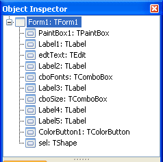  
The form layout would be something like this: If you don't find a component then use Ctrl+Alt+P (or View-> Components) to find that naughty little component that was hiding from you.  
  
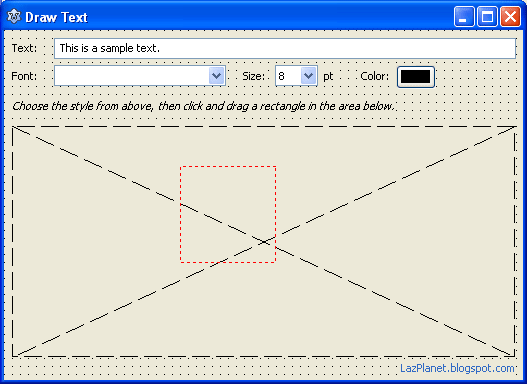  
At the top we have edtText. Change its default Text property to something like "This is a sample text".  
Then its the cboFonts. Set its Style property to csDropDownList. Set it also for the cboSize. For cboSize, set its Items property with variaous font sizes, such as:  
8  
10  
12  
14  
16  
18  
24  
36  
Then set its ItemIndex to 0. The Text property will be automatically changed.  
  
For sel, the selection rectangle, set its Pen->Color to clRed and Pen->Style to psDot.  
  
Now add these variables under the first var that appears in the code (usually after Form1: TForm1; line). You can switch between code and form view by pressing F12.  
  

  PrevX, PrevY: Integer;  
  Clicked: Boolean = False;  
  
  bmp1: TBitmap;

  
Double click the form and enter:  
  

begin  
  
  // we list all the fonts in the TComboBox  
  cboFonts.Items := Screen.Fonts;  
  cboFonts.ItemIndex:=0;  
  
  bmp1 := TBitmap.Create;  
  
  bmp1.SetSize(Screen.Width, Screen.Height);  
  bmp1.Canvas.FillRect(0,0,screen.Width,screen.Height);  
end;

  
Now add these codes in the OnClose event of the form (select the form, then go to Object Inspector-> Events-> OnClick-> \[...\]).  
  

begin  
  bmp1.Free;  
end;

  
On Paintbox1's OnMouseDown event enter:  
  

procedure TForm1.PaintBox1MouseDown(Sender: TObject; Button: TMouseButton;  
  Shift: TShiftState; X, Y: Integer);  
  
begin  
  if Button = mbLeft then begin  
    PrevX:=X;  
    PrevY:=Y;  
  
    // so that it doesn't appear with the previous size  
    // that was made with dragging  
    sel.SetBounds(0,0,1,1);  
    sel.Visible:=True;  
  
    Clicked:=True;  
  end;  
end;

  
On Paintbox1's OnMouseMove event enter:  
  

procedure TForm1.PaintBox1MouseMove(Sender: TObject; Shift: TShiftState; X,  
  Y: Integer);  
  
begin  
  if Clicked = true then begin  
     sel.left  := PaintBox1.Left+PrevX;  
     sel.top   := PaintBox1.Top+PrevY;  
     sel.Width := X - PrevX;  
     sel.Height:= Y - PrevY;  
  end;  
end;

  
On Paintbox1's OnMouseUp event enter:  
  

procedure TForm1.PaintBox1MouseUp(Sender: TObject; Button: TMouseButton;  
  Shift: TShiftState; X, Y: Integer);  
var  
  textarea: TRect;  
  mytext: string;  
  mytextstyle: TTextStyle;  
begin  
  
  if Clicked = true then begin  
  
    Clicked:=False;  
    sel.Visible:=false;  
  
    bmp1.Canvas.Font.Name:=cboFonts.Text;  
    bmp1.Canvas.Font.Size:=StrToInt(cboSize.Text);  
    bmp1.Canvas.Font.Color:=ColorButton1.ButtonColor;  
  
    mytext:=edtText.Text;  
    textarea:=Rect(0, 0, X, Y);  
    mytextstyle := bmp1.Canvas.TextStyle;  
    mytextstyle.Wordbreak:=True;  
    mytextstyle.SingleLine:=False;  
  
    bmp1.Canvas.TextRect(textarea, PrevX, PrevY, mytext, mytextstyle);  
    PaintBox1Paint(Sender);  
  
  end;  
  
end;

  
Now, Run it (F9 or Run-> Run).  
  
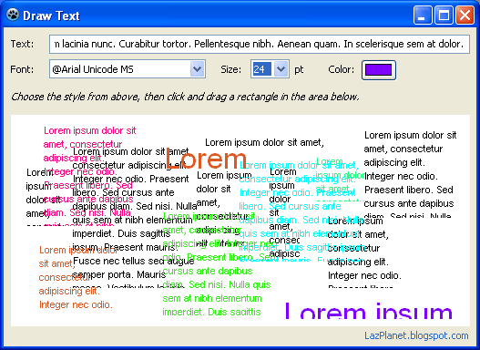  
Now choose a font, size, color, text and then drag a rectangular area on the Paintbox to your text drawn on it. Simple!  
  

### Download Sample Code ZIP

You can download an example source code zip file from [here](https://www.dropbox.com/s/zncc8kggdirvh06/DrawTextCanvas.zip?dl=1)  
Or here: [http://bit.ly/12ftOdL](http://bit.ly/12ftOdL)  
Size: 528 KB  
The package contains compiled executable EXE file.  
  
**Ref:**  
[http://www.lazarus.freepascal.org/index.php?topic=21118.0](http://www.lazarus.freepascal.org/index.php?topic=21118.0)  
[http://msdn.microsoft.com/en-us/library/aa911421.aspx](http://msdn.microsoft.com/en-us/library/aa911421.aspx)  
[http://docs.embarcadero.com/products/rad\_studio/delphiAndcpp2009/HelpUpdate2/EN/html/delphivclwin32/Graphics\_TCanvas\_TextRect@TRect@Integer@Integer@string.html](http://docs.embarcadero.com/products/rad_studio/delphiAndcpp2009/HelpUpdate2/EN/html/delphivclwin32/Graphics_TCanvas_TextRect@TRect@Integer@Integer@string.html)