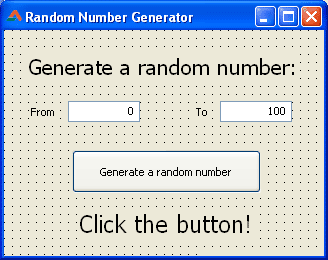
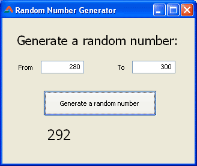

Do you know what face of dice is going to come up before throwing? That's what random means. We learn how to create a program that shows a random number each time you click a button.  
  
  

### Introduction to "Random"

The Oxford dictionary defines "Random" as "done, chosen, \[something\] without \[somebody\] deciding in advance what is going to happen, or without any regular pattern". For example, if you stack books one over the other without maintaining a specific order (such as alphabetically), then you are stacking the books randomly. It is kind of like the shuffling of cards. Nobody knows which card will go where after the shuffling (or randomization).  
  
Randomizing is something when you need something to surprise people or something the result of which is just totally unknown. Such as you roll the dice to see a random face each time. [Wikipedia](http://www.wikipedia.org/) has a [Random Article](http://en.wikipedia.org/wiki/Special:Random) feature which shows you a random Wikipedia article each time you [click the link](http://en.wikipedia.org/wiki/Special:Random).  
  

### Random()

There is a [Random()](http://lazarus-ccr.sourceforge.net/docs/rtl/system/random.html) function (from the system unit) which can generate random number with a given value. You can use an Integer as a value/parameter.See the syntax below:  
  

function Random(  
  l: LongInt  
):LongInt;  
  
function Random(  
  l: Int64  
):Int64;  
  
function Random: extended; 

  
If you write:  

Random(100);

\-it will return a random number. It will be different each time the code is run, as this is what its designed to do.  
  
You can create a Console program (Project-> NewProject-> Program-> OK) and copy-paste the following code:  
  

program rand\_number;  
  
{$mode objfpc}{$H+}  
  
uses  
  {$IFDEF UNIX}{$IFDEF UseCThreads}  
  cthreads,  
  {$ENDIF}{$ENDIF}  
  Classes;  
  
var  
  i: Integer;  
  
begin  
  WriteLn('This program will generate 5 random numbers between 0 and 100');  
  ReadLn;  
  
  Randomize;  
  
  for i := 0 to 5 do  
    WriteLn(Random(100));  
  
  ReadLn;  
  
end.

  
Run it (F9 or Run-> Run) and press enter. This will show 5 random numbers ranging from 0 to 99.  
  

### Random with Range

  
What if you want random numbers from 80 to 100? You can try:  
  

WriteLn(Random(20) + 80);

  
  
First, we generate a random number of (100-80=)20, because we could have maximum of 20 random numbers between 80 and 100. That will, say, generate a random number like 12.  
  
Now we can't use 12 because our range starts from 80. So we add 80 with 12 and get 92 as a result. 92 is between 80 and 100, right? This way Random(20) could generate other numbers:  
6, which would be then turned into (6+80)=86;  
0, which would be then turned into (0+80)=80;  
19, which would be then turned into (19+80)=99;  
  
But what happens when you don't want random number to start from zero? Instead, you want to start it from 1. Just add 1 to the result of Random() function. For example, if you want to roll a dice (virtually of course :-) ), you will have to:  
  

WriteLn(Random(6)+1);

  
  
We add 1 because the Random() function returns random numbers starting from 0 (zero). We don't have a face of dice with 0 dots, so we start from 1. The [documentation for Random() function](http://lazarus-ccr.sourceforge.net/docs/rtl/system/random.html) describes:  

> ...Random returns a random number larger or equal to 0 and strictly less than L....

So, when we write Random(6), we would never get 6 as a return. It will always return some number less than 6. If it returns maximum possible number 5, then we have addition of 1 to make it a 6.  
  
So we can put together another way of presenting this with an algorithm:  
  

Random(Range End - Range Start) + Range Start;

  
  
Let's see a Quick Tutorial for a GUI program.  
  

### Quick Tutorial

Create a new Application Project (Project-> New Project-> Application-> OK). Prepare the form layout like the following:  
  
  
Name the Editbox near to "From" as edtFrom and the other one as edtTo. Name the tButton as btnRandom and name also the TLabel which will show the random number as lblRandom. Set the text of both Editboxes as a numeric value.  
  
Now double click the button and enter:  
  

var  
  rFrom, rTo, rRand: integer;  
  
begin  
  Randomize; // we generate a new sequence every time  
             //  the program is run  
  
  
  rFrom := StrToInt(edtFrom.Text);  
  rTo := StrToInt(edtTo.Text);  
  
  
  rRand := Random(rTo - rFrom) + rFrom;  
  
  
  lblRandom.Caption := IntToStr(rRand);  
  
end;

  
\[**Note**: As the discussion in the comments, the above code has an error. The line rRand := Random(rTo - rFrom) + rFrom; should be rRand := Random(rTo - rFrom + 1) + rFrom; I am testing it further and I will update the code and the project zip download.\]  
  
Now Run the project (F9 or Run-> Run). You will see the form like below:  
  
  
Enter desired values and click the button.  
  
This is a basic implementation of the program. If you enter non-numeric or non-integer inputs, the program will crash. You will have to apply [Val()](http://lazarus-ccr.sourceforge.net/docs/rtl/system/val.html) function in order to face this error. Such as:  
  

var  
rFrom: Integer;  
//...   
Code: Integer;   
  
begin  
  //...  
  Val(edtFrom.text, rFrom, Code);  
  if Code <> 0 then begin  
    ShowMessage('Error in input. Please enter a numeric integer as input.');  
    Exit;  
  end;  
  
//...   
  
end;

  

### Download Sample Code ZIP

You can download example source code zip file from here: [http://db.tt/uIzAEOfU](http://db.tt/uIzAEOfU)  
Or here: [http://bit.ly/195ERZK](http://bit.ly/195ERZK)  
Size: 520 KB  
The package contains compiled executable EXE file.  
  
_Photo credit: [en.kioskea.net](http://static.commentcamarche.net/en.kioskea.net/faq/images/0-tgQcgNyu-asdg-s-.png)_