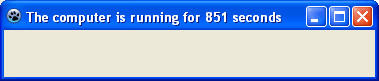
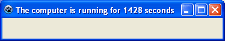
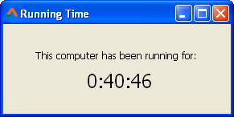

If you are reading this text then most probably you have your computer turned on. But for how long? You can get the time for how long the computer is running for.
<!-- more -->
  
  
The operating system, such as Windows, Ubuntu, Mac OS, keeps a record of how long the computer is running for. We can simply get the running time and use it in our program.  
  
Each Operating System (OS) has different ways of keeping this record and a different way of retrieving it. For example, in Windows it can be retrieved with the help of Windows API. Fortunately, in Lazarus, we don't have to get into these mumbo jumbo for each platform. We can use windows.GetTickCount for windows or LclIntf.GetTickCount for a cross platform way. (We would have to add windows or LclIntf in the uses clause as well.) We will see the both ways. But for both of them, the syntax is the same:  
  

function GetTickCount: DWord; 

  
The [GetTickCount](http://lazarus-ccr.sourceforge.net/docs/lcl/lclintf/gettickcount.html)() procedure returns the running time in milliseconds. 1 Seconds = 1000 Milliseconds. So we can divide the returning value by 1000 to get the running time in Seconds. DWord is not new for API based functions and procedures. There is nothing to worry about. We would use Variant type to store the returing value of DWord. We could then use it as normal float value.  
  
  
  

### The Windows way (Not recommended)

We can use the GetTickCount from the Windows unit to get running time in Windows. It utilizes Windows API so it will only work in Windows and not other platforms, such as Linux and Mac. It is not recommended to use this for this reason. But it is interesting to know this stuff anyway!  
  
Create a new Application Project (Project-> New Project-> Application-> OK).  
  
Switch to code view (F12) and add windows to the uses section:  
  

uses  
  
..., windows;

  
Double click the form and enter:  
  

procedure TForm1.FormCreate(Sender: TObject);  
var  
  TickCount : variant;  
begin  
  TickCount := Windows.GetTickCount;  
  Caption := 'The computer is running for '+floattostr(TickCount Div 1000)+' seconds';  
end;

  
We have used TickCount Div 1000 to get the time in seconds. We have used Div to get an integer value.  
  
Run the project with F9 (or Run-> Run).  
  

  
  
  
  
  
The seconds would obviously differ from this screenshot because the running time will not be the same with your computer. But if you see a number it is working.  
  
  

### The Cross-platform way (Recommended)

This method is more accepted because it works in all platforms including windows.  
  
Create a new Application Project. Now switch to code view and add the LclIntf to the uses clause:  
  

uses  
  
..., LCLIntf;

  
Now double click the form and enter:  
  

procedure TForm1.FormCreate(Sender: TObject);  
var  
  TickCount : variant;  
begin  
  TickCount := LCLIntf.GetTickCount;  
  Caption:='The computer is running for '+floattostr(TickCount Div 1000)+' seconds';  
end;

  
Now run the project. The result would be similar to the above.  
  

  

### Demo Project

The above is for just testing. It won't sell, right? We have to make something better in order to satisfy our users, because they will be hungry for more.  
  
We would create a simple program to show the running time in hours:minutes:seconds which would update every second to show the actual running time every second.  
  
Create a new project. Drop a TLabel on your form. Make its font large enough (set Font->Size property to something like 18). Set its name as lblTime. You can change its caption to 0:00:00. Now place a TTimer (from System tab) in your form. By default it should be enabled and its interval should be set to 100 milliseconds (which equals to 1 second). Double click Timer1 and enter:  
  

procedure TForm1.Timer1Timer(Sender: TObject);  
var  
   TickCount : variant;  
  
   mySeconds : variant;  
   hrs, min, sec : variant;  
begin  
   TickCount := LclIntf.GetTickCount;  
  
   mySeconds := TickCount Div 1000;  
  
   hrs := (mySeconds Div 60) Div 60;  
   mySeconds := mySeconds - (hrs \* 60 \* 60);  
   min := mySeconds Div 60;  
   mySeconds := mySeconds - (min \* 60);  
   sec := mySeconds;  
  
   lblTime.Caption := IntToStr(hrs) + ':' + IntToStr(min) + ':' + IntToStr(sec);  
end;

  
Explanation:  
  

   hrs := (mySeconds Div 60) Div 60;

  
First we calculate the hours. Hour = (Seconds / 60) / 60  
  

   mySeconds := mySeconds - (hrs \* 60 \* 60);

  
After calculating the hours, we eliminate the calculated hours from the seconds value. Now we have to calculate minutes and seconds from this remaining time.  
  

   min := mySeconds Div 60;

  
Now we calculate minutes. Minutes = Seconds / 60.  
  

   mySeconds := mySeconds - (min \* 60);

  
After calculating minutes we subtract the calculated minutes from MySeconds. Now we are left with seconds. So...  
  

   sec := mySeconds;

  
  
Now, decorate your form with other explanatory labels. Resize the form to appropriate size. To disable the maximize button set the Form's BorderIcons->biMaximize to False. To make it un-resizable set its BorderStyle property to bsSingle.  
  
Now Run the project (F9 or Run-> Run).  
  

  
You can take further challenges with this code. It is great for learning new stuff and making your learning permanent. You can save the user's daily computer usage in a text file or database (maybe with Sqlite). You can also create a statistics form and show for how much time the user keeps the computer running in a week, month or even a year. This could be an interesting app. Also if you could keep it synchronized with multiple computers (for example, across desktops and laptops and even multiple platforms) then it would be a delicacy!  
  

### Download Sample Code ZIP

You can download the above example tutorial project source code from here: [http://db.tt/F84ErkI7](http://db.tt/F84ErkI7)  
Size: 518 KB  
The package contains compiled executable EXE.