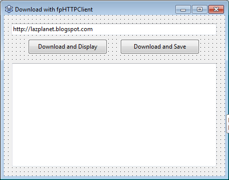

The Web is an amazing place. What if we could download the contents of a link on the web to our own Lazarus program? Let's find out how!
<!-- more -->
  
Getting the contents of a link can give us so much to do. We can communicate with servers or websites, get data from them, then parse and present the data in our program window just like we want to. And we can even use REST APIs to do amazing things.  
  
We can retrieve the contents of a link in 3 ways: fpHTTPClient, Synapse, Indy. There might be other ways, but these are the most popular.  
  
We'll see the first two in this article.  
  

### fpHTTPClient Tutorial

This is the most simple of the 3, plus the library is bundled with Lazarus. So it is more convenient than the other ones.  
  
Start [Lazarus](https://www.lazarus-ide.org/).  
Create an Application Project (**Project - New Project - Application - OK**).  
  
Place 2 **TButton**s, **TEdit** and a **TMemo** on the form.  
Change **button1**'s Caption to "Download and Display" and **button2**'s to "Download and Save".  
Set the Text of Edit1 to **http://lazplanet.blogspot.com**  
Also empty the **Memo1**'s **Lines** property and set its **ScrollBars** to **ssAutoVertical**.  
  
But what happens when we get large outputs and we need to resize the form? We can't have tiny components to fiddle around! To fix this you can enable the **akRight** for **Edit1** under **Anchors**. And **akRight** and **akBottom** for **Memo1** so that when the form is resized the components fill the form.  
  
Your form should look something like this:  
  

  
Switch to **Code View (F12)** and simply include **fphttpclient** in the uses clause:  
  

uses  
  ...,  
  fphttpclient;  

  
Now add this function above the "end." line (usually the last line of the unit):  
  

function TForm1.FPHTTPClientDownload(URL: string; SaveToFile: boolean = false; Filename: string = ''): string;  
begin  
  // Result will be:  
  // - empty ('') when it has failed  
  // - filename when the file has been downloaded successfully  
  // - content when the content SaveToFile is set to False  
  Result := '';  
  With TFPHttpClient.Create(Nil) do  
  try  
    try  
      if SaveToFile then begin  
        Get(URL, Filename);  
        Result := Filename;  
      end else begin  
        Result := Get(URL);  
      end;  
    except  
      on E: Exception do  
        ShowMessage('Error: ' + E.Message);  
    end;  
  finally  
    Free;  
  end;  
end;  

  
Then put your cursor on the function line and press **Ctrl+Shift+C**.  
  
Now double click **button1** and enter:  
  

procedure TForm1.Button1Click(Sender: TObject);  
begin  
  memo1.Text := FPHTTPClientDownload(Edit1.Text);  
end;  

  
Double click **button2** and enter:  
  

procedure TForm1.Button2Click(Sender: TObject);  
begin  
  memo1.Text := FPHTTPClientDownload(Edit1.Text, True, 'test.txt');  
end;  

  
The above will save the contents of the link to test.txt.  
  
Now this will easily work for http links. But for **HTTPS** links support (links that start with https://) you will have to do the following:  
  
Save the project in a folder. Then download the appropriate package from: [https://indy.fulgan.com/SSL/](https://indy.fulgan.com/SSL/)  
  
You can check the Help - About dialog. If it has **x86\_64** somewhere, then you are using 64 bit Lazarus. Otherwise you are probably using 32 bit version.  
  
Download the appropriate version of OpenSSL for you from the above URL. Then extract the **ssleay32.dll** and **libeay32.dll** file and keep them on the project directory.  
  
This is not required, but I'm mentioning this for fun... For the geeks out there, by default, your app is the architecture of your Lazarus architecture. More precisely, it is similar to the FPC installed. The matching architecture FPC should be installed for the target architecture you want to build for. If you want to compile for 32 bit from 64 bit Lazarus go to Project - Project Option - Compiler Options - Config and Target - Target CPU Family (-P). If you select i386 there, then get the 32 bit package from the above URL. Then [download and install the 32 bit FPC from here](https://freepascal.org/download.var). Also select the 32 bit FPC exe from Tools - Options - Environment - Compiler executable and show the GDB executable on Tools - Options - Debugger - General from your 32 bit fpc directory. \[Please ignore this paragraph if you are not a geek!\]  
  
If you don't include these dlls, it will raise an error when you would try to access a https link. So I would recommend to include these. Another way is to have the dlls in the system directory. On Linux, I think having the openssl package installed would be enough.  
  
Now **Run** the project **(F9 or Run - Run)** and test both buttons.  
  

  
You may have to give these some time to download the data. Eventually you should see the content on the **Memo1** and also a test.txt file on the project directory.  
  

  
We'll do the same project in Synapse...  
  

### Synapse Tutorial

Start [Lazarus](https://www.lazarus-ide.org/) and create a new Application project (**Project - New Project - Application - OK**).  
Click **File - Save All** and save the project in a folder.  
  
Now [get Synapse from here](http://www.ararat.cz/synapse/doku.php/download). Download the **synapse.zip** file from under the title Stable release. Extract and put the folder inside your project folder.  
  

  
You should have a folder named **synapse40** or something similar inside your project folder. Now go to **Project - Project Options - Compiler Options - Paths** and click the **\[...\]** button beside **Other unit files** and browse the source folder inside lib folder from the synapse folder. For example, **synapse40sourcelib**.  
  

  
Now switch to **Code view (F12)** and add **httpsend** in the **uses** clause.  
  

uses  
  ...,  
  httpsend;  

  
If you want to use the https:// links then also add **ssl\_openssl**. As a result it would become something like:  
  

uses  
  ...,  
  httpsend, ssl\_openssl;  

  
Now add this before the "end." line:  
  

function TForm1.SynapseDownload(URL: string; SaveToFile: boolean=False; TargetFile: string=''): string;  
var  
  HTTPGetResult: Boolean;  
  HTTPSender: THTTPSend;  
  S: string;  
begin  
  // Result will be:  
  // - empty ('') when it has failed  
  // - filename when the file has been downloaded successfully  
  // - content when the content SaveToFile is set to False  
  Result := '';  
  HTTPSender := THTTPSend.Create;  
  
  try  
    HTTPGetResult := HTTPSender.HTTPMethod('GET', URL);  
    if (HTTPSender.ResultCode >= 100) and (HTTPSender.ResultCode<=299) then begin  
      if SaveToFile = true then begin  
        HTTPSender.Document.SaveToFile(TargetFile);  
        Result := TargetFile;  
      end else begin  
        SetLength(S, HTTPSender.Document.Size);  
        HTTPSender.Document.Read(S\[1\], Length(S));  
        Result:=S;  
      end;  
    end;  
  
  finally  
    HTTPSender.Free;  
  
  end;  
  
end;  

  
Then place your cursor on the function line and press Ctrl+Shift+C.  
  
Now create a similar form. Place 2 **TButton**s, a **TEdit** and a **TMemo**.  
Change **Caption** of **button1** to "Download and Display" and **button2** to "Download and Save".  
Set the Text of TEdit to: **http://lazplanet.blogspot.com**  
Set **Lines** property of **Memo1** to empty and set its **ScrollBars** to **ssAutoVertical**.  
  
Like previous project, you can enable the **akRight** for **Edit1** under **Anchors**. And **akRight** and **akBottom** for **Memo1** so that when the form is resized the components fill the form.  

  

  
Double click **button1** and enter:  
  

procedure TForm1.Button1Click(Sender: TObject);  
begin  
  Memo1.Text := SynapseDownload(Edit1.Text);  
end;  

  
Double click **button2** and enter:  
  

procedure TForm1.Button2Click(Sender: TObject);  
begin  
  Memo1.Text := SynapseDownload(Edit1.Text, True, 'test.txt');  
end;  

  
If you want your program to be able to access **https** links, then save the project in a folder. Then save the 2 dlls (**ssleay32.dll** and **libeay32.dll**) like previously on your project directory.  
  
Now **Run** the project (**F9 or Run - Run**). Now click the buttons to test. **button1** should show the contents on the **Memo1**, **button2** should download the contents on "test.txt".  
  

  
  
You can also fetch links like: https://api.desktoppr.co/1/wallpapers/random  
This will give you JSON data about a random wallpaper everytime. You can then [parse the JSON data](http://localhost/wp-lazplanet/2014/09/03/a-simple-json-parsing-example/) to get the random wallpaper image URL, then download and [set it as wallpaper](http://localhost/wp-lazplanet/2014/08/31/how-to-set-the-desktop-wallpaper/). This way you will get yourself a random wallpaper setter!  
  

### Download Sample Code ZIP

You can download the above example tutorial project's source code from [here](https://drive.google.com/uc?export=download&id=1lGFBapcyiRWhMgJ6CXBl4nlzm2tEdwIa) or [here](https://www.dropbox.com/s/b6nzuecc2htw136/DownloadContent.zip?dl=1).  
Size: 4.29MB  
The package contains compiled executable EXE file. It has been compressed with UPX so some antivirus programs may see it as a false positive.  
  
Ref:  
[http://wiki.lazarus.freepascal.org/fphttpclient](http://wiki.lazarus.freepascal.org/fphttpclient)  
[https://forum.lazarus.freepascal.org/index.php/topic,41401.msg287233.html#msg287233](https://forum.lazarus.freepascal.org/index.php/topic,41401.msg287233.html#msg287233)  
[http://wiki.freepascal.org/Synapse](http://wiki.freepascal.org/Synapse)  
[https://www.desktoppr.co/api](https://www.desktoppr.co/api)