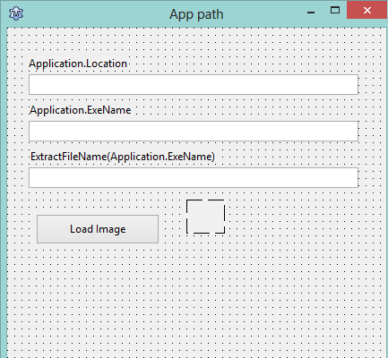
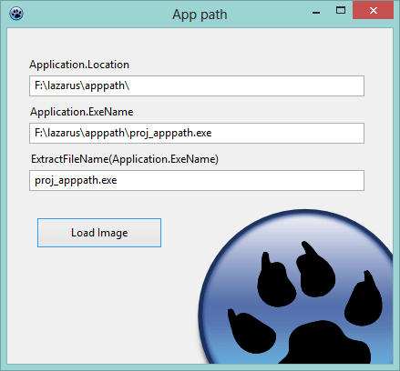

It is a common question. In your code, sometimes you need to define where your EXE is running from. Then you can load any file from the application's directory or subdirectories. Let's learn how to.
<!-- more -->


**The easy way to put it is:**
- To get from where the EXE is running: `Application.Location`
- To get the application path and EXE file name: `Application.ExeName`
- To get only the EXE file name: `ExtractFileName(Application.ExeName)`

Now let's get a tutorial to use this code:


### Tutorial

Create a new Application project. (**Project -> New Project -> Application -> OK**).

Switch to form view (**F12**). Place a **TLabel** and a **TEdit** on the form. Set the **TEdit**'s text to blank. Now copy the both objects and paste twice.

Now place a **TButton** and a **Timage**. Set the **Timage**'s `Autosize` property to `True`.

Your form will look like this:





Double click on form and enter:

```pascal
  Edit1.Text:=Application.Location;
  Edit2.Text:=Application.ExeName;
  Edit3.Text:=ExtractFileName(Application.ExeName);
```

Save the project in a directory (**File -> Save All**). Copy an image to the project's directory, a jpg, gif or png would work. I have copied a png image and named it `laz.png`. We will load the image file in a **TImage** component, the path of which will be determined using `Application.Location`.

Swith to form view (**F12**). Double click on the **TButton** and write:

```pascal
  Image1.Picture.LoadFromFile(Application.Location+'laz.png');
```

_Change the image filename according to what image you are using._


### Run it

Now run it (**F9**). You will see the application path, exe file path and exe filename on the editboxes. Click the tButton and you will see your image loading in the timage.




