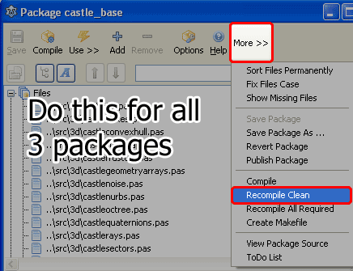

Castle is a mouth watering and exciting 3D Game Engine for Lazarus. It can show, modify, animate X3D, Collada, 3DS, VRML, OBJ and more 3D formats. Start your 3D programing life, now...!
<!-- more -->
  
  

### Introduction

[Castle Game Engine](http://castle-engine.sourceforge.net/) is a 3D game engine for [Lazarus](http://www.lazarus.freepascal.org/) having a range of features to create 3D games. It was formerly known as Kambi VRML Game Engine, apparently because the game engine is created by Michalis Kamburelis. Although it is a game engine, you can use it for anything 3D. (Duh...!) Castle is a cross platform game engine for your favorite cross platform IDE.  
  

")

_A first person shooter game made with Castle_

  
  
  
After installing it, you can drop a 3D component directly into your form and start writing code for it. You can open popular 3D files, create cameras, create a keyboard or mouse interface to move through your 3D world, and even move things here & there -- pretty much what a 3D Editing Software can do. Amazing, right? There is also an audio library present, so you can play sounds as well. It is all what you need to create 3D Games (or anything 3D).  
  

_A 3D file viewer, view3dscene, made with Castle_

  
Here's a portion of the [Introduction on its website](http://castle-engine.sourceforge.net/engine.php#section_intro):  
  

> Our main 3D scene format is VRML / X3D, which is an open standard (you'll find you can export to it from virtually any 3D modeler), and a lot of our strength comes from it (it's a 3D scene format that can also express interactive world features, scripting etc.). Even if you don't know VRML/X3D, the whole engine is designed as a general-purpose 3D engine, and other 3D model formats are supported as well (Collada, Wavefront, MD3 and others). ...We have Lazarus components for RAD development, although the core engine doesn't depend on Lazarus LCL and you can develop full games with pure FPC (we have our own OpenGL window management unit, if you want). **The whole engine is 100% clean Object Pascal code.**

  
  
  

#### The [features](http://castle-engine.sourceforge.net/engine.php#section_features) are comparable to premium or paid engines. It has the following features in short:

*   Optimized OpenGL Rendering
*   Cross platform (Linux, Mac OS X, Windows, and more)
*   Range of formats supported (see below) which lets you import practically any model in your project
*   Saving of 3D files is possible (so it is possible to create a 3D modeler with Castle!)
*   Animations can be done on runtime or can be embedded in file
*   Built in collision detection
*   Scene manager for centralized 3D world handling (you can also create custom viewports)
*   Shadow volumes, shadow maps
*   Bump mapping
*   GLSL shaders
*   Multi-texturing, cube map texturing, 3D textures, S3TC compressed textures, anisotropic filtering
*   It is possible to either create windows with OpenGL context, or use Lazarus LCL forms
*   Reading and writing of images in many formats (png, jpg, ppm, bmp and more)
*   Handling of fonts
*   3D Sound Engine, Open AL
*   Anti-aliasing, ray tracer, ability to load and save short movie files...
*   And [COUNTLESS more features](http://castle-engine.sourceforge.net/engine.php#section_features)...

  
  

#### The formats supported are:

VRML (.wrl, .wrl.gz, \*.wrz)  
X3D XML (.x3d, .x3dz, .x3d.gz)  
X3D Classic (.x3dv, .x3dvz, .x3dv.gz)  
Collada (.dae)  
Inventor (.iv)  
3D Studio (.3ds)  
Quake 3 engine models (.md3)  
Wavefront (.obj)  
Videoscape (.geo)  
  
_\[ These formats are according to the model\_3d\_viewer example's open dialog filters found in Castle 4.0.1 source package \]_  
  
Now I've got to admit that the list is impressive. When I last used it there was only 2 formats supported. But now everything from 3D Studio Max files to Collada are supported. Oh boy!  
  

### Requirements

Castle website recommends the most recent stable version of Free Pascal (when I am writing this article Free Pascal in on version 2.6.2). The current Castle version -- 4.0.1 is compatible with FPC 2.6.0 or above. Any [Lazarus 1.0.x](http://www.lazarus.freepascal.org/) version is good enough to install this version of Castle Game Engine.  
  
You will also need disk space to store the downloaded files and rebuild Lazarus. You also need decent hardware requirements to work with 3D environment. It depends on the work you will do. But if you have a 1.5 Ghz processor, 1GB RAM and a 512 MB graphics card you are pretty much safe.  
  
For any latest improvements on the requirements see [here](http://castle-engine.sourceforge.net/engine.php#section_fpc_ver).  
  

### How to install Castle in Lazarus

In this straight-forward guide we will learn [how to install Castle](http://castle-engine.sourceforge.net/tutorial_install.php) so that you can show 3D objects in your Lazarus Program. You can also [install Castle for Free Pascal use](http://castle-engine.sourceforge.net/tutorial_install.php), without the LCL Form Controls.  
  

### Step-1: Download Castle Game Engine

  
Download the latest Castle from this link: [http://castle-engine.sourceforge.net/engine.php#section\_download\_src](http://castle-engine.sourceforge.net/engine.php#section_download_src)  
Or directly from here: [http://sourceforge.net/projects/castle-engine/files/castle\_game\_engine/](http://sourceforge.net/projects/castle-engine/files/castle_game_engine/)  
  
You can download 2 versions. Both have the same files but...  

*   **ZIP** file is easier to extract in Windows
*   **TAR.GZ** file requires third party compression software such as [7-zip](http://www.7-zip.org/) to extract

  
I use 7-zip anyway, so I go for tar.gz package.  
  

### Step-2: Extract the files

Inside the file you will find a "castle\_game\_engine" folder. You can extract it to anywhere. But I like to keep it in the components folder of my Lazarus installation. So I have extracted it to **C:lazaruscomponents** directory, so I have a directory like this C:lazaruscomponentscastle\_game\_enginesrc.  
  

  
  
Remember, Lazarus will need these files even after the installation. That's why I prefer to install it inside the Lazarus directory, so I don't accidentally delete or move those files to other directory.  
  

### Step-3: Install the Engine

This seems to be the hardest part. But trust me, I am with you and you will be able to install it just fine. And there will be screenshots to accompany you. Click any screen shot to see it in larger size.  
  

  
  
1\. Start Lazarus.  
2\. Go to **Package -> Open package file (.lpk)**.  
3\. Select the 3 files: castle\_base.lpk, castle\_components.lpk, castle\_window.lpk and click open. Now 3 windows will appear one over the other. Move the windows to see each of the windows.  
  

  
  
[The Castle website says](http://castle-engine.sourceforge.net/tutorial_install.php) to "Compile" the 3 packages. But [due to a problem](http://www.lazarus.freepascal.org/index.php?topic=10984.0) I recommend a different approach.  
  
\[\[ **UPDATE:** As you know that Lazarus 1.0.10 has been released recently and the bug that created the above problem got squashed! So if you are using Lazarus 1.0.10 you can just use "Compile" instead of Recompile Clean. (Thanks to Michalis Kamburelis for pointing out this fact.) \]\]  
  

4\. Click the "More >>" at the right and click Recompile clean.  
  

  
You will see in the messages window that the compiling package xyz is completed. Do this for **all the 3 windows.**  
  

  
  
  
5\. Now in the window for **castle\_components**, click **Use** and then click **Install**. **Do this for only castle\_components window** and not for the other 2 windows.  
  

  
Click OK on the message that comes in the screen.  
  

  
Click Yes in the next message.  
  

  
Now Lazarus will recompile and rebuild itself. After the rebuild process Lazarus will restart itself. Check out the components' tabs. You will see a new tab in the toolbar named "Castle" (and another one named "OpenGL").  
  

  
  

### Step-4: Use Lazarus with Castle

  
Now that you have installed Castle, it is time to test things. Start Lazarus. You will see a new tab in the toolbar called "Castle". If you see that, then you have installed Castle successfully. You can use the components in the Castle tab for building programs with 3D objects in Lazarus.  
  
Now we will test an example program. We will compile a sample project that is given in the Castle source package.  
  
1\. Go to **C:lazaruscomponentscastle\_game\_engineexampleslazarusmodel\_3d\_viewer**. (Or if you have extracted elsewhere then **castle\_game\_engineexampleslazarusmodel\_3d\_viewer**)  
  
2\. **Open the .lpi file.** When you have opened the file, you will notice a strange thing. The Lazarus splash screen does not disappear after loading the project! This only occurs to projects using Castle and does not affect other projects. So don't worry. Simply click the splash screen and press Alt+F4 and it will disappear.  
  
3\. Click **Run-> Build** menu and the project will be compiled and executables will be built. Now run the EXE file that has been created in the project directory. Open any 3D file that is supported, and you will be able to see it in the 3D area/viewport.  
  
You will notice that the generated EXE is so big (around 37 mb). You can [reduce EXE file size by following a tutorial article here](http://lazplanet.blogspot.com/2013/03/how-to-reduce-exe-file-size-of-your.html) . By following the tutorial you can reduce size with 2 clicks, or even none.  
  
There you go! Your 3D Software Development Environment is ready! You can look at the examples in the [Castle sourceforge project files](http://sourceforge.net/projects/castle-engine/files/) to have a better understanding of the engine.